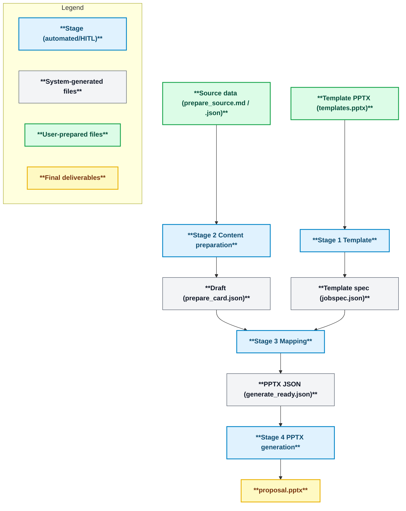
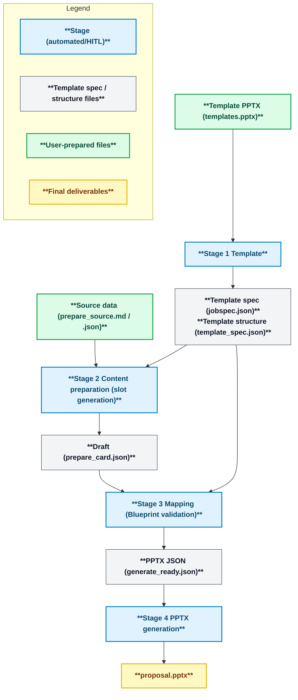

<div align="center">
  <p>
    <picture>
      <source media="(prefers-color-scheme: dark)" srcset="docs/assets/pptx_generator_logo_black.png">
      <source media="(prefers-color-scheme: light)" srcset="docs/assets/pptx_generator_logo_white.png">
      
    </picture>
  </p>

  <p>
    <a href="LICENSE"></a>
    <a href="https://github.com/yurake/pptx_generator/actions/workflows/ci.yml"></a>
    
  </p>

  <p>
    <a href="https://sonarcloud.io/project/overview?id=yurake_pptx_generator"></a>
    <a href="https://sonarcloud.io/project/overview?id=yurake_pptx_generator"></a>
    <a href="https://sonarcloud.io/project/issues?resolved=false&amp;id=yurake_pptx_generator&amp;types=BUG"></a>
    <a href="https://sonarcloud.io/project/issues?resolved=false&amp;id=yurake_pptx_generator&amp;types=VULNERABILITY"></a>
    <a href="https://sonarcloud.io/project/issues?resolved=false&amp;id=yurake_pptx_generator&amp;types=CODE_SMELL"></a>
  </p>

  <p>
    <a href="https://sonarcloud.io/project/overview?id=yurake_pptx_generator"></a>
    <a href="https://sonarcloud.io/project/overview?id=yurake_pptx_generator"></a>
    <a href="https://sonarcloud.io/project/overview?id=yurake_pptx_generator"></a>
    <a href="https://sonarcloud.io/project/overview?id=yurake_pptx_generator"></a>
  </p>

<p>
<a href="README.md"></a>
<a href="README.zh.md"></a>
<a href="README.en.md"></a>
</p>

  <p>
  This CLI tool ingests PowerPoint templates and material data (plain text, PDFs, etc.) to generate presentation materials that conform to the template.
  </p>
</div>

## Overview
- Extract the layout structure and brand settings from a template PPTX to generate a reusable specification JSON.
- Combine the extracted specifications with document data to generate PPTX/PDF with an audit log (PDF conversion is also possible via LibreOffice).

## Quick Start
1. Prepare a virtual environment for Python 3.12.x and sync dependencies with `uv sync`.
2. Run `uv run --help` to verify that the CLI entry point is available.
3. Run the generation pipeline.

## Generation Pipeline Overview
### Dynamic Generation (dynamic mode)
Using layout information extracted from the templates, it assembles the presentation data into provisional slides and, by adjusting the content order and placement, can be produced again and again—a flexible mode. It is suitable when you want to flexibly create slides from presentation data.



| Stage | Overview | Command examples |
| --- | --- | --- |
| 1. Template | Extract and validate the template PPTX, and output foundational data such as `jobspec.json` to `.pptx/template/` | `uv run pptx template samples/templates/templates.pptx --mode dynamic` |
| 2. Content preparation | Normalize input materials into tentative slides and generate a draft with AI logs and audit information | `uv run pptx prepare samples/input/pitch.md` |
| 3. Mapping | Perform HITL approval and layout assignment, creating `.pptx/compose/generate_ready.json` | `uv run pptx compose .pptx/template/jobspec.json --prepare-cards .pptx/prepare/prepare_card.json` |
| 4. PPTX Generation | Output PPTX/PDF and audit logs using `generate_ready.json` | `uv run pptx gen .pptx/compose/generate_ready.json` |

### Static generation (static mode)
A mode that automatically maps data to the slide structure defined by the template and produces the final output. It is useful when slide layout and rules are fixed.

The structures that appear in static mode are organized as follows.

```
Blueprint (overall template blueprint)
└─ Slide (per-slide frame)
    └─ Slot (content placeholder)
```

- For static templates, placing `external/<template_id>/hooks.json` lets you delegate each stage to external hooks. Configuration examples and the environment variables passed to hooks are documented under `docs/design/stages/`.



| stage | Overview | Command examples |
| --- | --- | --- |
| 1. Template | Output the Blueprint information together with `.pptx/template/prompts/` (prompt templates) and `.pptx/slide_inputs.md` (slide input manifest) | `uv run pptx template samples/templates/templates.pptx --mode static` |
| 2. Content preparation | Edit the template (`.pptx/template/prompts/01_*.md`) and the input manifest (`.pptx/slide_inputs.md`), and if necessary omit `<data file path>` to shape mock slides according to the Blueprint slot definitions | `uv run pptx prepare --mode static` |
| 3. Mapping | Validate slot fulfillment and generate `generate_ready.json` | `uv run pptx compose .pptx/template/jobspec.json --static` |
| 4. PPTX generation | Output PPTX/PDF with a fixed layout | `uv run pptx gen .pptx/compose/generate_ready.json` |

The CLI commands for each stage and their key options are in `docs/design/cli/cli-command-reference.md`.

## Tests
- Run tests:
  ```bash
  uv run --extra dev pytest
  ```
- After testing, verify that the output directories such as `.pptx/compose/` and `.pptx/gen/` contain the expected artifacts.
- For detailed testing policy, refer to `tests/AGENTS.md`.

## Documentation Guide
- `AGENTS.md`: Common rules that coding agents must follow and links to related documents.
- `docs/README.md`: Navigation to the categories under `docs/` and their detailed documentation.
- `docs/requirements/requirements.md`: Current business and functional requirements.
- `docs/design/design.md`: Design overview of the four-stage pipeline and major components.
- `docs/runbooks/runbooks.md`: Procedures for operations, releases, troubleshooting, and related tasks.
- `docs/policies/policies.md`: Index summarizing the update procedures and the reference order for policy documents.
- `tests/AGENTS.md`: Guidelines for additional rules per test level and test-case design.

## Support and Inquiries
- For individual procedures such as releases, support, and story-skeleton operations, please refer to the contents under `docs/runbooks/`.

## License
- This project is licensed under the MIT License. For details, please refer to `LICENSE`.
