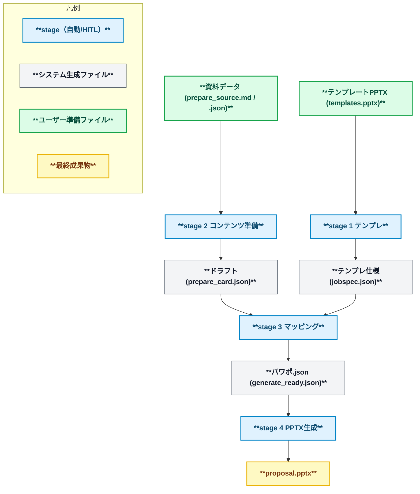
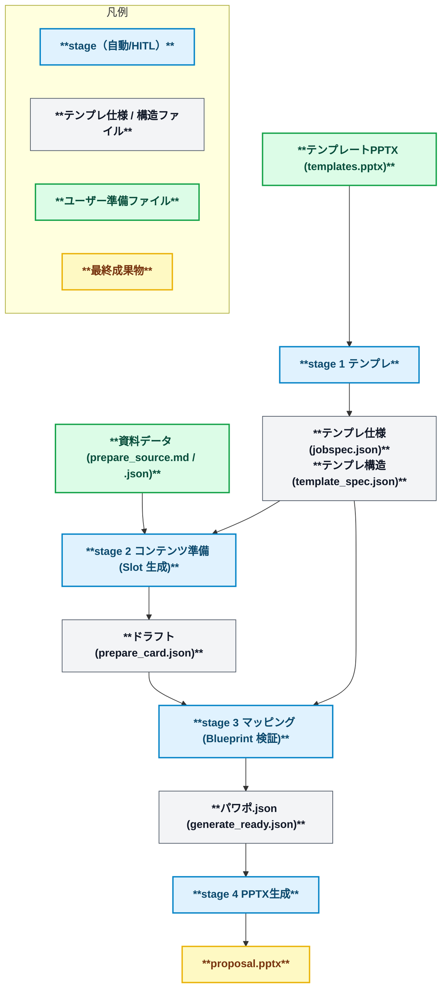

<div align="center">
  <p>
    <picture>
      <source media="(prefers-color-scheme: dark)" srcset="docs/assets/background_black.png">
      <source media="(prefers-color-scheme: light)" srcset="docs/assets/background_white.png">
      
    </picture>
  </p>

  <p>
    <a href="LICENSE"></a>
    <a href="https://github.com/yurake/pptx_generator/actions/workflows/ci.yml"></a>
    
  </p>

  <p>
    <a href="https://sonarcloud.io/project/overview?id=yurake_pptx_generator"></a>
    <a href="https://sonarcloud.io/project/overview?id=yurake_pptx_generator"></a>
    <a href="https://sonarcloud.io/project/issues?resolved=false&amp;id=yurake_pptx_generator&amp;types=BUG"></a>
    <a href="https://sonarcloud.io/project/issues?resolved=false&amp;id=yurake_pptx_generator&amp;types=VULNERABILITY"></a>
    <a href="https://sonarcloud.io/project/issues?resolved=false&amp;id=yurake_pptx_generator&amp;types=CODE_SMELL"></a>
  </p>

  <p>
    <a href="https://sonarcloud.io/project/overview?id=yurake_pptx_generator"></a>
    <a href="https://sonarcloud.io/project/overview?id=yurake_pptx_generator"></a>
    <a href="https://sonarcloud.io/project/overview?id=yurake_pptx_generator"></a>
    <a href="https://sonarcloud.io/project/overview?id=yurake_pptx_generator"></a>
  </p>

<p>
<a href="README.md"></a>
<a href="README.zh.md"></a>
<a href="README.en.md"></a>
</p>

  <p>
  This CLI tool imports PowerPoint templates and data assets (plain text, PDFs, etc.) and generates presentation slides that conform to the template.
  </p>
</div>

## Overview
- Extract layout structure and branding settings from a template PPTX, and generate a reusable specification JSON.
- Combine the extracted specifications with the document data to generate PPTX/PDF with audit logs (PDF conversion is also possible via LibreOffice).

## Quick Start
1. Create a Python 3.12 virtual environment and sync dependencies with `uv sync`.
2. Run `uv run --help` to verify that the CLI entry point is available.
3. Run the generation pipeline.

## Generation Pipeline Overview
### Dynamic generation (dynamic mode)
Using layout information extracted from the template, assemble the presentation data into draft slides, and it is a flexible mode that can be regenerated any number of times while adjusting the order and layout of the content. It is suitable when you want to flexibly create slides from presentation data.



| stage | Overview | Example commands |
| --- | --- | --- |
| 1. Template | Extract and validate the template PPTX, and output foundational data such as jobspec.json to `.pptx/template/` | `uv run pptx template samples/templates/templates.pptx --mode dynamic` |
| 2. Content Preparation | Normalize input materials into provisional slides and generate a draft with AI logs and audit information | `uv run pptx prepare samples/input/pitch.md` |
| 3. Mapping | Perform HITL approvals and layout assignments, creating `.pptx/compose/generate_ready.json` | `uv run pptx compose .pptx/template/jobspec.json --prepare-cards .pptx/prepare/prepare_card.json` |
| 4. PPTX Generation | Use `generate_ready.json` to output PPTX/PDF and audit logs | `uv run pptx gen .pptx/compose/generate_ready.json` |

### Static generation (static mode)
This mode automatically allocates and finalizes the presentation data to match the slide structure defined by the template. It is useful in cases where slide layout and rules are predetermined.

The structures that appear in static mode are arranged in the following hierarchy.

```
Blueprint（テンプレ全体の設計図）
└─ Slide（スライドごとの枠組み）
    └─ Slot（コンテンツ差し込み枠）
```



| Stage | Overview | Command Examples |
| --- | --- | --- |
| 1. Template | Output the `.pptx/template/prompts/` (prompt templates) and `.pptx/slide_inputs.md` (slide input manifest) together with Blueprint information | `uv run pptx template samples/templates/templates.pptx --mode static` |
| 2. Content Preparation | Edit the template (`.pptx/template/prompts/01_*.md`) and the input manifest (`.pptx/slide_inputs.md`), and if needed, omit `<data file path>` and shape dummy slides in accordance with the Blueprint Slot definitions | `uv run pptx prepare --mode static` |
| 3. Mapping | Verify slot fulfillment status and generate `generate_ready.json` | `uv run pptx compose .pptx/template/jobspec.json --static` |
| 4. PPTX Generation | Output PPTX/PDF in a fixed layout | `uv run pptx gen .pptx/compose/generate_ready.json` |

- In static templates, you can delegate per-stage processing to external hooks by preparing `external/<template_id>/hooks.json`. For installation and operation procedures, refer to `external/README.md`. For work guidelines, refer to `external/AGENTS.md`. For detailed configuration examples and the environment variables passed, refer to the stage documents under `docs/design/stages/`.

The CLI commands for each stage and the main options are in `docs/design/cli/cli-command-reference.md`.

## Test
- Test execution:
  ```bash
  uv run --extra dev pytest
  ```
- After testing, check the output directories such as `.pptx/compose/` and `.pptx/gen/` to verify that the expected artifacts have been generated.
- For detailed testing policy, please refer to `tests/AGENTS.md`.

## Documentation Guide
- `AGENTS.md`: Common rules that coding agents must follow and links to related documentation.
- `docs/README.md`: Guidance to the categories and detailed documentation under `docs/`.
- `docs/requirements/requirements.md`: Current business and functional requirements.
- `docs/design/design.md`: Design overview of the 4-stage pipeline and major components.
- `docs/runbooks/runbooks.md`: Procedures for operations, releases, and troubleshooting.
- `docs/policies/policies.md`: An index summarizing the update procedures and reference order for policy documents as a whole.
- `tests/AGENTS.md`: Guidance on additional rules and test-case design per test level.

## Support and Inquiries
- For individual procedures such as release, support, and story skeleton operations, please refer to the `docs/runbooks/` directory.

## License
- This project is provided under the MIT License. For details, please refer to `LICENSE`.
