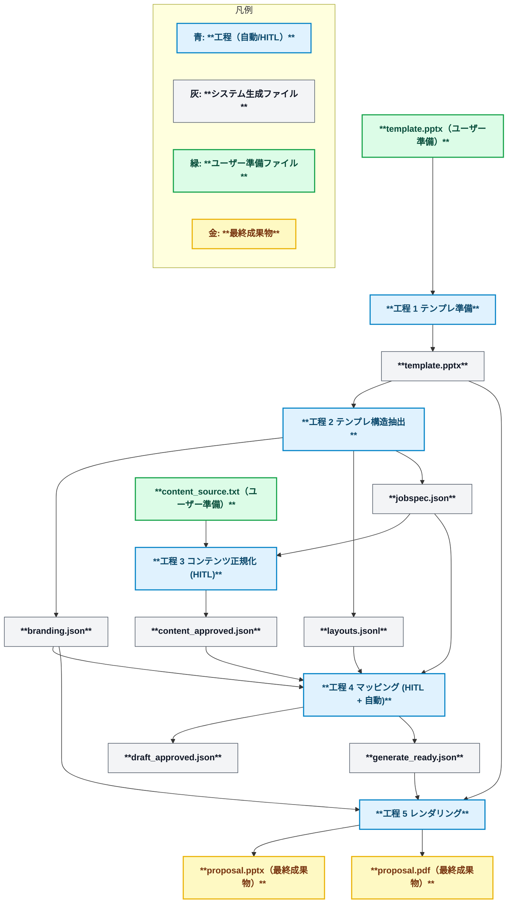

<p align="center">
  <picture>
    <source media="(prefers-color-scheme: dark)" srcset="assets/pptx_generator_logo_black.png">
    <source media="(prefers-color-scheme: light)" srcset="assets/pptx_generator_logo_white.png">
    
  </picture>
</p>


PowerPoint テンプレートと資料データ（プレーンテキストや PDF など）を取り込み、テンプレートに沿ったプレゼン資料を生成する CLI ツールです。

## 主な機能
- PPTX テンプレートからレイアウト構造とブランド設定を抽出し、再利用可能な プレゼン仕様 JSON を自動生成する。
- 資料データ（プレーンテキストや PDF など）とプレゼン仕様 JSON を取り込み、PPTX を生成し、必要に応じて LibreOffice 経由で PDF を併産する。

## アーキテクチャ概要
本プロジェクトは 5 工程で資料を生成します。詳細は `docs/design/design.md` を参照してください。

| 工程 | 実行主体 | 主な入力 | 主な成果物 | 概要 |
| --- | --- | --- | --- | --- |
| 1. テンプレ準備 | 自動＋HITL | 既存テンプレート資産 | テンプレートファイル、版管理ノート | ブランドごとの PPTX テンプレ資産を整備し、命名ルールを適用 |
| 2. テンプレ構造抽出 | 自動 | テンプレートファイル | `.pptx/extract/template_spec.json`, `.pptx/extract/jobspec.json`, `.pptx/extract/branding.json`, `.pptx/validation/layouts.jsonl` | テンプレ仕様・ジョブスペック雛形・ブランド設定を抽出し、レイアウト候補を検証 |
| 3. コンテンツ正規化 | HITL | `.pptx/extract/jobspec.json`, 入力コンテンツ | `.pptx/content/content_approved.json` | 入力データをスライド候補へ整形し、生成 AI を併用しながら承認を行う |
| 4. マッピング (HITL + 自動) | HITL + 自動 | `.pptx/content/content_approved.json` | `.pptx/draft/draft_approved.json`, `.pptx/gen/generate_ready.json` | 章構成承認とレイアウト割付をまとめて実施し、ドラフトとマッピング成果物を生成 |
| 5. PPTX レンダリング | 自動 | `.pptx/gen/generate_ready.json`、テンプレート、ブランド設定 | `.pptx/gen/proposal.pptx`、`proposal.pdf`（任意）、`analysis.json`、`rendering_log.json`、`audit_log.json`、`review_engine_analyzer.json` | テンプレ適用と最終出力を生成し、整合チェックと監査メタを記録 |

工程 3・4 では人による承認（HITL）が必須です。AI レビューや承認フローの仕様は `docs/design/schema/README.md` と `docs/requirements/requirements.md` にまとめています。




### セットアップ
1. Python 3.12 系の仮想環境を用意し、有効化します。
2. 依存パッケージを同期します。
   ```bash
   uv sync
   ```
   - uv を未導入の場合は <https://docs.astral.sh/uv/getting-started/installation/> を参照してインストールしてください。
   - 権限エラーが発生する環境では `UV_CACHE_DIR=.uv-cache uv sync` を使用します。
3. CLI が動作することを確認します。
   ```bash
   uv run --help
   ```
4. LibreOffice を利用する場合は headless 実行を確認します（任意、PDF 変換機能を使う際に必要）。
   ```bash
   soffice --headless --version
   ```
5. Polisher や仕上げツールを利用する場合は .NET 8 SDK をインストールします（任意）。

## CLI チートシート

| 工程 | コマンド例 | 主な出力 | 補足 |
| --- | --- | --- | --- |
| 1. テンプレ準備 | `uv run pptx tpl-release --template samples/templates/templates.pptx --brand demo --version v1` | `.pptx/release/template_release.json` | テンプレ資産の受け渡しメタを作成 |
| 2. テンプレ構造抽出 | `uv run pptx tpl-extract --template samples/templates/templates.pptx`<br>`uv run pptx layout-validate --template samples/templates/templates.pptx --output .pptx/validation` | `.pptx/extract/template_spec.json`, `.pptx/extract/jobspec.json`, `.pptx/extract/branding.json`, `.pptx/validation/layouts.jsonl` | テンプレ仕様・ジョブスペック雛形・ブランド設定を抽出し、レイアウト候補を検証 |
| 3. コンテンツ正規化 | `uv run pptx content .pptx/extract/jobspec.json --content-source samples/contents/sample_import_content.txt --output .pptx/content` | `.pptx/content/content_approved.json` | プレーンテキスト等の非構造化データを取り込み正規化 |
| 4. マッピング (HITL + 自動) | `uv run pptx compose .pptx/extract/jobspec.json --content-approved .pptx/content/content_approved.json --draft-output .pptx/draft --output .pptx/gen --template samples/templates/templates.pptx` | `.pptx/draft/draft_approved.json`, `.pptx/gen/generate_ready.json`, `.pptx/gen/mapping_log.json` | 章構成承認とレイアウト割付をまとめて実行 |
| 5. レンダリング | `uv run pptx gen .pptx/extract/jobspec.json --content-approved .pptx/content/content_approved.json --template samples/templates/templates.pptx --branding .pptx/extract/branding.json --output .pptx/gen --export-pdf` | `.pptx/gen/proposal.pptx`, `proposal.pdf`（任意） | 工程4/5を一括実行。ドラフト確認は工程4で `compose` を利用 |


> 工程4の個別サブコマンド（`pptx outline` / `pptx mapping`）や詳細な運用手順は `docs/design/cli-command-reference.md` と `docs/runbooks/story-outline-ops.md` を参照してください。

補足資料: 要件は `docs/requirements/requirements.md`、アーキテクチャは `docs/design/design.md`、CLI 詳細は `docs/design/cli-command-reference.md`、運用メモは `docs/runbooks/` を参照してください。

CLI の詳細なオプションは各サブコマンドに対して `uv run pptx <cmd> --help` を参照してください。

## 工程別ガイド概要
ここでは各工程の目的と主要な参照ドキュメントをまとめます。詳細な手順やチェックリストはリンク先を参照してください。

> `pptx` ルートコマンドには `-v/--verbose`（INFO レベル）と `--debug`（DEBUG レベル）のログオプションがあります。生成AIモードのプロンプト／レスポンス詳細はこれらのオプションを付与した場合に出力されます。

### 工程 1: テンプレ準備
- テンプレ資産は `templates/` で管理し、命名規約や更新手順は `docs/policies/config-and-templates.md` を参照します。
- 自動検査ツール（命名整合性チェックなど）は設計中です。運用中は手動レビュー（HITL）を併用します。
- テンプレ受け渡しメタを生成する場合はテンプレリリース CLI を利用します。
   ```bash
   uv run pptx tpl-release \
     --template templates/libraries/<brand>/<version>/template.pptx \
     --brand <brand> \
     --version <version> \
     --baseline-release templates/releases/<brand>/<prev_version>/template_release.json \
     --golden-spec samples/json/sample_jobspec.json
   ```
   - 既定の出力先は `.pptx/release/` です。`template_release.json`（受け渡しメタ）や `release_report.json`（差分レポート）、`golden_runs/`（ゴールデンサンプル検証ログ）が保存されます。
   - `--baseline-release` で過去バージョンとの差分比較が可能です。`--golden-spec` を複数指定すると代表 spec でのレンダリング検証をまとめて実行します。

### 工程 2: テンプレ構造抽出
- テンプレート PPTX からレイアウトとアンカー情報を抽出し、`template_spec.json` / `jobspec.json` / `branding.json` / `layouts.jsonl` を生成します。
- 差分チェックや品質検証には `pptx layout-validate` を併用します。
- 詳細ガイド: `docs/requirements/stages/stage-02-template-structure-extraction.md`

### 工程 3: コンテンツ正規化
- `.pptx/extract/jobspec.json` を基に入力コンテンツをスライド候補へ整形し、HITL で `content_approved.json` を確定します。生成AIドラフトの作成やレビュー支援は `pptx content` コマンドで行い、生成AIモードが既定です。
- ガイドラインは `docs/requirements/stages/stage-03-content-normalization.md` を参照してください。
- `.pptx/content/` 配下に `content_draft.json`（生成AIモード時）、`content_ai_log.json`、`ai_generation_meta.json`、`spec_content_applied.json`、`content_meta.json` を出力します。
  ```bash
  # 生成AIドラフトを作成（content_draft.json などを出力）
  uv run pptx content .pptx/extract/jobspec.json \
    --content-source samples/contents/sample_import_content.txt \
    --output .pptx/content

  # 承認済み JSON を適用する場合
  uv run pptx content .pptx/extract/jobspec.json \
    --content-approved samples/json/sample_content_approved.json \
    --content-review-log samples/json/sample_content_review_log.json \
    --output .pptx/content
  ```
  - 承認済み JSON を適用したい場合は `--content-approved` / `--content-review-log` を指定します。
  - プレーンテキスト・PDF・URL など外部ソースから取り込む場合は `--content-source` を利用します。

### 工程 4: マッピング (HITL + 自動)
- 章構成の承認とレイアウト割付を同一工程で扱い、`draft_approved.json` と `generate_ready.json` を同時に更新します。
- 推奨コマンドは `pptx compose` で、HITL 差戻しや再実行時も一貫した出力ディレクトリ（`.pptx/draft` / `.pptx/gen`）を維持します。
- サブ工程（旧 `pptx outline` / `pptx mapping`）や差戻しログの取り扱いは `docs/requirements/stages/stage-04-mapping.md` と `docs/design/stages/stage-04-mapping.md` を参照してください。
  ```bash
  uv run pptx compose .pptx/extract/jobspec.json \
    --content-approved .pptx/content/content_approved.json \
    --draft-output .pptx/draft \
    --output .pptx/gen \
    --layouts .pptx/validation/layouts.jsonl \
    --template samples/templates/templates.pptx
  # `draft_*` / `generate_ready.json` / `mapping_log.json` を確認
  ```

- `pptx gen` は JobSpec を直接入力し、工程4（マッピング）と工程5（レンダリング）を一括で実行するワンショットコマンドです。ドラフト成果物を都度確認したい場合は `compose` を併用し、最終成果物が必要になったタイミングで `gen` を実行してください。
  ```bash
  uv run pptx gen .pptx/extract/jobspec.json \
    --content-approved .pptx/content/content_approved.json \
    --template samples/templates/templates.pptx \
    --branding .pptx/extract/branding.json \
    --output .pptx/gen
  ```
- 詳細ガイド: `docs/requirements/stages/stage-05-rendering.md` と `docs/design/stages/stage-05-rendering.md`

## 主な成果物
- 最終成果物（`proposal.pptx` や任意の `proposal.pdf`）および中間ファイルの一覧は `docs/design/design.md` を参照してください。

## 詳細コマンドリファレンス
- 5 工程パイプラインと各コマンドの責務・主要オプションは `docs/design/cli-command-reference.md` を参照してください。

## テスト・検証
- 全体テスト: `uv run --extra dev pytest`
- CLI 統合テストのみ: `uv run --extra dev pytest tests/test_cli_integration.py`
- テスト実行後は `.pptx/gen/` や `.pptx/extract/` の成果物を確認し、期待する PPTX／PDF／ログが生成されているかをチェックします。テスト方針の詳細は `tests/AGENTS.md` を参照してください。

## 設定リファレンス
| ファイル | 役割 | 変更時に参照するドキュメント |
| --- | --- | --- |
| `config/rules.json` | 文字数上限・段落レベル・禁止ワードなど検証ルールを定義 | `docs/policies/config-and-templates.md` |
| `config/branding.json` | フォント・配色・レイアウト個別設定を管理する `layout-style-v1` スキーマ | `config/AGENTS.md` |

テンプレ抽出やリリースの詳細な運用フローは `docs/design/cli-command-reference.md` および `docs/design/design.md` のテンプレ関連節を参照してください。

## 開発ガイドライン
- コントリビューション規約は `CONTRIBUTING.md` にまとめています。
- `docs/AGENTS.md`（ドキュメント更新ルール）や `src/AGENTS.md`（実装ガイド）を併読してください。
- 主な静的解析コマンド:
  ```bash
  uv tool run --package ruff ruff check .
  uv tool run --package black black --check .
  uv tool run --package mypy mypy src
  ```
- .NET 関連の整形は `dotnet format` を利用します。

## 参考ドキュメント
- `docs/design/design.md`: アーキテクチャ全体像
- `docs/design/schema/README.md`: 中間 JSON スキーマと AI レビュー仕様
- `docs/requirements/requirements.md`: ビジネス／機能要件
- `docs/requirements/stages/stage-0x-*.md`: 各工程の詳細要件
- `docs/notes/20251012-readme-refactor.md`: README リファクタリングの検討メモ
- `docs/roadmap/roadmap.md`: ロードマップとテーマ一覧

## ライセンス / サポート
- ライセンス: 社内利用を前提としており、公開ライセンスは未定です。
- 運用・問い合わせフローは `docs/runbooks/support.md` を参照してください。
