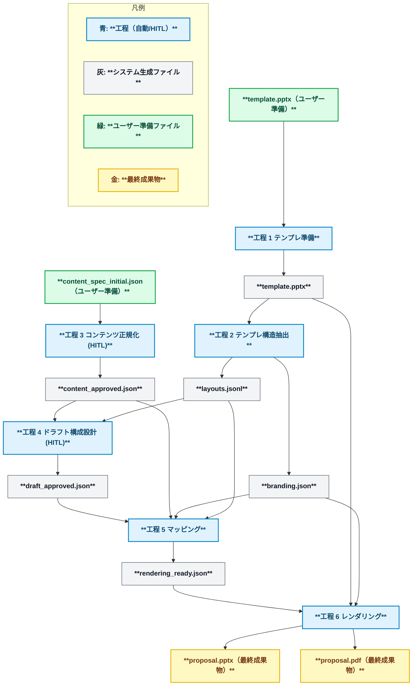

<p align="center">
  <picture>
    <source media="(prefers-color-scheme: dark)" srcset="assets/pptx_generator_logo_black.png">
    <source media="(prefers-color-scheme: light)" srcset="assets/pptx_generator_logo_white.png">
    
  </picture>
</p>


PowerPoint テンプレートと資料データ（プレーンテキストや PDF など）を取り込み、テンプレートに沿ったプレゼン資料を生成する CLI ツールです。

## 主な機能
- PPTX テンプレートからレイアウト構造とブランド設定を抽出し、再利用可能な プレゼン仕様 JSON を自動生成する。
- 資料データ（プレーンテキストや PDF など）とプレゼン仕様 JSON を取り込み、PPTX を生成し、必要に応じて LibreOffice 経由で PDF を併産する。

## アーキテクチャ概要
本プロジェクトは 6 工程で資料を生成します。詳細は `docs/design/design.md` を参照してください。

| 工程 | 実行主体 | 主な入力 | 主な成果物 | 概要 |
| --- | --- | --- | --- | --- |
| 1. テンプレ準備 | 自動＋HITL | 既存テンプレート資産 | テンプレートファイル、版管理ノート | ブランドごとの PPTX テンプレ資産を整備し、命名ルールを適用 |
| 2. テンプレ構造抽出 | 自動 | テンプレートファイル | レイアウト JSON、`branding.json` | テンプレからレイアウト構造 JSON と layout-style 定義を生成 |
| 3. コンテンツ正規化 | HITL | プレゼン仕様 JSON (`slides`) | `content_approved.json` | 入力データをスライド候補へ整形し、承認を行う |
| 4. ドラフト構成設計 | HITL | `content_approved.json` | `draft_approved.json` | 章立て・ページ順・`layout_hint` を確定し、承認を行う |
| 5. マッピング | 自動 | `draft_approved.json` | `rendering_ready.json` | レイアウト選定とプレースホルダ割付を行い、中間 JSON を生成 |
| 6. PPTX レンダリング | 自動 | `rendering_ready.json`、テンプレート、ブランド設定 | PPTX、PDF（任意）、`analysis.json`、`rendering_log.json`、`audit_log.json`、`review_engine_analyzer.json` | テンプレ適用と最終出力を生成し、整合チェックと監査メタを記録 |

工程 3・4 では人による承認（HITL）が必須です。AI レビューや承認フローの仕様は `docs/design/schema/README.md` と `docs/requirements/requirements.md` にまとめています。




### セットアップ
1. Python 3.12 系の仮想環境を用意し、有効化します。
2. 依存パッケージを同期します。
   ```bash
   uv sync
   ```
   - uv を未導入の場合は <https://docs.astral.sh/uv/getting-started/installation/> を参照してインストールしてください。
   - 権限エラーが発生する環境では `UV_CACHE_DIR=.uv-cache uv sync` を使用します。
3. CLI が動作することを確認します。
   ```bash
   uv run --help
   ```
4. LibreOffice を利用する場合は headless 実行を確認します（任意、PDF 変換機能を使う際に必要）。
   ```bash
   soffice --headless --version
   ```
5. Polisher や仕上げツールを利用する場合は .NET 8 SDK をインストールします（任意）。

## CLI チートシート

| 工程 | コマンド例 | 主な出力 | 補足 |
| --- | --- | --- | --- |
| 1. テンプレ準備 | `uv run pptx tpl-release --template samples/templates/templates.pptx --brand demo --version v1` | `.pptx/release/template_release.json` | テンプレ資産の受け渡しメタを作成 |
| 2. テンプレ構造抽出 | `uv run pptx tpl-extract --template samples/templates/templates.pptx`<br>`uv run pptx layout-validate --template samples/templates/templates.pptx --output .pptx/validation` | `.pptx/extract/template_spec.json`, `.pptx/extract/branding.json`, `.pptx/validation/layouts.jsonl` | テンプレ仕様とブランド設定を抽出し、レイアウト候補を検証 |
| 3. ブリーフ正規化 | `uv run pptx content samples/contents/sample_import_content_summary.txt --output .brief` | `.brief/brief_cards.json` ほか | ブリーフ入力を BriefCard に正規化し、ログとメタ情報を出力 |
| 4. ドラフト構成設計 | `uv run pptx outline samples/json/sample_jobspec.json --brief-cards .brief/brief_cards.json --brief-log .brief/brief_log.json --brief-meta .brief/ai_generation_meta.json` | `.pptx/draft/draft_approved.json` | BriefCard をもとに章立てとページ順を確定し、ドラフト成果物を出力 |
| 5. マッピング | `uv run pptx mapping samples/json/sample_jobspec.json --brief-cards .brief/brief_cards.json --brief-log .brief/brief_log.json --brief-meta .brief/ai_generation_meta.json --layouts .pptx/validation/layouts.jsonl --draft-output .pptx/draft --branding .pptx/extract/branding.json` | `.pptx/gen/rendering_ready.json` | ドラフト成果物を読み込みレイアウト割り付けとフォールバック制御を実施 |
| 4-5. ドラフト＋マッピング一括 | `uv run pptx compose samples/json/sample_jobspec.json`<br>`  --draft-output .pptx/draft --output .pptx/gen`<br>`  --template samples/templates/templates.pptx`<br>`  --brief-cards .brief/brief_cards.json --brief-log .brief/brief_log.json --brief-meta .brief/ai_generation_meta.json` | `.pptx/draft/draft_approved.json`, `.pptx/gen/rendering_ready.json` | 工程4と5を連続実行し、ドラフト成果物とマッピング成果物を同時更新 |
| 6. レンダリング | `uv run pptx render .pptx/gen/rendering_ready.json --template samples/templates/templates.pptx --branding .pptx/extract/branding.json` | `.pptx/gen/proposal.pptx`（`proposal.pdf` 任意） | `--export-pdf` で PDF も生成 |
| 工程3〜6 一括 | `uv run pptx gen samples/json/sample_jobspec.json --template samples/templates/templates.pptx --branding .pptx/extract/branding.json` | `.pptx/gen/proposal.pptx`（`proposal.pdf` 任意） | `.brief/` などブリーフ成果物を事前に用意した上でパイプライン後半を実行 |

補足資料: 要件は `docs/requirements/requirements.md`、アーキテクチャは `docs/design/design.md`、CLI 詳細は `docs/design/cli-command-reference.md`、運用メモは `docs/runbooks/` を参照してください。

CLI の詳細なオプションは各サブコマンドに対して `uv run pptx <cmd> --help` を参照してください。

## 工程別ガイド概要
ここでは各工程の目的と主要な参照ドキュメントをまとめます。詳細な手順やチェックリストはリンク先を参照してください。

> `pptx` ルートコマンドには `-v/--verbose`（INFO レベル）と `--debug`（DEBUG レベル）のログオプションがあります。生成AIモードのプロンプト／レスポンス詳細はこれらのオプションを付与した場合に出力されます。

### 工程 1: テンプレ準備
- テンプレ資産は `templates/` で管理し、命名規約や更新手順は `docs/policies/config-and-templates.md` を参照します。
- 自動検査ツール（命名整合性チェックなど）は設計中です。運用中は手動レビュー（HITL）を併用します。
- テンプレ受け渡しメタを生成する場合はテンプレリリース CLI を利用します。
   ```bash
   uv run pptx tpl-release \
     --template templates/libraries/<brand>/<version>/template.pptx \
     --brand <brand> \
     --version <version> \
     --baseline-release templates/releases/<brand>/<prev_version>/template_release.json \
     --golden-spec samples/json/sample_jobspec.json
   ```
   - 既定の出力先は `.pptx/release/` です。`template_release.json`（受け渡しメタ）や `release_report.json`（差分レポート）、`golden_runs/`（ゴールデンサンプル検証ログ）が保存されます。
   - `--baseline-release` で過去バージョンとの差分比較が可能です。`--golden-spec` を複数指定すると代表 spec でのレンダリング検証をまとめて実行します。

### 工程 2: テンプレ構造抽出
- テンプレート PPTX からレイアウトとアンカー情報を抽出し、`template_spec.json`（または `.yaml`）、`branding.json`、`jobspec.json` を生成します。
- `pptx tpl-extract` 実行時にレイアウト検証 (`layout-validate`) が自動実行され、同じ出力ディレクトリへ `layouts.jsonl` / `diagnostics.json`（比較時は `diff_report.json`）を保存します。
- 検証のみを個別に実施したい場合や出力先を分けたい場合は `pptx layout-validate` を直接利用します。
- 詳細ガイド: `docs/requirements/stages/stage-02-template-structure-extraction.md`

### 工程 3: ブリーフ正規化
- ブリーフ入力（Markdown / JSON など）を BriefCard モデルへ正規化し、工程4以降で利用する成果物を `.brief/` 配下に生成します。
- ガイドラインは `docs/requirements/stages/stage-03-content-normalization.md` を参照してください。
- 代表的な実行例:
  ```bash
  uv run pptx content samples/contents/sample_import_content_summary.txt \
    --output .brief
  ```
  - 生成物: `brief_cards.json`, `brief_log.json`, `brief_ai_log.json`, `ai_generation_meta.json`, `brief_story_outline.json`, `audit_log.json`
  - `--card-limit` で生成するカード枚数の上限を制御できます。
  - 旧 `content_approved.json` ベースのフローは廃止し、Brief 成果物を起点に工程4・5へ連携します。

### 工程 4: ドラフト構成設計
- 章立てやページ順を確定し、HITL で `draft_approved.json` を承認します。
- レイアウト選定の指針は `docs/requirements/stages/stage-04-draft-structuring.md` を参照してください。
- Brief 成果物からドラフト成果物を生成する場合は `pptx outline`（新名称）を利用します。
  ```bash
  uv run pptx outline samples/json/sample_jobspec.json \
    --brief-cards .brief/brief_cards.json \
    --brief-log .brief/brief_log.json \
    --brief-meta .brief/ai_generation_meta.json \
    --output .pptx/draft
  # `draft_draft.json` / `draft_approved.json` / `draft_meta.json` を確認
  ```
  - 工程4の更新と同時にマッピング成果物も再生成したい場合は、後述の `pptx compose` を利用すると工程4/5を連続実行できます。

### 工程 5: マッピング
- `draft_approved.json` を入力にレイアウトスコアリングとフォールバック制御を行い、`rendering_ready.json`・`mapping_log.json`・必要に応じて `fallback_report.json` を生成します。`mapping_log.json` には Analyzer 指摘サマリ（件数集計・スライド別詳細）が追加されており、補完やフォールバック制御の判断材料として活用します。詳細は `docs/requirements/stages/stage-05-mapping.md` と `docs/design/stages/stage-05-mapping.md` を参照してください。
- 実行手順:
  ```bash
  uv run pptx mapping samples/json/sample_jobspec.json \
    --brief-cards .brief/brief_cards.json \
    --brief-log .brief/brief_log.json \
    --brief-meta .brief/ai_generation_meta.json \
    --template samples/templates/templates.pptx
  # 完了後に `.pptx/gen/rendering_ready.json` や `mapping_log.json` を確認
  ```
- 工程4からの連続実行には `pptx compose` を利用できます。既存ドラフトを再承認した後、同コマンドを再実行すると `draft_*` と `rendering_ready.json` が一括で更新されます。
- `pptx gen` を実行した場合も内部で `mapping` → `render` が順に呼び出され、従来どおりの成果物を `.pptx/gen/` に保存します。

### 工程 6: PPTX レンダリング
- `pptx render` サブコマンドで `rendering_ready.json` を入力し、PPTX・`analysis.json`・Review Engine 連携ファイル（`review_engine_analyzer.json`）、必要に応じて PDF を生成します。
  ```bash
  # 工程5の成果物からレンダリングのみを再実行する例
  uv run pptx mapping samples/json/sample_jobspec.json --output .pptx/gen
  uv run pptx render .pptx/gen/rendering_ready.json \
    --template samples/templates/templates.pptx \
    --output .pptx/gen
  ```
- `pptx gen` を利用すると工程3〜6を一括実行できます。
- 詳細ガイド: `docs/requirements/stages/stage-06-rendering.md`

## 主な成果物
- 最終成果物（`proposal.pptx` や任意の `proposal.pdf`）および中間ファイルの一覧は `docs/design/design.md` を参照してください。

## 詳細コマンドリファレンス
- 6 工程パイプラインと各コマンドの責務・主要オプションは `docs/design/cli-command-reference.md` を参照してください。

## テスト・検証
- 全体テスト: `uv run --extra dev pytest`
- CLI 統合テストのみ: `uv run --extra dev pytest tests/test_cli_integration.py`
- テスト実行後は `.pptx/gen/` や `.pptx/extract/` の成果物を確認し、期待する PPTX／PDF／ログが生成されているかをチェックします。テスト方針の詳細は `tests/AGENTS.md` を参照してください。

## 設定リファレンス
| ファイル | 役割 | 変更時に参照するドキュメント |
| --- | --- | --- |
| `config/rules.json` | 文字数上限・段落レベル・禁止ワードなど検証ルールを定義 | `docs/policies/config-and-templates.md` |
| `config/branding.json` | フォント・配色・レイアウト個別設定を管理する `layout-style-v1` スキーマ | `config/AGENTS.md` |

テンプレ抽出やリリースの詳細な運用フローは `docs/design/cli-command-reference.md` および `docs/design/design.md` のテンプレ関連節を参照してください。

## 開発ガイドライン
- コントリビューション規約は `CONTRIBUTING.md` にまとめています。
- `docs/AGENTS.md`（ドキュメント更新ルール）や `src/AGENTS.md`（実装ガイド）を併読してください。
- 主な静的解析コマンド:
  ```bash
  uv tool run --package ruff ruff check .
  uv tool run --package black black --check .
  uv tool run --package mypy mypy src
  ```
- .NET 関連の整形は `dotnet format` を利用します。

## 参考ドキュメント
- `docs/design/design.md`: アーキテクチャ全体像
- `docs/design/schema/README.md`: 中間 JSON スキーマと AI レビュー仕様
- `docs/requirements/requirements.md`: ビジネス／機能要件
- `docs/requirements/stages/stage-0x-*.md`: 各工程の詳細要件
- `docs/notes/20251012-readme-refactor.md`: README リファクタリングの検討メモ
- `docs/roadmap/roadmap.md`: ロードマップとテーマ一覧

## ライセンス / サポート
- ライセンス: 社内利用を前提としており、公開ライセンスは未定です。
- 運用・問い合わせフローは `docs/runbooks/support.md` を参照してください。
