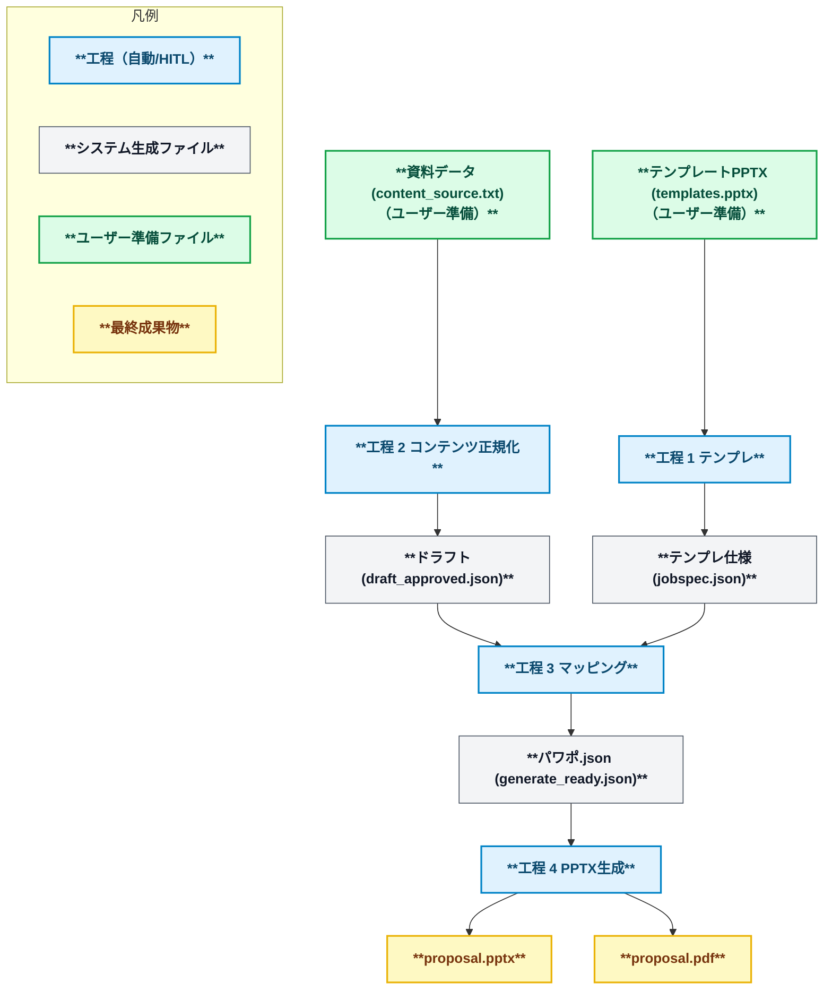

<p align="center">
  <picture>
    <source media="(prefers-color-scheme: dark)" srcset="assets/pptx_generator_logo_black.png">
    <source media="(prefers-color-scheme: light)" srcset="assets/pptx_generator_logo_white.png">
    
  </picture>
</p>


PowerPoint テンプレートと資料データ（プレーンテキストや PDF など）を取り込み、テンプレートに沿ったプレゼン資料を生成する CLI ツールです。

## 主な機能
- PPTX テンプレートからレイアウト構造とブランド設定を抽出し、再利用可能な プレゼン仕様 JSON を自動生成する。
- 資料データ（プレーンテキストや PDF など）とプレゼン仕様 JSON を取り込み、PPTX を生成し、必要に応じて LibreOffice 経由で PDF を併産する。

## アーキテクチャ概要
本プロジェクトは 4 工程で資料を生成します。詳細は `docs/design/design.md` を参照してください。

| 工程 | 入力 | 出力 | 主な出力先 | 概要 |
| --- | --- | --- | --- | --- |
| 1. テンプレ | テンプレートPPTX(`templates.pptx`) | テンプレ仕様(`jobspec.json`) | `.pptx/extract/` | テンプレ整備・抽出・検証・リリースをワンフローで実施し、後続工程の基盤データを用意 |
| 2. コンテンツ正規化 | 資料データ(text,PDFなど)、<br>テンプレ仕様(`jobspec.json`)  | ドラフト(`draft_approved.json`) | `.pptx/content/` | 入力データをスライド候補へ整形し、生成 AI を併用しながら承認を行う |
| 3. マッピング | テンプレ仕様(`jobspec.json`)、<br>ドラフト(`draft_approved.json`) | パワポ.json(`generate_ready.json`) | `.pptx/draft/` | 章構成承認とレイアウト割付をまとめて実施し、ドラフトとマッピング成果物を生成 |
| 4. PPTX生成 | パワポ生成input(`generate_ready.json`)  | `proposal.pptx`、`proposal.pdf` | `.pptx/gen/` | テンプレ適用と最終出力を生成し、整合チェックと監査メタを記録 |




### セットアップ
1. Python 3.12 系の仮想環境を用意し、有効化します。
2. 依存パッケージを同期します。
   ```bash
   uv sync
   ```
3. CLI が動作することを確認します。
   ```bash
   uv run --help
   ```
4. (任意)パワポのPDF出力を実施したい場合は、LibreOffice を導入し headless 実行を確認します。
   ```bash
   soffice --headless --version
   ```
5. (任意、基本不要)パワポの仕上げツールを利用する場合は .NET 8 SDK をインストールします。

## CLI チートシート

| 工程 | コマンド例 | 主な出力 | 補足 |
| --- | --- | --- | --- |
| 1. テンプレ工程 | `uv run pptx template samples/templates/templates.pptx --output .pptx/extract` | `.pptx/extract/template_spec.json`, `.pptx/extract/jobspec.json`, `.pptx/extract/branding.json`, `.pptx/extract/layouts.jsonl`, `.pptx/extract/diagnostics.json` | テンプレ抽出と検証を一括実行。`--with-release --brand demo --version v1` を付与すると `.pptx/release/template_release.json` などリリース成果物も生成 |
| 2. コンテンツ正規化 | `uv run pptx content .pptx/extract/jobspec.json --content-source samples/contents/sample_import_content.txt --output .pptx/content` | `.pptx/content/content_approved.json` | プレーンテキスト等の非構造化データを取り込み正規化 |
| 3. マッピング (HITL + 自動) | `uv run pptx compose .pptx/extract/jobspec.json --content-approved .pptx/content/content_approved.json --draft-output .pptx/draft --output .pptx/gen --template samples/templates/templates.pptx` | `.pptx/draft/draft_approved.json`, `.pptx/gen/rendering_ready.json`, `.pptx/gen/mapping_log.json` | 章構成承認とレイアウト割付をまとめて実行 |
| 4. レンダリング | `uv run pptx render .pptx/gen/rendering_ready.json --template samples/templates/templates.pptx --branding .pptx/extract/branding.json --output .pptx/gen --export-pdf` | `.pptx/gen/proposal.pptx`, `proposal.pdf`（任意） | 監査ログ・Analyzer 結果も同時に出力 |
| 工程2〜4 一括 | `uv run pptx gen .pptx/extract/jobspec.json --template samples/templates/templates.pptx --branding .pptx/extract/branding.json --output .pptx/gen` | `.pptx/gen/proposal.pptx`（`proposal.pdf` 任意） | コンテンツ正規化以降をまとめて実行 |

> テンプレ工程の個別サブコマンド（`tpl-extract` / `layout-validate` / `tpl-release`）や中間成果物の詳細は `docs/design/cli-command-reference.md` の「テンプレ工程詳細オプション」を参照してください。旧 `outline` / `mapping` の運用手順は `docs/runbooks/story-outline-ops.md` に整理しています。

補足資料: 要件は `docs/requirements/requirements.md`、アーキテクチャは `docs/design/design.md`、CLI 詳細は `docs/design/cli-command-reference.md`、運用メモは `docs/runbooks/` を参照してください。

CLI の詳細なオプションは各サブコマンドに対して `uv run pptx <cmd> --help` を参照してください。

## 工程別ガイド概要
ここでは各工程の目的と主要な参照ドキュメントをまとめます。詳細な手順やチェックリストはリンク先を参照してください。

> `pptx` ルートコマンドには `-v/--verbose`（INFO レベル）と `--debug`（DEBUG レベル）のログオプションがあります。生成AIモードのプロンプト／レスポンス詳細はこれらのオプションを付与した場合に出力されます。

### 工程 1: テンプレ工程
- テンプレ資産は `templates/` で管理し、命名規約や更新手順は `docs/policies/config-and-templates.md` を参照します。
- 抽出と検証は `uv run pptx template` で一括実行します。リリースメタが必要な場合は `--with-release --brand <brand> --version <ver>` を付与してください。
  ```bash
  uv run pptx template templates/libraries/<brand>/<version>/template.pptx \
    --output .pptx/extract/<brand>_<version> \
    --with-release --brand <brand> --version <version>
  ```
  - 既定の出力先は `.pptx/extract/` です。抽出成果物に加え、`--with-release` 指定時は `.pptx/release/` に `template_release.json` や `release_report.json` が生成されます。
- 個別コマンド（`tpl-extract` / `layout-validate` / `tpl-release`）やゴールデンサンプル運用は `docs/design/cli-command-reference.md` の「テンプレ工程詳細オプション」を参照してください。
- 要件と品質ゲートは `docs/requirements/stages/stage-01-template-pipeline.md` に集約しています。

### 工程 2: コンテンツ正規化
- `.pptx/extract/jobspec.json` を基に入力コンテンツをスライド候補へ整形し、HITL で `content_approved.json` を確定します。生成AIドラフトの作成やレビュー支援は `pptx content` コマンドで行い、生成AIモードが既定です。
- ガイドラインは `docs/requirements/stages/stage-02-content-normalization.md` を参照してください。
- `.pptx/content/` 配下に `content_draft.json`（生成AIモード時）、`content_ai_log.json`、`ai_generation_meta.json`、`spec_content_applied.json`、`content_meta.json` を出力します。
  ```bash
  uv run pptx content samples/contents/sample_import_content_summary.txt \
    --output .brief
  ```
  - 生成物: `brief_cards.json`, `brief_log.json`, `brief_ai_log.json`, `ai_generation_meta.json`, `brief_story_outline.json`, `audit_log.json`
  - `--card-limit` で生成するカード枚数の上限を制御できます。
  - 旧 `content_approved.json` ベースのフローは廃止し、Brief 成果物を起点に工程4・5へ連携します。

### 工程 3: マッピング (HITL + 自動)
- 章構成の承認とレイアウト割付を同一工程で扱い、`draft_approved.json` と `rendering_ready.json` を同時に更新します。
- 推奨コマンドは `pptx compose` で、HITL 差戻しや再実行時も一貫した出力ディレクトリ（`.pptx/draft` / `.pptx/gen`）を維持します。
- サブ工程（旧 `pptx outline` / `pptx mapping`）や差戻しログの取り扱いは `docs/requirements/stages/stage-03-mapping.md` と `docs/design/stages/stage-03-mapping.md` を参照してください。
  ```bash
  uv run pptx compose .pptx/extract/jobspec.json \
    --content-approved .pptx/content/content_approved.json \
    --draft-output .pptx/draft \
    --output .pptx/gen \
    --layouts .pptx/extract/layouts.jsonl \
    --template samples/templates/templates.pptx
  # 完了後に `.pptx/gen/rendering_ready.json` や `mapping_log.json` を確認
  ```
- 工程4からの連続実行には `pptx compose` を利用できます。既存ドラフトを再承認した後、同コマンドを再実行すると `draft_*` と `rendering_ready.json` が一括で更新されます。
- `pptx gen` を実行した場合も内部で `mapping` → `render` が順に呼び出され、従来どおりの成果物を `.pptx/gen/` に保存します。

### 工程 4: PPTX レンダリング
- `pptx render` サブコマンドで `rendering_ready.json` を入力し、PPTX／PDF（任意）と監査ログを生成します。
  ```bash
  # 工程5の成果物からレンダリングのみを再実行する例
  uv run pptx mapping samples/json/sample_jobspec.json --output .pptx/gen
  uv run pptx render .pptx/gen/rendering_ready.json \
    --template samples/templates/templates.pptx \
    --output .pptx/gen
  ```
- `pptx gen` を利用すると工程2〜4を一括実行できます。
- 詳細ガイド: `docs/requirements/stages/stage-04-rendering.md` と `docs/design/stages/stage-04-rendering.md`

## 主な成果物
- 最終成果物（`proposal.pptx` や任意の `proposal.pdf`）および中間ファイルの一覧は `docs/design/design.md` を参照してください。

## 詳細コマンドリファレンス
- 4 工程パイプラインと各コマンドの責務・主要オプションは `docs/design/cli-command-reference.md` を参照してください。

## テスト・検証
- 全体テスト: `uv run --extra dev pytest`
- CLI 統合テストのみ: `uv run --extra dev pytest tests/test_cli_integration.py`
- テスト実行後は `.pptx/gen/` や `.pptx/extract/` の成果物を確認し、期待する PPTX／PDF／ログが生成されているかをチェックします。テスト方針の詳細は `tests/AGENTS.md` を参照してください。

## 設定リファレンス
| ファイル | 役割 | 変更時に参照するドキュメント |
| --- | --- | --- |
| `config/rules.json` | 文字数上限・段落レベル・禁止ワードなど検証ルールを定義 | `docs/policies/config-and-templates.md` |
| `config/branding.json` | フォント・配色・レイアウト個別設定を管理する `layout-style-v1` スキーマ | `config/AGENTS.md` |

テンプレ抽出やリリースの詳細な運用フローは `docs/design/cli-command-reference.md` および `docs/design/design.md` のテンプレ関連節を参照してください。

## 開発ガイドライン
- コントリビューション規約は `CONTRIBUTING.md` にまとめています。
- `docs/AGENTS.md`（ドキュメント更新ルール）や `src/AGENTS.md`（実装ガイド）を併読してください。
- 主な静的解析コマンド:
  ```bash
  uv tool run --package ruff ruff check .
  uv tool run --package black black --check .
  uv tool run --package mypy mypy src
  ```
- .NET 関連の整形は `dotnet format` を利用します。

## 参考ドキュメント
- `docs/design/design.md`: アーキテクチャ全体像
- `docs/design/schema/README.md`: 中間 JSON スキーマと AI レビュー仕様
- `docs/requirements/requirements.md`: ビジネス／機能要件
- `docs/requirements/stages/stage-0x-*.md`: 各工程の詳細要件
- `docs/notes/20251012-readme-refactor.md`: README リファクタリングの検討メモ
- `docs/roadmap/roadmap.md`: ロードマップとテーマ一覧

## ライセンス / サポート
- ライセンス: 社内利用を前提としており、公開ライセンスは未定です。
- 運用・問い合わせフローは `docs/runbooks/support.md` を参照してください。
