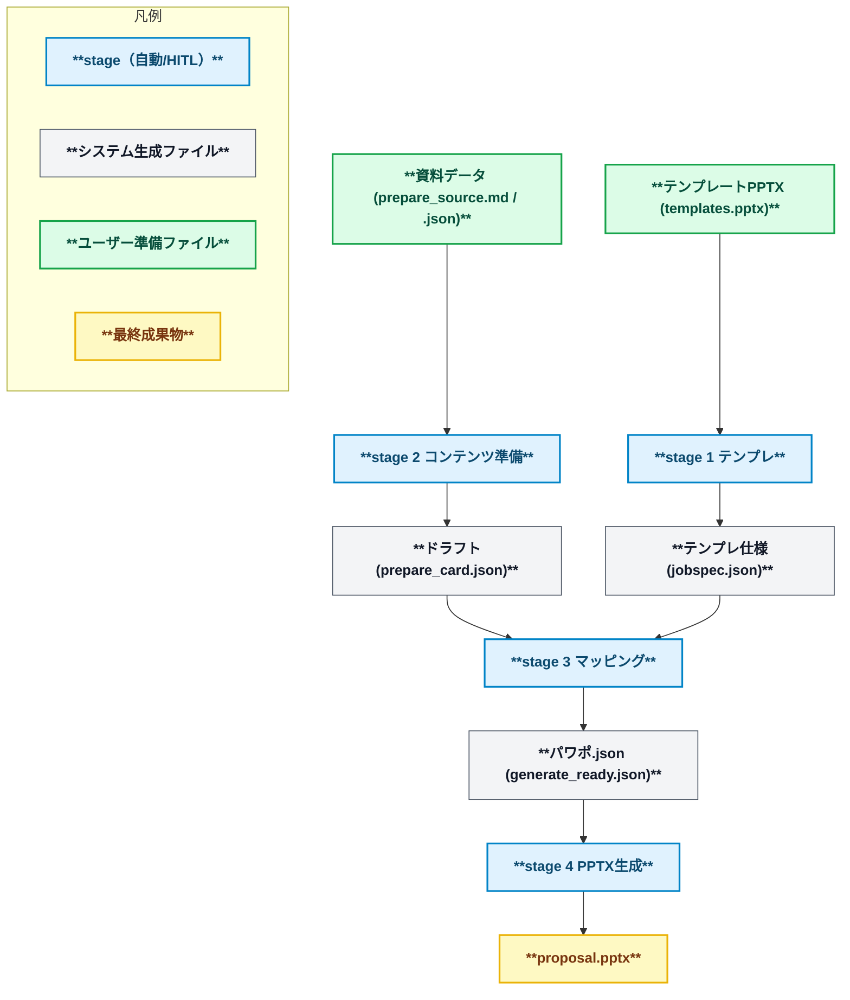
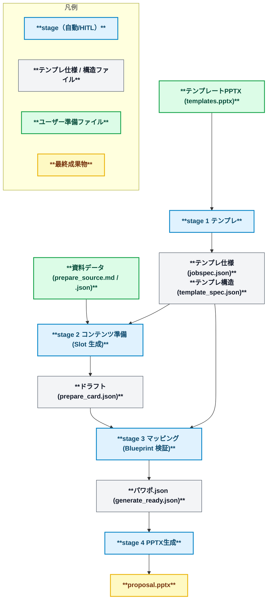

<div align="center">
  <p>
    <picture>
      <source media="(prefers-color-scheme: dark)" srcset="assets/pptx_generator_logo_black.png">
      <source media="(prefers-color-scheme: light)" srcset="assets/pptx_generator_logo_white.png">
      
    </picture>
  </p>

  <p>
    <a href="LICENSE"></a>
    <a href="https://github.com/yurake/pptx_generator/actions/workflows/ci.yml"></a>
    
  </p>

  <p>
    <a href="https://sonarcloud.io/project/overview?id=yurake_pptx_generator"></a>
    <a href="https://sonarcloud.io/project/overview?id=yurake_pptx_generator"></a>
    <a href="https://sonarcloud.io/project/issues?resolved=false&amp;id=yurake_pptx_generator&amp;types=BUG"></a>
    <a href="https://sonarcloud.io/project/issues?resolved=false&amp;id=yurake_pptx_generator&amp;types=VULNERABILITY"></a>
    <a href="https://sonarcloud.io/project/issues?resolved=false&amp;id=yurake_pptx_generator&amp;types=CODE_SMELL"></a>
  </p>

  <p>
    <a href="https://sonarcloud.io/project/overview?id=yurake_pptx_generator"></a>
    <a href="https://sonarcloud.io/project/overview?id=yurake_pptx_generator"></a>
    <a href="https://sonarcloud.io/project/overview?id=yurake_pptx_generator"></a>
    <a href="https://sonarcloud.io/project/overview?id=yurake_pptx_generator"></a>
  </p>

  <p>
  <a href="README.md"></a>
  <a href="README.zh.md"></a>
  <a href="README.en.md"></a>
  </p>

  <p>
  PowerPoint テンプレートと資料データ（プレーンテキストや PDF など）を取り込み、テンプレートに沿ったプレゼン資料を生成する CLI ツールです。
  </p>
</div>

## 概要
- テンプレート PPTX からレイアウト構造・ブランド設定を抽出し、再利用可能な仕様 JSON を生成します。
- 抽出した仕様と資料データを組み合わせ、監査ログ付きの PPTX／PDF を生成します（LibreOffice を利用することで PDF 変換も可能）。

## クイックスタート
1. Python 3.12 系の仮想環境を用意し、`uv sync` で依存を同期する。
2. `uv run --help` を実行して CLI エントリーポイントが利用可能であることを確認する。
3. 生成パイプラインを実行する。

## 生成パイプライン概要
### 動的生成 (dynamic mode)
テンプレートから抽出したレイアウト情報を使い、資料データを仮スライドにまとめ、コンテンツの順番や配置を調整しながら何度でも出し直せる柔軟なモードです。資料データから柔軟にスライドを作成したい場合に向きます。


```mermaid
flowchart TD
  %% ======= Styles =======
  classDef stage fill:#e0f2fe,stroke:#0284c7,stroke-width:2px,color:#0c4a6e,font-weight:bold;
  classDef file fill:#f3f4f6,stroke:#4b5563,stroke-width:1px,color:#111827,font-weight:bold;
  classDef userfile fill:#dcfce7,stroke:#16a34a,stroke-width:2px,color:#064e3b,font-weight:bold;
  classDef final fill:#fef9c3,stroke:#eab308,stroke-width:2px,color:#78350f,font-weight:bold;

  %% ======= Stage 1 =======
  Tmpl["**テンプレートPPTX (templates.pptx)**"]:::userfile --> S1["**stage 1 テンプレ**"]:::stage
  S1 --> Jobspec["**テンプレ仕様(jobspec.json)**"]:::file

  %% ======= Stage 2 =======
  Prepare["**資料データ (prepare_source.md / .json)**"]:::userfile --> S2["**stage 2 コンテンツ準備**"]:::stage
  S2 --> PrepareCards["**ドラフト(prepare_card.json)**"]:::file
  PrepareCards --> S3

  %% ======= Stage 3 =======
  S3["**stage 3 マッピング**"]:::stage
  Jobspec --> S3
  S3 --> Ready["**パワポ.json (generate_ready.json)**"]:::file

  %% ======= Stage 4 =======
  Ready --> S4["**stage 4 PPTX生成**"]:::stage
  S4 --> PPTX["**proposal.pptx**"]:::final

  %% ======= Legend =======
  subgraph Legend[凡例]
    direction LR
    A1["**stage（自動/HITL）**"]:::stage
    A2["**システム生成ファイル**"]:::file
    A3["**ユーザー準備ファイル**"]:::userfile
    A4["**最終成果物**"]:::final
  end
```

| stage | 概要 | コマンド例 |
| --- | --- | --- |
| 1. テンプレ | テンプレート PPTX を抽出・検証し、`jobspec.json` などの基盤データを `.pptx/template/` に出力 | `uv run pptx template samples/templates/templates.pptx --mode dynamic` |
| 2. コンテンツ準備 | 入力資料を仮スライドへ正規化し、AI ログや監査情報付きのドラフトを生成 | `uv run pptx prepare samples/input/pitch.md` |
| 3. マッピング | HITL 承認とレイアウト割り当てを行い、`.pptx/compose/generate_ready.json` を作成 | `uv run pptx compose .pptx/template/jobspec.json --prepare-cards .pptx/prepare/prepare_card.json` |
| 4. PPTX 生成 | `generate_ready.json` を用いて PPTX／PDF と監査ログを出力 | `uv run pptx gen .pptx/compose/generate_ready.json` |

### 静的生成 (static mode)
テンプレートで決めたスライド構造に合わせて資料データを自動で割り当てて仕上げるモードです。スライドの配置やルールが決まっているケースで役立ちます。

静的モードで登場する構造は下記のような階層になっています。

```
Blueprint（テンプレ全体の設計図）
└─ Slide（スライドごとの枠組み）
    └─ Slot（コンテンツ差し込み枠）
```


```mermaid
flowchart TD
  %% ======= Styles =======
  classDef stage fill:#e0f2fe,stroke:#0284c7,stroke-width:2px,color:#0c4a6e,font-weight:bold;
  classDef file fill:#f3f4f6,stroke:#4b5563,stroke-width:1px,color:#111827,font-weight:bold;
  classDef userfile fill:#dcfce7,stroke:#16a34a,stroke-width:2px,color:#064e3b,font-weight:bold;
  classDef final fill:#fef9c3,stroke:#eab308,stroke-width:2px,color:#78350f,font-weight:bold;

  %% ======= Stage 1 =======
  TmplStatic["**テンプレートPPTX (templates.pptx)**"]:::userfile --> S1Static["**stage 1 テンプレ**"]:::stage
  S1Static --> SpecStatic["**テンプレ仕様(jobspec.json)**<br/>**テンプレ構造(template_spec.json)**"]:::file

  %% ======= Stage 2 =======
  PrepareStatic["**資料データ (prepare_source.md / .json)**"]:::userfile --> S2Static["**stage 2 コンテンツ準備 (Slot 生成)**"]:::stage
  SpecStatic --> S2Static
  S2Static --> PrepareCardsStatic["**ドラフト(prepare_card.json)**"]:::file
  PrepareCardsStatic --> S3Static

  %% ======= Stage 3 =======
  S3Static["**stage 3 マッピング (Blueprint 検証)**"]:::stage
  SpecStatic --> S3Static
  S3Static --> ReadyStatic["**パワポ.json (generate_ready.json)**"]:::file

  %% ======= Stage 4 =======
  ReadyStatic --> S4Static["**stage 4 PPTX生成**"]:::stage
  S4Static --> PPTXStatic["**proposal.pptx**"]:::final

  %% ======= Legend =======
  subgraph LegendStatic[凡例]
    direction LR
    B1["**stage（自動/HITL）**"]:::stage
    B2["**テンプレ仕様 / 構造ファイル**"]:::file
    B3["**ユーザー準備ファイル**"]:::userfile
    B4["**最終成果物**"]:::final
  end
```

| stage | 概要 | コマンド例 |
| --- | --- | --- |
| 1. テンプレ | Blueprint 情報とあわせて `.pptx/template/prompts/`（プロンプト雛形）と `.pptx/slide_inputs.md`（スライド入力マニフェスト）を出力 | `uv run pptx template samples/templates/templates.pptx --mode static` |
| 2. コンテンツ準備 | 雛形 (`.pptx/template/prompts/01_*.md`) と入力マニフェスト (`.pptx/slide_inputs.md`) を編集し、必要なら `<data file path>` を省略して Blueprint の Slot 定義に沿って仮スライドを整形 | `uv run pptx prepare --mode static` |
| 3. マッピング | Slot 充足状況を検証しつつ `generate_ready.json` を生成 | `uv run pptx compose .pptx/template/jobspec.json --static` |
| 4. PPTX 生成 | 固定レイアウトで PPTX／PDF を出力 | `uv run pptx gen .pptx/compose/generate_ready.json` |

- 静的テンプレートでは `external/<template_id>/hooks.json` を用意すると Stage ごとの処理を外部フックへ委譲できます。導入・運用手順は `external/README.md`、作業指針は `external/AGENTS.md` を参照してください。詳細な設定例や渡される環境変数は `docs/design/stages/` の各ステージドキュメントを参照してください。

各 stage の CLI コマンドと主要オプションは `docs/design/cli/cli-command-reference.md`。

## テスト
- テスト実行:
  ```bash
  uv run --extra dev pytest
  ```
- テスト後は `.pptx/compose/` や `.pptx/gen/` などの出力ディレクトリを確認し、期待する成果物が生成されたかをチェックしてください。
- 詳細なテスト方針は `tests/AGENTS.md` を参照してください。

## ドキュメントガイド
- `AGENTS.md`: コーディングエージェントが守るべき共通ルールと関連ドキュメントへのリンク。
- `docs/README.md`: `docs/` 配下のカテゴリと詳細資料への導線。
- `docs/requirements/requirements.md`: 現行のビジネス／機能要件。
- `docs/design/design.md`: 4 stage パイプラインや主要コンポーネントの設計概要。
- `docs/runbooks/runbooks.md`: 運用・リリース・トラブル対応などの手順書。
- `docs/policies/policies.md`: ポリシードキュメント全体の更新手順と参照順をまとめた索引。
- `tests/AGENTS.md`: テスト階層ごとの追加ルールとケース設計の指針。

## サポートと問い合わせ
- リリース・サポート・ストーリー骨子運用など、個別の手順は `docs/runbooks/` 配下を参照してください。

## ライセンス
- 本プロジェクトは MIT License の下で提供されています。詳細は `LICENSE` を参照してください。
