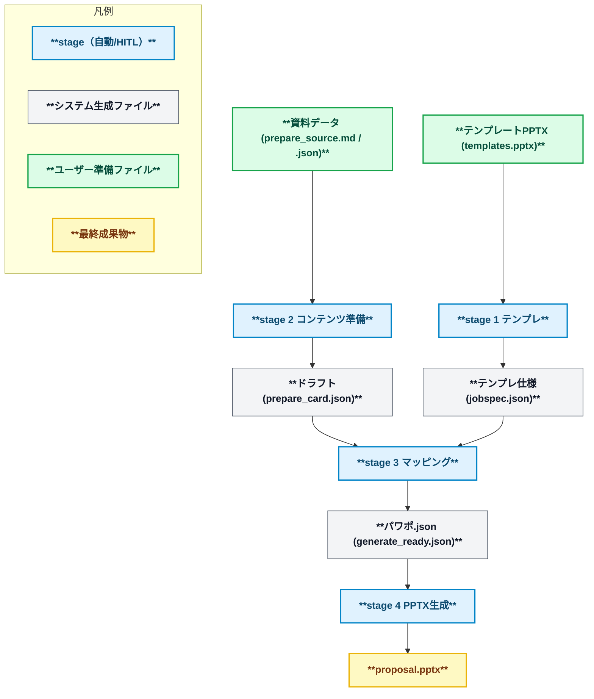
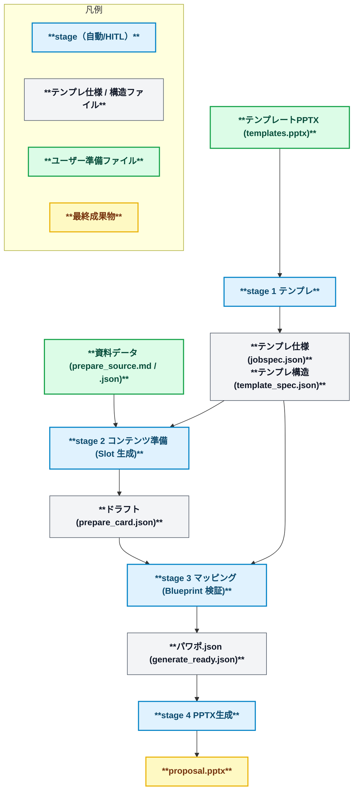

<div align="center">
  <p>
    <picture>
      <source media="(prefers-color-scheme: dark)" srcset="docs/assets/background_black.png">
      <source media="(prefers-color-scheme: light)" srcset="docs/assets/background_white.png">
      
    </picture>
  </p>

<p>
  <a href="LICENSE"></a>
  <a href="https://github.com/yurake/pptx_generator/actions/workflows/ci.yml"></a>
  
</p>

  <p>
    <a href="https://sonarcloud.io/project/overview?id=yurake_pptx_generator"></a>
    <a href="https://sonarcloud.io/project/overview?id=yurake_pptx_generator"></a>
    <a href="https://sonarcloud.io/project/issues?resolved=false&amp;id=yurake_pptx_generator&amp;types=BUG"></a>
    <a href="https://sonarcloud.io/project/issues?resolved=false&amp;id=yurake_pptx_generator&amp;types=VULNERABILITY"></a>
    <a href="https://sonarcloud.io/project/issues?resolved=false&amp;id=yurake_pptx_generator&amp;types=CODE_SMELL"></a>
  </p>

<p>
  <a href="https://sonarcloud.io/project/overview?id=yurake_pptx_generator"></a>
  <a href="https://sonarcloud.io/project/overview?id=yurake_pptx_generator"></a>
  <a href="https://sonarcloud.io/project/overview?id=yurake_pptx_generator"></a>
  <a href="https://sonarcloud.io/project/overview?id=yurake_pptx_generator"></a>
</p>

<p>
<a href="README.md"></a>
<a href="README.zh.md"></a>
<a href="README.en.md"></a>
</p>

  <p>
  这是一个 CLI 工具，用于导入 PowerPoint 模板和资料数据（纯文本、PDF 等），并按模板生成演示文稿。
  </p>
</div>

## 概述
- 从模板 PPTX 中提取布局结构和品牌设定，生成可重复使用的规格 JSON。
- 将提取的规格与资料数据结合，生成带有审计日志的 PPTX/PDF（可使用 LibreOffice 进行 PDF 转换）。

## 快速入门
1. 为 Python 3.12 系的虚拟环境做好准备，并使用 `uv sync` 同步依赖项。
2. 执行 `uv run --help` 以确认 CLI 入口点可用。
3. 运行生成流水线。

## 生成管线概览
### 动态生成 (dynamic mode)
使用从模板中提取的布局信息，将资料数据整理成临时幻灯片，并在调整内容的顺序和排布的同时，可以多次重新输出的灵活模式。适合希望从资料数据灵活地创建幻灯片的场景。



| 阶段 | 概述 | 命令示例 |
| --- | --- | --- |
| 1. 模板 | 提取并验证模板 PPTX，将 `jobspec.json` 等基础数据输出到 `.pptx/template/` 目录 | `uv run pptx template samples/templates/templates.pptx --mode dynamic` |
| 2. 内容准备 | 将输入资料规范化为临时幻灯片，并生成包含 AI 日志和审计信息的草稿 | `uv run pptx prepare samples/input/pitch.md` |
| 3. 映射 | 进行 HITL 审核与布局分配，生成 `.pptx/compose/generate_ready.json` | `uv run pptx compose .pptx/template/jobspec.json --prepare-cards .pptx/prepare/prepare_card.json` |
| 4. PPTX 生成 | 使用 `generate_ready.json` 输出 PPTX、PDF 及审计日志 | `uv run pptx gen .pptx/compose/generate_ready.json` |

### 静态生成 (static mode)
按照模板确定的幻灯片结构，自动分配资料数据并完成制作的模式。适用于幻灯片排布和规则已确定的场景。

在静态模式中出现的结构具有如下层次结构。

```
Blueprint（テンプレ全体の設計図）
└─ Slide（スライドごとの枠組み）
    └─ Slot（コンテンツ差し込み枠）
```



| 阶段 | 概要 | 命令示例 |
| --- | --- | --- |
| 1. 模板 | 与 Blueprint 信息一起输出 `.pptx/template/prompts/`（提示模板）和 `.pptx/slide_inputs.md`（幻灯片输入清单） | `uv run pptx template samples/templates/templates.pptx --mode static` |
| 2. 内容准备 | 编辑模板 (`.pptx/template/prompts/01_*.md`) 与输入清单 (`.pptx/slide_inputs.md`)，如有必要省略 `<数据文件路径>`，并按照 Blueprint 的 Slot 定义整理临时幻灯片 | `uv run pptx prepare --mode static` |
| 3. 映射 | 在验证 Slot 满足情况的同时生成 `generate_ready.json` | `uv run pptx compose .pptx/template/jobspec.json --static` |
| 4. PPTX 生成 | 以固定布局输出 PPTX / PDF | `uv run pptx gen .pptx/compose/generate_ready.json` |

- 在静态模板中，准备好 `external/<template_id>/hooks.json` 即可将各阶段的处理委托给外部钩子。请参考 `external/README.md` 了解引入与运维步骤；请参考 `external/AGENTS.md` 了解工作指引。有关详细的设定示例和传入的环境变量，请参考 `docs/design/stages/` 下的各阶段文档。

各阶段的 CLI 命令及主要选项，请参阅 `docs/design/cli/cli-command-reference.md`。

## 测试
- 测试执行:
  ```bash
  uv run --extra dev pytest
  ```
- 测试完成后，请检查输出目录，如 `.pptx/compose/`、`.pptx/gen/` 等，确保已生成期望的产物。
- 请参考 `tests/AGENTS.md` 了解详细的测试方针。

## 文档指南
- `AGENTS.md`: 编码代理应遵守的通用规则及相关文档链接。
- `docs/README.md`: `docs/` 下的分类与详细资料入口。
- `docs/requirements/requirements.md`: 当前的业务/功能需求。
- `docs/design/design.md`: 四阶段流水线和主要组件的设计概述。
- `docs/runbooks/runbooks.md`: 运维、发布、故障排除等的操作手册。
- `docs/policies/policies.md`: 政策文档整体的更新流程与参考顺序的索引。
- `tests/AGENTS.md`: 按测试层级的附加规则与测试用例设计指南。

## 支持与咨询
- 发布、支持、故事骨架运维等，个别步骤请参考位于 `docs/runbooks/` 下的内容。

## 许可证
- 本项目基于 MIT License 提供。具体请参阅 `LICENSE`。
