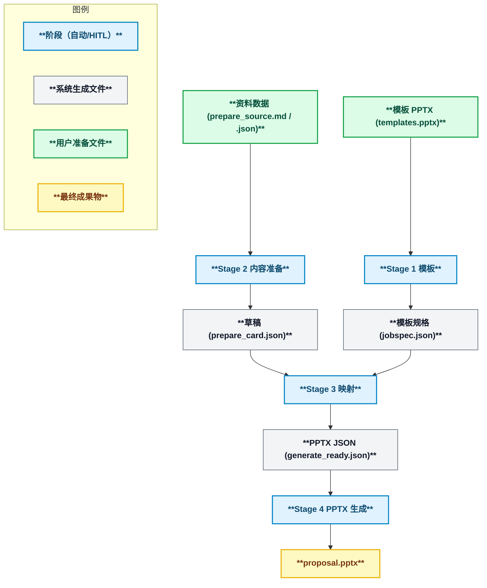
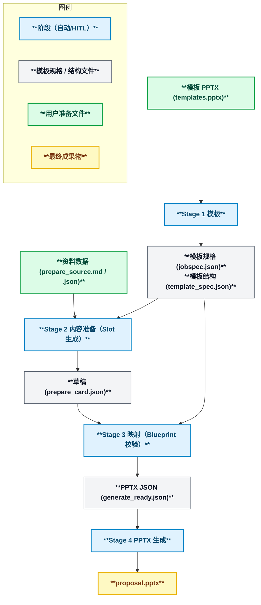

<div align="center">
  <p>
    <picture>
      <source media="(prefers-color-scheme: dark)" srcset="assets/pptx_generator_logo_black.png">
      <source media="(prefers-color-scheme: light)" srcset="assets/pptx_generator_logo_white.png">
      
    </picture>
  </p>

  <p>
    <a href="LICENSE"></a>
    <a href="https://github.com/yurake/pptx_generator/actions/workflows/ci.yml"></a>
    
  </p>

  <p>
    <a href="https://sonarcloud.io/project/overview?id=yurake_pptx_generator"></a>
    <a href="https://sonarcloud.io/project/overview?id=yurake_pptx_generator"></a>
    <a href="https://sonarcloud.io/project/issues?resolved=false&amp;id=yurake_pptx_generator&amp;types=BUG"></a>
    <a href="https://sonarcloud.io/project/issues?resolved=false&amp;id=yurake_pptx_generator&amp;types=VULNERABILITY"></a>
    <a href="https://sonarcloud.io/project/issues?resolved=false&amp;id=yurake_pptx_generator&amp;types=CODE_SMELL"></a>
  </p>

  <p>
    <a href="https://sonarcloud.io/project/overview?id=yurake_pptx_generator"></a>
    <a href="https://sonarcloud.io/project/overview?id=yurake_pptx_generator"></a>
    <a href="https://sonarcloud.io/project/overview?id=yurake_pptx_generator"></a>
    <a href="https://sonarcloud.io/project/overview?id=yurake_pptx_generator"></a>
  </p>

  <p>
  <a href="README.md"></a>
  <a href="README.zh.md"></a>
  <a href="README.en.md"></a>
  </p>

  <p>
  这是一个 CLI 工具，用于导入 PowerPoint 模板和资料数据（纯文本或 PDF 等），并按模板生成演示文稿。
  </p>
</div>

## 概述
- 从模板 PPTX 提取布局结构与品牌设置，生成可重用的规格 JSON。
- 将提取的规格与资料数据结合，生成带审计日志的 PPTX/PDF（可通过 LibreOffice 将其转换为 PDF）。

## 快速开始
1. 准备一个 Python 3.12 系的虚拟环境，并使用 `uv sync` 同步依赖。
2. 执行 `uv run --help`，以确认 CLI 入口点可用。
3. 运行生成流水线。

## 生成流水线概览
### 动态生成（dynamic mode）
使用从模板中提取的布局信息，将资料数据整理成临时幻灯片，在调整内容的顺序和排布的同时，可以多次重新生成，是一种灵活的模式。适合希望从资料数据灵活地创建幻灯片的场景。



| 阶段 | 概述 | 命令示例 |
| --- | --- | --- |
| 1. 模板 | 模板 PPTX 的提取与验证，并将 `jobspec.json` 等基础数据输出到 `.pptx/extract/` | `uv run pptx template samples/templates/templates.pptx --layout-mode dynamic` |
| 2. 内容准备 | 将输入资料规范化为临时幻灯片，并生成带有 AI 日志和审计信息的草稿 | `uv run pptx prepare samples/input/pitch.md` |
| 3. 映射 | 进行 HITL 批准和布局分配，并创建 `.pptx/compose/generate_ready.json` | `uv run pptx compose .pptx/extract/jobspec.json --prepare-cards .pptx/prepare/prepare_card.json` |
| 4. PPTX 生成 | 使用 `generate_ready.json` 输出 PPTX/PDF 与审计日志 | `uv run pptx gen .pptx/compose/generate_ready.json` |

### 静态生成 (static mode)
这是根据模板设定的幻灯片结构自动分配资料数据并完成排版的模式。在幻灯片的布局和规则已确定的场景中非常有用。



| 阶段 | 概述 | 命令示例 |
| --- | --- | --- |
| 1. 模板 | 与 Blueprint 信息一起输出 `.pptx/extract/prompts/`（提示词模板）和 `.pptx/slide_inputs.md`（幻灯片输入清单） | `uv run pptx template samples/templates/templates.pptx --layout-mode static` |
| 2. 内容准备 | 模板 (`.pptx/extract/prompts/01_*.md`) 与输入清单 (`.pptx/slide_inputs.md`) 进行编辑；如有需要，可以省略 `<data file path>`，并按照 Blueprint 的 slot 定义整理占位幻灯片 | `uv run pptx prepare --mode static` |
| 3. 映射 | 在验证 slot 的充足情况的同时，生成 `generate_ready.json` | `uv run pptx compose .pptx/extract/jobspec.json --static` |
| 4. PPTX 生成 | 在固定布局下输出 PPTX/PDF | `uv run pptx gen .pptx/compose/generate_ready.json` |

各阶段的 CLI 命令和主要选项是 `docs/design/cli/cli-command-reference.md`。

## 测试
- 测试执行：
  ```bash
  uv run --extra dev pytest
  ```
- 测试完成后，请检查 `.pptx/compose/`、`.pptx/gen/` 等输出目录，确认是否生成了预期的产物。
- 详细的测试方针请参考 `tests/AGENTS.md`。

## 文档指南
- `AGENTS.md`: 编码代理应遵守的通用规则及相关文档链接。
- `docs/README.md`: `docs/` 下的分类与详细资料导航。
- `docs/requirements/requirements.md`: 当前的业务与功能需求。
- `docs/design/design.md`: 四阶段流水线及主要组件的设计概览。
- `docs/runbooks/runbooks.md`: 运维、发布、故障处理等的操作手册。
- `docs/policies/policies.md`: 策略文档整体的更新步骤及引用顺序的索引。
- `tests/AGENTS.md`: 各测试层级的附加规则与用例设计指南。

## 技术支持与咨询
- 有关发布、支持、故事骨架的运用等具体步骤，请参考位于 `docs/runbooks/` 下的内容。

## 许可证
- 本项目在 MIT License 下提供。详情请参阅 `LICENSE`。
