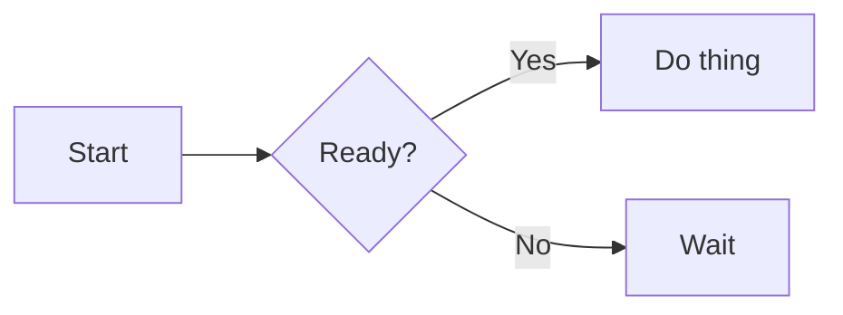

# README Mermaid 自動レンダリング検討メモ（2025-11-05）

## 背景
- README.md の `mermaid` フローチャートを手書き風スタイルへ変換し、PNG を掲載したい。
- Mermaid ブロックを更新した際に画像も自動更新されるよう GitHub Actions でレンダリングを行いたい。

## 対応方針
- Mermaid の hand-drawn スタイルを利用し、Mermaid CLI (`mmdc`) で PNG を生成する。
- README 内の `mermaid` コードブロックを検出して生成画像を挿入するスクリプトを作成する。
- `diagrams/` ディレクトリを新設し、ソース `.mmd`・設定・生成物を整理する。
- GitHub Actions で README や `.mmd` が更新された際に自動レンダリング → 差分コミットを実施する。
- 将来的に draw.io へ置き換える場合にも対応しやすい構成にする。

## フォルダ構成案
```
pptx_generator/
├─ README.md
├─ diagrams/
│  ├─ mermaid/               # Mermaid ソース (.mmd)
│  │  ├─ flow.mmd
│  │  └─ architecture.mmd
│  ├─ config/
│  │  └─ mermaid.config.json # handDrawn 等の共通設定
│  └─ manifests/             # 生成物のメタ情報（ハッシュ等）
├─ assets/
│  ├─ diagrams/
│  │  ├─ png/
│  │  │  ├─ flow.png
│  │  │  └─ architecture.png
│  │  └─ svg/                # 必要であれば SVG を保持
├─ scripts/
│  └─ render_mermaid.py      # 一括レンダリング + README 更新スクリプト
├─ .github/workflows/
│  └─ render-mermaid.yml     # GitHub Actions のワークフロー
├─ .gitignore                # 不要生成物を除外
└─ Makefile                  # ローカル確認用コマンド
```

## 自動レンダリングの流れ
1. `scripts/render_mermaid.py` が `diagrams/mermaid/*.mmd` を走査し、Mermaid CLI で `assets/diagrams/png/*.png`（必要なら SVG も）を生成する。
2. README 内に配置したマーカー `<!-- AUTO-DIAGRAM: diagrams/mermaid/<name>.mmd -->` を検出し、マーカー直下に `.png" …>` を挿入または更新する。
3. GitHub Actions（`render-mermaid.yml`）が README や `.mmd`、設定ファイルが変更された際に実行され、差分があれば自動コミットする。
4. ローカルでも `make diagrams`（Mermaid CLI 事前インストール）で同じ生成処理を再現可能とする。

## Mermaid 設定例（handDrawn スタイル）
```json
{
  "look": "handDrawn",
  "handDrawnSeed": 1,
  "theme": "forest",
  "themeVariables": {
    "fontFamily": "ui-sans-serif, system-ui, -apple-system, Segoe UI, Roboto, Helvetica, Arial"
  }
}
```
- `handDrawnSeed` を固定することでランダム揺らぎを一定にし、差分ノイズを抑制する。
- 色やフォントは必要に応じて `themeVariables` で調整する。

## README へのマーカー例
```markdown


<!-- AUTO-DIAGRAM: diagrams/mermaid/flow.mmd -->
```

## GitHub Actions 概要
- Mermaid CLI / Python をセットアップし、`scripts/render_mermaid.py` を実行する。
- 差分が発生した場合のみ自動コミット（コミットメッセージ例：`chore(diagram): auto-render mermaid (hand-drawn) & update README`）。
- 対象ファイルは `.mmd`、`mermaid.config.json`、`scripts/`、`README.md` の変更とする。

## 今後の検討事項
- draw.io（diagrams.net）の Sketch モードによる出力に切り替える場合は GUI 依存のため CI 実装が難しく、Docker + Xvfb 等の追加検討が必要。
- 生成 PNG を SVG 化する、または CDN で配信する等の拡張は別途検討する。
- Mermaid ブロックが多数ある場合のビルド時間や差分検知の最適化。
