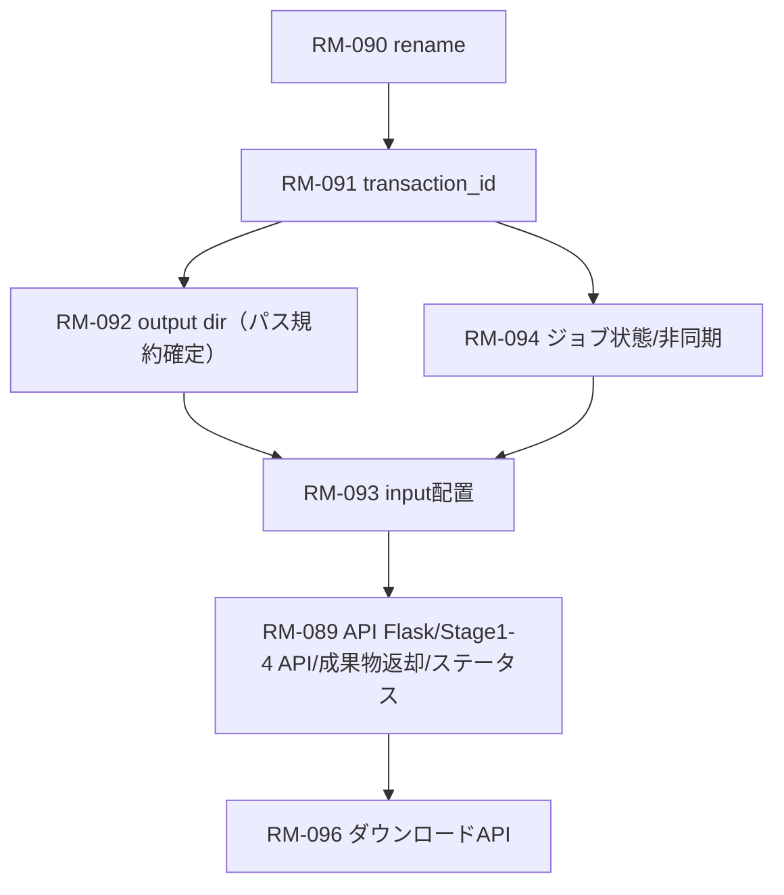

# 依存関係

- 1（execution_id→job_idリネーム）は全タスクの前提。まず完了させる。
- 2（transaction_id導入）は 3/4/5 の前提。job_id とセットで扱うため 1 完了後に着手。
- 3（output dir統一）は 2 に依存（tx/job をパスに含める）。1完了後に、2と並行で進められるがパス規約は合意してから着手。
- 4（input配置）は 2/3 に依存（tx/jobキーと入出力ルート）。3完了後に着手。
- 5（ジョブ状態モデル＋非同期化）は 2 に依存（tx/jobキーで状態追跡）。3との直接依存は低いが成果物参照で揃えるのが望ましい。設計は 2 完了後に並行開始可、実装は 2/3 を揃えた上で進行。
- RM-089（Flask + Stage1-4 API 実装・gen成果物返却・ステータスAPI）は 1/2 を前提とし、3/4/5 と整合を取る。ダウンロードAPI（RM-096）は RM-089 完了後に着手。


### RM-089（Web API化）元の対応予定と依存
- Stage1-4 の API 提供（templates/prepare/compose/gen）と最小フロー確立（Flask への移植を含む）。
- gen で成果物（pptx/pdf）返却。
- ステータス問い合わせ/API（将来の非同期対応を見越す）。
依存: 1（rename）→2（transaction_id）→3（output dir）→4（input配置）、5（状態モデル/非同期）で仕上げ、ダウンロードAPI（RM-096）は RM-089 完了後に着手する想定。  
開発並行性: 1 を最優先で完了させ、2 完了後に 3/5 を並行で進め、4 は 2/3 揃った後に着手。RM-096 は RM-089 の API 基盤ができてから。

# 1. rename RM-090
## RM-089 Web化インタフェース検討ログ（生ログ）
User: rmやtodoは後ほど 仕様の検討を一緒にして欲しい  
Assistant: プランを用意しました。承認いただければ議論を進めます。  
（Plan: 1) 前提確認 2) 要件抽出とギャップ仮説 3) 論点提示）  
User: 全てのstageに影響 / 検討したものをdocs/notesに残しつつ、新規rmを起票 / 期限は前提なし  
Assistant: Plan 更新（上記ステップ継続）  
User: 1. UX改善 2. 前提を整理したいので、-mode static で動かすときの4 stage のcliのexampleを教えて  
Assistant: `--mode static` で 4 stage を通す最小 CLI 例（サンプル資産前提）  
- Stage1: `uv run pptx template samples/templates/templates.pptx --mode static --output .pptx/template`（jobspec/template_spec/prompt/slide_inputs.md 生成）  
- Stage2: `.pptx/template/prompts/*` の `<<<user-editable:*>` を必要なら編集、`.pptx/slide_inputs.md` を埋める → `uv run pptx prepare --mode static --jobspec .pptx/template/jobspec.json --output .pptx/prepare`（slide_inputs 全埋めなら PREPARE_PATH 省略可）  
- Stage3: `uv run pptx compose .pptx/template/jobspec.json --prepare-cards .pptx/prepare/prepare_card.json --output .pptx/compose`  
- Stage4: `uv run pptx gen .pptx/compose/generate_ready.json --output .pptx/gen --export-pdf --emit-structure-snapshot`  
補足: static は jobspec.meta.template_path/layouts_path 必須、--page-limit 併用不可。PDF/Polisher は必要に応じてパス指定。  
User: rm089でstage1-4のweb化を検討している。現状cliの場合は --jobspec や 位置引数で jobspec.jsonやgenerate_ready.jsonを渡すことで、前回の内容を引き継いでいる。web化した場合にhttpのレスポンスに上記と同様にファイルのパスを返して、ユーザーに次のstageのrequest inputに同様にパスを入れてもらうのはIFとして本当に正しい姿なのかが疑問  
Assistant: ファイルパスをHTTPレスポンスで返し次リクエストに渡させるIFは避ける理由を提示（環境依存・権限/マルチテナント不整合・スケールアウト/リトライ非対応・UX悪化）。推奨案: リソースID＋署名付きURL。  
- Stage1 `POST /templates:extract` → `{template_id, jobspec_url, template_spec_url, prompts_zip_url, slide_inputs_url, diagnostics_url}`（必要なら job_id も返し GET /jobs/{job_id} で進捗）  
- Stage2 `POST /prepare` with template_id/jobspec_url +入力 → `{prepare_id, prepare_card_url, prepare_log_url, ai_log_url, ai_generation_meta_url, audit_log_url}`  
- Stage3 `POST /compose` with template_id + prepare_id → `{compose_id, generate_ready_url, generate_ready_meta_url, draft_mapping_log_url, draft_review_log_url, fallback_report_url?}`  
- Stage4 `POST /render` with compose_id → `{render_id, pptx_url, pdf_url?, rendering_log_url, monitoring_report_url, analysis_url, audit_log_url, analysis_snapshot_url?}`  
設計ポイント: 非同期ジョブ(202+job_id)、IDと署名付きURLセット返却、テンプレ/レイアウトは meta に埋め込む、IDはimmutableで再実行は新ID、テナント紐付け/期限付きURL、UI側で「次へ進む」を誘導。  
User: job_id は既に存在する概念ですか？  
Assistant: CLI/ドキュメントに正式な job_id 概念なし（rg確認）。ファイル受け渡しモデルのみ。  
User: job_idはCLIの実行ごとに一意に振られるIDと理解していますが、相当なものはありますか？  
Assistant: 内部に `PipelineContext.execution_id` (UUID) があり pipeline_trace.json に保存されるが公開していない。標準成果物に出さず次ステージ入力にも未利用。  
User: execution_idを流用でいいんじゃない？job_idを新設する理由ある？  
Assistant: execution_id を job_id としてそのまま公開で十分。新設不要。名称は公開IFで job_id に統一し、レスポンス・主要成果物メタに含めるのがシンプル。  
User: では実装やドキュメントのexecution_idをjob_idにrenameしよう  
Assistant: Plan 提示（対象: pipeline/base.py でフィールドリネーム、trace 出力キー更新、tests/pipeline/test_pipeline_trace.py のアサート更新。リスク: JSONキー変更による後方互換性。ロールバックは単一コミット revert）。  
User: これが対応の1つです。ここまでの内容をnotes/docsに要約せずそのまま転記して。  
Assistant: 本ファイルで転記。  
User: 内容確認しました。あなたが調査して提案してくれた内容が消えている。user responseの内容を要約したでしょ  
Assistant: （本ファイルを未要約で更新する対応へ）

## 実装Planメモ（execution_id → job_id リネーム対応）
- 対象と目的: execution_id を job_id に統一し、外部公開時も一貫して job_id を使う。影響範囲はパイプライン基盤とトレース出力。
- 変更スコープ: `src/pptx_generator/pipeline/base.py`（PipelineContext フィールド/利用箇所）、`src/pptx_generator/pipeline/trace.py`（トレースJSONキー）、`tests/pipeline/test_pipeline_trace.py`（アサート）。
- 手順: (1) フィールド名を execution_id→job_id にリネームし生成箇所と参照を更新 (2) `pipeline_trace.json` のキーを job_id に変更 (3) 該当テスト更新 (4) 可能なら `uv run --extra dev pytest tests/pipeline/test_pipeline_trace.py` で確認。
- リスク: JSONキー変更で後方互換性が崩れるため、Web/API 化で job_id を公式キーとする方針を前提にする。
- ロールバック: 単一コミットでまとめ、問題時はそのコミットを revert。

# 2. transaction_id 導入 RM-091
### gen 最小成果物フローに至る経緯ログ
- User: gen のレスポンスは作成された artifact (pptx, pdfなど) が返ってほしい。  
- Assistant: gen だけ artifacts を返すフローを提示（pptx/pdf/log/analysis をオプション例示）。  
- User: 最小限。オプションは不要。  
- Assistant: gen だけ pptx_url/pdf_url のみに絞った最小フローを提示（他ステージは job_id＋transaction_id のみ）。  
- User: Stage4 は render ではなく gen ね。  
- Assistant: フローを gen に修正。  
- User: ありがとう。確認した。なぜこうなったかの経緯の記録が重要。  
- Assistant: （本節で経緯を追記）

## 最小APIフロー（job_idのみ連鎖、Stage4=genは成果物URL返却）
```
POST /templates
-> { job_id: tpl-job-1, transaction_id: tx-1, template_id: tpl-2025-01, status: ... }

POST /prepare (template_id, transaction_id=tx-1)
-> { job_id: prep-job-1, transaction_id: tx-1, status: ... }

POST /compose (prepare_job_id=prep-job-1, transaction_id=tx-1)
-> { job_id: cmp-job-1, transaction_id: tx-1, status: ... }

POST /gen (compose_job_id=cmp-job-1, transaction_id=tx-1)
-> { job_id: gen-job-1,
     transaction_id: tx-1,
     status: ...,
     artifacts: {
       pptx_url: "...",
       pdf_url: "..."   # PDFを生成した場合のみ
     }
   }

GET /jobs/{job_id}                  # 任意: 状態/成果物の再取得
GET /transactions/{transaction_id}  # 任意: tx配下ジョブ一覧・最新ステータス
```
ポイント: Stage4 だけ成果物URLを返却。他ステージは job_id と transaction_id のみ。transaction_id は省略時にサーバが発行し、以降クライアントが引き回す。

### transaction_id 導入に至る経緯ログ
- User: job_idはrequestごとのidだよね。stage 1-4 をまたがる一意のid(transaction_id)は必要ではと思ったんだけどどう思う？  
- Assistant: job_id 各リクエスト単位。Stage横断で追跡しやすくするため transaction_id（run_id）を推奨。Stage1 で発行し、各 job_id をぶら下げる案を提示。  
- User: transaction_idを発行するタイミングはいつになる？  
- Assistant: 最初のステージ呼び出し（多くは prepare 起点）でサーバが発行しレスポンスに載せる。テンプレ登録だけ先行する場合は prepare/compose 起点で発行。リトライ時は job_id 新規・transaction_id 継続。クライアントからの指定も許容。  
- User: 最初のステージの呼び出しかどうかはどう判断する？  
- Assistant: クライアントが transaction_id を渡さなければ新規発行とみなす運用にする。全APIで transaction_id は任意入力、未指定ならサーバ生成。  
- User: ありがとう。文言ではざっくりイメージできたので、認識あっているか確認したいので*_idとapiのrequest/responseが書いてあるフロー図を書いて  
- Assistant: transaction_id を含むAPIシーケンスを提示（templates:extract → prepare → compose → gen）。  
- User: responseに artifacts って必要？クライアントはこれを受け取って何か操作する？  
- Assistant: 最小化を提案。必要なら別エンドポイントで取得。  
- User: まずは最小化  
- Assistant: artifacts 省き ID 連鎖のみの最小フロー提示。  
- User: prepare_id, compose_id, render_id は返却必要？  
- Assistant: Option A（job_id をハンドルに統一）を提示。  
- User: A  
- Assistant: job_id 連鎖のみのフローを提示。  
- User: stage 4はrenderではなくgenね  
- Assistant: gen に修正。  
- User: genのレスポンスは作成されたartifact(pptx, pdfなど)が返ってほしい。  
- Assistant: gen だけ artifacts を返す案を提示（最終的に pptx_url/pdf_url のみに縮約）。  
- User: 最小限。オプションは不要。  
- Assistant: pptx_url/pdf_url のみに絞った最小フローを反映。

## 実装Planメモ（transaction_id 導入）
- 目的: 4 stage をまたぐ一意IDを公式化し、job_id（各リクエスト単位）を束ねて追跡できるようにする。RM-089 での Web API 最小フローは「transaction_id 導入済み」を前提とする。
- スコープ（想定ファイル）
  - `src/pptx_generator/pipeline/base.py`: PipelineContext に transaction_id を追加（生成/保持/伝搬）。
  - `src/pptx_generator/pipeline/trace.py`: `pipeline_trace.json` に transaction_id を含める。
  - `src/pptx_generator/cli_handlers/*` or API層（別途実装想定）: transaction_id を受け取り/生成し、コンテキストへセットする入り口。
  - テスト: `tests/pipeline/test_pipeline_trace.py` などトレース/メタ確認系。
- 方針
  - transaction_id は UUID でサーバ発行。リクエストで未指定なら新規発行、指定されれば継続。
  - job_id は従来どおりリクエスト単位で発行し、必ず transaction_id とセットで残す。
- 監査・トレース（pipeline_trace/audit_log）に両方を記録する。外部IFは transaction_id を公式化（job_id はステージ内/リトライ単位）。
- 手順（ラフ）
  1. PipelineContext に transaction_id を追加し、デフォルト UUID 発行。コンストラクタ引数経由で上書え可能にする。
  2. pipeline_trace の JSON に `transaction_id` を追加（既存の execution_id→job_id リネームとあわせて整合）。
  3. CLI/API 呼び出し時に transaction_id を受け取れる経路を用意（未指定なら生成→コンテキストへセット）。
  4. テスト更新: pipeline_trace のキー検証、transaction_id の生成/維持を確認するケースを追加。
- リスク
  - JSONスキーマ変更による後方互換性への影響（trace/audit を読むツール側要確認）。
  - transaction_id を全経路に貫通させるための漏れ（コンテキスト構築箇所の網羅性）。
- ロールバック
  - 専用コミットにまとめ、問題時はそのコミットを revert。

# 3. output dir RM-092
## output ルートと履歴保持の方針（採用）
- 目的: APIリクエストごとに出力を分離し履歴を保持する。指定なしでもCLI互換の既定パスで動作する。
- ルート設定: `PPTX_OUTPUT_ROOT` を外部設定で指定（例: ローカル `/var/lib/pptx-generator` / docker ボリューム / S3 等）。未指定時は CLI 同等の `${PROJECT_ROOT}/.pptx` を既定値にする想定。
- 配置規約: `PPTX_OUTPUT_ROOT/<transaction_id>/<stage>/<job_id>/` で統一。stage は template/prepare/compose/gen。
- 成果物例:
  - template: `template_spec.json`, `jobspec.json`, `prompts/`, `diagnostics.json` など
  - prepare: `prepare_card.json`, `prepare_log.json`, `prepare_ai_log.json`, `ai_generation_meta.json`, `audit_log.json`
  - compose: `generate_ready.json`, `generate_ready_meta.json`, `draft_mapping_log.json`, `draft_review_log.json`, `fallback_report.json`
  - gen: `proposal.pptx`, `proposal.pdf`（任意）, `rendering_log.json`, `monitoring_report.json`, `analysis.json`, `audit_log.json`
- 運用:
  - transaction_id 未指定ならサーバが発行 → 上記階層を作成。
  - job_id はリクエストごとに発行し同階層に配置（リトライも別 job_id で履歴保持）。
- 署名付きURL発行時は当該パスを基に生成（gen で必須、それ以外は必要時のみ）。
- 保持期間/クリーンアップは設定で制御（例: N日後削除、バッチ掃除）。
- CLI との整合: CLI も `PPTX_OUTPUT_ROOT` を参照できるようにし、未設定時は従来どおり `.pptx` を既定にする。PipelineContext の workdir 解決で環境変数/設定を優先し、なければ `.pptx/<stage>` を使う。README/CLI リファレンスに「env指定で出力ルート変更可、未指定は .pptx」と明記。

## 実装Planメモ（output dir 統一）
- 目的: Web/API と CLI で出力ルート指定を統一し、`PPTX_OUTPUT_ROOT/<transaction_id>/<stage>/<job_id>/` 規約で履歴を保持する。未設定時は既存の `.pptx` 振る舞いを維持。
- スコープ（想定ファイル）
  - `src/pptx_generator/pipeline/base.py` ほか workdir 解決箇所（PipelineContext 生成に入るところ）。
  - `src/pptx_generator/cli_handlers/*`（各ステージの output_dir 決定ロジック）。
  - ドキュメント: README / CLI リファレンス（出力ルート設定の明記）。
  - テスト: 出力先決定の単体・フックがあれば調整。
- 方針
  - 環境変数/設定 `PPTX_OUTPUT_ROOT` を見て、未指定時は従来どおり `.pptx` を基点に stage 別サブディレクトリを使う。
  - API では `PPTX_OUTPUT_ROOT/<tx>/<stage>/<job>/` を採用し、CLI も同じ規約に寄せる（tx/job がない場合は現行 `.pptx/<stage>`）。
  - 署名付きURL発行や履歴保持は上記規約を前提にする。
- 手順（ラフ）
  1) workdir 解決ロジックに `PPTX_OUTPUT_ROOT` を追加（未指定時は現行 `.pptx` 維持）。
  2) stage ごとのサブディレクトリを規約化（API は tx/job 付き、CLI は現行互換）。
  3) README/CLI リファレンスに設定方法と既定値を追記。
  4) 必要なら出力先決定のテストを追加/更新。
- リスク
  - 出力先変更によるスクリプト/CI のパス依存が壊れる可能性（既定値は変えないことで緩和）。
  - tx/job ディレクトリがないモードとの整合（CLI互換パスを維持する）。
- ロールバック
  - 単一コミットでまとめ、出力先決定部分のみ revert 可能な形にする。

# 4. input RM-093（ダウンロードAPIは RM-096 へ分離）
### 検討ログ（要約）
- 認可はアプリ外で提供され、アプリにアクセスできる人は全員利用可能とする前提。
- 出力の置き場所は決定済み（PPTX_OUTPUT_ROOT）。入力ファイル置き場が未定。
- ステータス管理は後ほど議論。
- ダウンロードAPIは RM-096 に切り出し、RM-089 完了後に実装する。

## 実装Planメモ（input配置）
- 目的: 入力の置き場を規約化し、後続ステージや API から安定参照できるようにする（認可は外部で担保）。ダウンロードAPIは RM-096 で扱う。
- スコープ（想定ファイル/箇所）
  - 入力配置: `PPTX_INPUT_ROOT/<transaction_id>/<job_id>/` を既定にする設定・解決ロジック。
- 方針
  - `PPTX_INPUT_ROOT` を設定で指定し、未設定時はローカル `.pptx/input` を既定にする想定（要決定）。
- 手順（ラフ）
  1) 入力パス解決に `PPTX_INPUT_ROOT` を導入（未指定時の既定も決める）。
- リスク
  - 入力の寿命/クリーンアップポリシー未決 → 運用設計が必要。
  - 認可を外部に委譲する前提で、内部の公開範囲を誤ると情報漏えいリスク。
- ロールバック
  - 個別コミットで管理し、入力パス解決部分を revert 可能にする。

# 5. ジョブ状態モデルと非同期ハンドリング RM-094
### 検討ログ（原文そのまま）
User: あとはこれね。ジョブ状態モデルと非同期ハンドリング 現状どうなっているの？  
Assistant: 現状まとめ（ジョブ状態モデル／非同期まわり）:
- ジョブ全体の状態管理はなし。CLI は同期実行のみで、完了＝プロセス終了コード/ログに依存。
- パイプライン内の記録は `pipeline_trace.json`（出力先に生成）で、
  - `execution_id`（今後 job_id にリネーム予定）
  - `current_stage`（直近の stage 名）
  - `execution_trace`（ステップ名の履歴）
  - `stage_results`（`stage`, `success`, `details` の配列）
  - `error_history`
  を持つが、ジョブ全体の `pending/running/succeeded/failed` といった状態フィールドはない。
- audit_log は各種成果物のパスや PDF/Polisher の status を格納するが、ジョブ全体のステートマシンではない。
- ジョブストア/キュー/非同期処理は未実装。ジョブの途中結果を問い合わせる API もない。

User: これを導入しないと何が困る？  
Assistant: 導入しない場合の懸念は以下です。
- API利用者が進行状況を把握できない  
  - 非同期リクエストに対して「いつ終わるか」「失敗か成功か」を問い合わせる手段がない。
  - クライアント側が独自にポーリングやタイムアウト管理を実装する必要があり、利用ハードルが上がる。
- 再試行やキャンセルの扱いが曖昧  
  - リトライで新しい job を作るのか、同じ job を再利用するのかが決まらず、重複処理・二重課金（外部API利用時）・成果物上書きリスクが生じる。
- 運用トラブル時の原因追跡が困難  
  - どのステージで止まったかを API から即座に見られず、ログ漁りやファイル参照が必要。
  - サポート時の調査コストが増大。
- SLAs/メトリクスが取りにくい  
  - pending/running/failed の定義がなく、遅延検知・SLA監視・キュー制御が難しい。
- 複数ステージの並行処理や優先度制御がやりづらい  
  - キュー投入やワーカー制御が設計しづらく、スケールアウト時に不具合が出やすい。

User: 非同期にする箇所がある？  
Assistant: 現状CLI相当は同期ですが、Web API化を考えると非同期にすべき箇所（時間がかかる可能性が高い箇所）は以下です。
- prepare（stage 2）: 入力ソースが大きい/PDFやURLテキスト化など前処理が重い場合。
- compose（stage 3）: LLM 呼び出しやスコアリングが絡むと遅くなりやすい。
- gen（stage 4）: PPTX生成＋PDF変換＋Polisher実行で数十秒かかる可能性がある。
template（stage 1）もテンプレ抽出/検証が重い場合は非同期にしてもよいですが、頻度が低いなら同期でも運用可能。
Web APIとしては、少なくとも `compose` と `gen` は非同期前提で設計しておくと安全。APIは 202 Accepted + job_id/transaction_id を返し、`GET /jobs/{job_id}` で状態確認・成果物取得、という形が扱いやすい。

User: 後から非同期にすることは可能？  
Assistant: 可能ですが、後付けすると下記の整合が必要になります。今のうちに「非同期も想定したIF」にしておくと移行コストを抑えられます。
- レスポンス契約: 今は同期で200を返していても、将来は202+job_id/transaction_idを返す形に変える必要がある。最初から job_id を必ず返し、`GET /jobs/{job_id}` を用意しておけば移行がスムーズ。
- 状態管理: pending/running/succeeded/failed の状態モデルがないと、非同期化のタイミングでクライアント側修正が大きくなる。先にステータス問い合わせAPIを用意しておくと安全。
- リトライ/キャンセル: 非同期化に合わせて定義が必要。先に契約だけ決めておくと後で実装しやすい。
- 出力パス: `PPTX_OUTPUT_ROOT/<tx>/<stage>/<job>` の規約があれば、同期/非同期に関係なく成果物の位置は一定になるので移行容易。
まとめ: 後から非同期化は可能だが、破壊的変更を避けるため、今の段階で job_id/transaction_id とステータス問い合わせAPIの枠だけ用意し、同期でもそれらを返す形にしておくとよい。

User: 状態管理はやる予定。その上で非同期までやるかが検討ポイントだった。flask対応した場合、非同期にしないと同時アクセス制御できないなどの制約はあるか？  
Assistant: Flask（WSGI）だけだとリクエスト処理中はワーカーを1つ占有するので、重い処理を同期で動かすと同時アクセス数に制約が出ます。非同期化しない場合の懸念:
- 長時間ジョブがワーカーをブロック: compose/gen などが数十秒かかると、同時リクエストがワーカー数に依存して詰まりやすい。
- タイムアウト/リバースプロキシ制約: フロントのタイムアウト（例: 30〜60秒）に引っかかる可能性。
- スケール戦略の限界: スレッド/プロセスワーカーを増やすだけでは重処理が増えるとスケールコストが大きい。
解決策:
- 非同期ジョブ化（キュー + ワーカー。flaskは受付だけ、実行はバックグラウンド）。
- どうしても同期にするなら、リバースプロキシのタイムアウト延長＋ワーカー数増加で当座しのげるが、負荷が上がると頭打ちになりやすい。
結論: 状態管理を入れる前提なら、将来のためにも「非同期もできる形」にしておくのが安全。最低でも受付時に job_id を返し、長時間は非同期で処理できるようキュー構造を入れる余地を残すのがよい。

User: ok, 非同期処理もやろう。  
Assistant: 了解です。非同期処理まで含める方向で進めます。次に進めるなら、以下の順で詰めるとスムーズです。
- 状態モデル: pending/running/succeeded/failed/canceled（+reason/started_at/finished_at）。
- API: `POST`で202+job_id/transaction_idを返し、`GET /jobs/{job_id}` で状態・成果物取得。キャンセルが必要なら `POST /jobs/{job_id}/cancel`。
- 実行基盤: キュー+ワーカー（RQ/Celery/自作） or マルチプロセスでバックグラウンド実行。
- タイムアウト/リトライ: どこで打ち切るか、リトライは新 job_id でやるか。
- ログ/可観測性: job_id/transaction_id で統一してトレースできるようにする。
このあたりをノートに追記しておきましょうか？

User: ジョブ状態モデルと非同期ハンドリング について会話を始めたところから現在までのログと、今整理してもらった対応方針まで。5. ジョブ状態モデルと非同期ハンドリング でよろしく  
User: 検討ろぐは要約せずに可能な限り絶対に詳細にそのまま転記して残して。

## 実装Planメモ（ジョブ状態モデル＋非同期化）
- 目的: Web API 化に伴い、ジョブ状態を明示（pending/running/succeeded/failed/canceled）し、長時間処理を非同期で扱えるようにする。job_id/transaction_id をAPIで返し、状態問い合わせと成果物取得を統一する。
- スコープ（想定ファイル/箇所）
  - ジョブ状態・ストア: 未実装（新規）。pipeline_trace/audit_log とは別にジョブステータスを保持する仕組み。
  - API: `POST ...` は 202+job_id/transaction_id を返す。`GET /jobs/{job_id}` で status/成果物パス（必要に応じてURL）を返す。必要ならキャンセルAPI。
  - 実行基盤: キュー+ワーカー（RQ/Celery/自作）またはバックグラウンドプロセスで compose/gen など重処理を実行。
  - ドキュメント: 状態遷移、API契約、タイムアウト/リトライポリシー。
- 方針
  - 状態モデルを pending/running/succeeded/failed/canceled で定義し、timestamp/reason を保持。
  - 受付時に job_id/transaction_id を必ず返す（同期でも）。後で非同期に切り替えてもAPIが壊れないようにする。
  - リトライは新しい job_id を発行しつつ同じ transaction_id を維持（履歴を追跡可能にする）。
  - compose/gen は非同期実行を基本想定。prepare/template は処理時間次第で同期も可。
- 手順（ラフ）
  1) ステータスモデルと永続ストア（簡易ならファイル/SQLite、将来的にはRedis/DB）を用意。
  2) `POST` レスポンスを 202+job_id/transaction_id 形式に揃え、`GET /jobs/{job_id}` を実装（status/成果物/エラー情報）。
  3) キュー/ワーカーで compose/gen を実行（同期fallbackはあってもよい）。タイムアウト/リトライ方針を決める。
  4) ログ/メトリクス/トレースに job_id/transaction_id を埋め込み、可観測性を確保。
  5) ドキュメントに状態遷移・API契約・運用（キャンセル/リトライ/保持期間）を追記。
- リスク
  - 後付けのステータス導入で既存クライアントが想定外のレスポンスを受ける可能性（API契約を慎重に）。
  - キュー/ワーカー導入による運用コスト増（監視・スケール調整）。
  - タイムアウト/リトライのポリシーを誤ると二重実行や不整合が起こる。
- ロールバック
  - 状態ストアと非同期実行導入を個別コミットに分け、段階的にリリース/リバートできるようにする。

### RM-096 ダウンロードAPI 方針メモ（2025-12-20）
- gen 完了時に返す `artifacts.pptx_url` / `pdf_url` はジョブIDに紐づく固定パス（例: `/jobs/{job_id}/artifacts/pptx`）。HMAC/Bearer 認証は本体 API と同じで、クライアントは返却 URL をそのまま GET するだけの契約とする。
- 将来署名付き URL を導入する場合も、同フィールドへ署名付き URL を入れるだけでクライアント契約を変えない。
