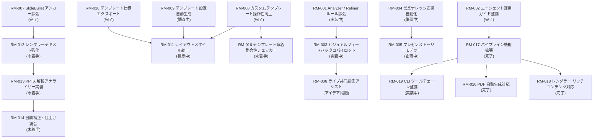

# 開発ロードマップ（大項目）

## 運用方針
- ブランチや PR を跨ぐ開発テーマを本ページで俯瞰し、ステータスの起点とする。
- 各テーマに紐づくタスク詳細は `docs/todo/` 配下で管理し、必ず相互リンクを張る。
- 進捗は「完了済み小項目数 / 総小項目数」を原則とし、更新日は ISO 形式で明記する。
- 評価指標や背景の議事は `docs/notes/` と `docs/requirements/`、設計変更は `docs/design/` を参照する。
- ロードマップから ToDo を切り出す際は、テンプレートに沿って「ブランチ→計画→設計→実装→テスト→関連Issue→PR」までの工程を明文化し、計画段階のみで完了とする場合は判断者・判断日・次判断条件をメモ欄に残す。

## 全体目標と指標
- **北極星指標**: 月次で社内提案書 120 件を自動生成し、手戻り率（再提出件数 / 総件数）10% 以下を達成する。
- **品質指標**: Analyzer が検知する `critical` issue を 1 ジョブあたり平均 0.5 件以下に抑える。
- **効率指標**: 30 スライド構成を 60 秒以内で PPTX + PDF 出力まで完了させる。
- **運用指標**: 監査ログの欠損率 0% を維持し、ジョブ失敗時の再実行時間を 5 分以内とする。

## 6 工程一覧
| No. | 工程 | 概要 |
| --- | --- | --- |
| 1 | テンプレ準備 | テンプレ資産 (.pptx) の整備と版管理 |
| 2 | テンプレ構造抽出 | レイアウト構造 JSON / ヒント値の生成 |
| 3 | コンテンツ正規化 (HITL) | 入力データをスライド素材へ整形し承認 |
| 4 | ドラフト構成設計 (HITL) | 章立て・ページ順・layout_hint を確定 |
| 5 | マッピング | レイアウト割付と `rendering_ready.json` 作成 |
| 6 | PPTX レンダリング | 最終出力と監査メタ付与 |

状況に応じて優先工程は変動するため、各 RM の「対象工程」欄を参照してタスクを選択する。

## アクティブテーマ
- テーマごとに `RM-xxx` 番号を付与し、ToDo フロントマターの `roadmap_item` と一致させる。

### RM-003 ビジュアルフィードバックコパイロット
- ゴール: 生成されたスライドに対し、視覚モデル＋LLM がリアルタイムで「目線導線」「情報の密度」「ブランド逸脱」を可視化し、プレゼンターが WOW と感じる改善提案を提示する。
- 対象工程: 5・6（レンダリング後の評価）＋ フィードバック API 全体
- 参照ドキュメント: [docs/design/overview.md](../design/overview.md)
- 状況: 調査中（2025-10-05 更新）
- 期待成果: スライド PNG + 幾何情報を入力としたフィードバック API、ダッシュボード UI モック、Fix への反映ルール策定。
- 依存: RM-001（Analyzer / Refiner ルール拡張）のログ・指標整備、画像生成モデルの選定、GPU 実行基盤との連携。
- 次のアクション: 参考事例のリサーチ、モデル推論コスト試算、UI プロトタイピング。

### RM-004 営業ナレッジ連携自動化
- ゴール: CRM や案件管理システムから取得した勝ちパターン・競合情報を提案書自動生成に組み込み、ユーザーにとっての「次の一手」を提案する。
- 対象工程: 3・4（コンテンツ正規化 / ドラフト構成設計）への外部データ統合
- 参照ドキュメント: [docs/requirements/overview.md](../requirements/overview.md)
- 状況: 準備中（2025-10-05 更新）
- 期待成果: CRM 連携スキーマ定義、勝因レビューの LLM 要約、提案書内へのサジェストブロック挿入。
- 依存: CRM API トークン管理、個人情報マスキング、ジョブスケジューラ。
- 次のアクション: 主要フィールドの洗い出し、プライバシー要件の確認、最初の連携 PoC 設計。

### RM-005 プレゼンストーリーモデラー
- ゴール: ユーザーの案件メモやディスカッションログから、提案書のストーリーラインを AI が共同設計し、アウトラインとスライド骨子を自動生成する。
- 対象工程: 3・4（コンテンツ正規化 / ドラフト構成設計）の高度化
- 参照ドキュメント: [docs/notes/20251004-initial-deiscussion.txt](../notes/20251004-initial-deiscussion.txt), [docs/requirements/overview.md](../requirements/overview.md)
- 状況: 企画中（2025-10-05 更新）
- 期待成果: `Service-A Outliner` の高度化、感情トーンや意思決定ステージに合わせたストーリーパターン生成、アウトライン差分レビュー UI。
- 依存: RM-004（営業ナレッジ連携自動化）で整備するデータ連携基盤、LLM プロンプト設計、ユーザー入力メタデータ（客先業界・想定読者）の整備。
- 次のアクション: ユースケース別ストーリーテンプレートの整理、プロトタイプ用プロンプトの作成。

### RM-006 ライブ共同編集アシスト
- ゴール: 提案会議中でも AI がライブでスライド修正案・説明コメント・補足資料リンクを提示し、即応性の高いプレゼンを実現する。
- 対象工程: 3・4・5（リアルタイム編集とマッピング）の拡張
- 参照ドキュメント: [docs/design/overview.md](../design/overview.md)
- 状況: アイデア段階（2025-10-05 更新）
- 期待成果: WebSocket ベースの共同編集プロトコル設計、リアルタイム要約と修正提案、セッション監査ログ。
- 依存: RM-003（ビジュアルフィードバックコパイロット）のフィードバック API、低遅延インフラ、アクセス制御、UI コンポーネント設計。
- 次のアクション: 技術スタック比較、遅延要件の整理、UI ワイヤーフレーム作成。

### RM-011 レイアウトスタイル統一
- ゴール: テーブル・チャート・画像などのレイアウトスタイルを設定ファイルで統一管理し、ブランド統一感を維持できるようにする。
- 対象工程: 5（マッピング）・6（レンダリング）
- 参照ドキュメント: [docs/design/layout-style-governance.md](../design/layout-style-governance.md)
- 参照 ToDo: [docs/todo/20251011-layout-style-governance.md](../todo/20251011-layout-style-governance.md)
- 状況: 実装中（2025-10-12 更新）
- 期待成果: レイアウト用設定スキーマ整備、レンダラーでのスタイル適用、サンプルとテストの更新。
- 依存: RM-008（アンカー混在対応）、RM-009（テンプレート設定自動生成）、RM-010（テンプレート仕様エクスポート）、`config/branding.json` の拡張設計。
- 次のアクション: CLI 全体テストとドキュメント同期（requirements/design/policies）の完了、テンプレート運用手順への反映を行う。
    - 備考: レイアウト仕様をエクスポートし資料化する拡張は RM-010 完了後の成果を元に新規 Roadmap として検討する。

### RM-013 PPTX 解析アナライザー実装（優先度: P1）
- ゴール: 生成された PPTX を解析して幾何・スタイル情報を収集し、`grid_misaligned` など設計済みルールを含む品質診断を実現する。
- 対象工程: 6（レンダリング後の解析）
- 参照ドキュメント: [docs/requirements/overview.md](../requirements/overview.md), [docs/design/overview.md](../design/overview.md), [docs/notes/20251009-feature-gap-analysis.md](../notes/20251009-feature-gap-analysis.md)
- 参照 ToDo: [docs/todo/20251011-pptx-analyzer-implementation.md](../todo/20251011-pptx-analyzer-implementation.md)
- 状況: 未着手（2025-10-09 設定）
- 期待成果: PPTX 読み取りロジックと issue/fix 出力、既存 JSON ベース診断からの移行計画、テストデータ（PPTX）を用いた検証。
- 依存: LibreOffice / Open XML SDK 等の解析ツール選定、RM-012 で追加する描画仕様、CI 環境でのバイナリ比較手法。
- 次のアクション: 解析対象項目の優先順位付けと PoC を終え、アナライザー実装とテスト完了まで進める。

### RM-014 自動補正・仕上げ統合（優先度: P1）
- ゴール: Refiner の自動補正範囲を拡張し、Open XML SDK ベースの Polisher を組み込んで仕上げ工程を自動化する。
- 対象工程: 5（マッピング）・6（レンダリング）および仕上げ工程
- 参照ドキュメント: [docs/design/overview.md](../design/overview.md), [docs/notes/20251009-feature-gap-analysis.md](../notes/20251009-feature-gap-analysis.md)
- 参照 ToDo: [docs/todo/20251011-automated-polisher-integration.md](../todo/20251011-automated-polisher-integration.md)
- 状況: 未着手（2025-10-09 設定）
- 期待成果: フォントサイズ引き上げ・色調整などの安全な自動適用、Polisher プロジェクト雛形と CLI 連携、監査ログへの補正記録。
- 依存: RM-013 の解析結果、.NET 8 実行環境、テンプレート運用ポリシーの更新。
- 次のアクション: 自動補正ポリシーを確定し、Polisher 実装とテスト完了までを ToDo に従って進める。

### RM-022 レイアウト解析検証強化（優先度: P1）
- ゴール: 工程 2 の抽出結果をスキーマ検証・差分可視化で保証し、マッピング前の品質を高める。
- 対象工程: 2（テンプレ構造抽出）
- 参照ドキュメント: [docs/requirements/stages/stage-02-template-structure-extraction.md](../requirements/stages/stage-02-template-structure-extraction.md)
- 参照 ToDo: [docs/todo/20251012-layout-validation-suite.md](../todo/20251012-layout-validation-suite.md)
- 状況: 未着手（2025-10-12 追加）
- 期待成果: `layouts.jsonl` スキーマバリデータ、差分レポート可視化、ヒント係数・用途タグ推定ロジック。
- 依存: RM-021（テンプレ資産監査パイプライン）、python-pptx / Open XML SDK の抽出結果、CI での JSON 検証基盤。
- 次のアクション: スキーマ項目の定義、差分レポートフォーマットの設計、AI 補完と連動するヒント係数算出アルゴリズムの検討。

### RM-023 コンテンツ承認オーサリング基盤（優先度: P1）
- ゴール: 工程 3 の HITL 承認 UI / API と AI レビュー連携を整備し、承認ログを監査可能にする。
- 対象工程: 3（コンテンツ正規化）
- 参照ドキュメント: [docs/requirements/stages/stage-03-content-normalization.md](../requirements/stages/stage-03-content-normalization.md)
- 参照 ToDo: [docs/todo/20251012-content-approval-platform.md](../todo/20251012-content-approval-platform.md)
- 状況: 未着手（2025-10-12 追加）
- 期待成果: 承認 UI ワイヤーと API 設計、AI レビュー（グレード/Auto-fix）の実装方針、禁則語および必須項目のリアルタイム検知。
- 依存: RM-022（レイアウト解析検証強化）のタグ情報、RM-001（Analyzer ルール拡張）の診断出力、監査ログ基盤。
- 次のアクション: UI 要件整理、承認ログスキーマ設計、AI レビュー評価指標のドラフト化。

### RM-024 ドラフト構成承認フロー整備（優先度: P1）
- ゴール: 工程 4 のストーリーボード UI と `layout_hint` 管理を実装し、章立て承認を確実化する。
- 対象工程: 4（ドラフト構成設計）
- 参照ドキュメント: [docs/requirements/stages/stage-04-draft-structuring.md](../requirements/stages/stage-04-draft-structuring.md)
- 参照 ToDo: [docs/todo/20251012-draft-structuring-workbench.md](../todo/20251012-draft-structuring-workbench.md)
- 状況: 未着手（2025-10-12 追加）
- 期待成果: 章レーン×カード UI、レイアウト候補スコアの可視化、多様性ルールと付録操作履歴の蓄積。
- 依存: RM-023（コンテンツ承認基盤）、RM-022（レイアウト解析検証強化）、UI フロントエンド基盤選定。
- 次のアクション: `layout_hint` 管理 API の設計、レイアウトスコア指標の定義、付録操作ログ仕様の整理。

### RM-025 マッピング補完エンジン（優先度: P1）
- ゴール: 工程 5 のスコアリング・フォールバック・AI 補完を実装し、`rendering_ready.json` の確度を高める。
- 対象工程: 5（マッピング）
- 参照ドキュメント: [docs/requirements/stages/stage-05-mapping.md](../requirements/stages/stage-05-mapping.md)
- 参照 ToDo: [docs/todo/20251012-mapping-orchestrator.md](../todo/20251012-mapping-orchestrator.md)
- 状況: 未着手（2025-10-12 追加）
- 期待成果: レイアウトスコアリング指標とフォールバック制御、AI 補完差分ログ、`rendering_ready.json` スキーマ検証ツール。
- 依存: RM-022（レイアウト解析検証強化）、RM-024（ドラフト構成承認フロー）、LLM 推論基盤。
- 次のアクション: スコアリングロジックのプロトタイプ作成、フォールバックルール表の策定、スキーマ検証 CLI の設計。

### RM-026 レンダリング監査統合（優先度: P1）
- ゴール: 工程 6 の軽量整合チェック・監査メタ・PDF/Polisher 統合を実装し、最終出力の信頼性を確保する。
- 対象工程: 6（PPTX 生成）
- 参照ドキュメント: [docs/requirements/stages/stage-06-rendering.md](../requirements/stages/stage-06-rendering.md)
- 参照 ToDo: [docs/todo/20251012-rendering-audit-integration.md](../todo/20251012-rendering-audit-integration.md)
- 状況: 未着手（2025-10-12 追加）
- 期待成果: 軽量整合チェックルールセット、生成ログと承認ログの突合、PDF 変換と Open XML Polisher の統合フロー。
- 依存: RM-025（マッピング補完エンジン）、LibreOffice / Open XML SDK の実行環境、CI でのバイナリ検証手法。
- 次のアクション: チェックルール一覧の策定、監査メタ拡張項目の設計、PDF/Polisher 統合 PoC の準備。

## バックログ（優先検討）
- `Service-F Distributor` の通知チャネル整備（Teams / Slack）と監査ログ統合。運用要件（docs/requirements/overview.md の 5. 出力と配布）で求められる保存先連携・通知を実現し、`docs/notes/20251009-feature-gap-analysis.md` の指摘に基づき優先度を再評価する。
- CLI / REST API の認証方式統一（OAuth2 / SAS トークン）とキー管理ドキュメントの追加。
- `reverse_engineer.py` PoC による既存 PPTX からの spec 逆生成検討。

## 完了テーマ

### RM-021 テンプレ資産監査パイプライン（優先度: P1）
- ゴール: テンプレ改訂時に差分と品質を自動診断し、工程 1 の受け渡しを自動化する。
- 対象工程: 1（テンプレ準備）
- 参照ドキュメント: [docs/requirements/stages/stage-01-template-preparation.md](../requirements/stages/stage-01-template-preparation.md)
- 参照 ToDo: [docs/todo/archive/20251012-template-audit-pipeline.md](../todo/archive/20251012-template-audit-pipeline.md)
- 状況: 完了（2025-10-16 更新）
- 期待成果: `uv run pptx tpl-release` による `template_release.json` / `release_report.json` 自動生成と、`golden_runs.json` によるゴールデンサンプル検証ログの取得（達成済み）。
- 依存: RM-016（テンプレ命名整合性チェッカー）、LibreOffice / Open XML SDK の差分検証ワークフロー。

### RM-001 Analyzer / Refiner ルール拡張（優先度: P2）
- ゴール: 品質診断と自動補正の精度を高め、要件定義書 4.3〜4.4 節の達成度を引き上げる。
- 対象工程: 5（マッピング）・6（PPTX レンダリング）に付随する Analyzer / Refiner 処理
- 参照ドキュメント: [docs/requirements/overview.md](../requirements/overview.md), [docs/design/overview.md](../design/overview.md)
- 参照 ToDo: [docs/todo/archive/20251007-analyzer-layout-consistency.md](../todo/archive/20251007-analyzer-layout-consistency.md)
- 状況: 完了（2025-10-15 更新）
- 期待成果: `contrast_low` 判定の調整、`layout_consistency` 追加、Fix ログの監査連携。

### RM-012 レンダラーテキスト強化（優先度: P1）
- ゴール: スライドのサブタイトル・ノート・テキストボックスを含む文章要素をレンダラーで描画し、基本レイアウト要件を満たす。
- 参照ドキュメント: [docs/design/overview.md](../design/overview.md), [docs/notes/20251009-feature-gap-analysis.md](../notes/20251009-feature-gap-analysis.md)
- 参照 ToDo: [docs/todo/archive/20251015-renderer-text-enhancement.md](../todo/archive/20251015-renderer-text-enhancement.md)
- 状況: 完了（2025-10-15 更新）
- 期待成果: `Slide.subtitle` と `notes` の描画処理実装、`slides[].textboxes[]` スキーマと描画サポート、サンプル／テストの反映。
- 依存: RM-007（SlideBullet アンカー拡張）の仕様調整、`samples/templates/` のレイアウト更新、CLI 統合テスト。
  - 2025-10-15: アンカー名継承とノートフォーマット整備を実施し、単体／CLI テストで検証済み。

### RM-016 テンプレート命名整合性チェッカー（優先度: P3）
- ゴール: テンプレート内で同一スライドに重複するプレースホルダー／図形名を検出し、アンカー指定時の衝突を防ぐ運用・実装フローを整える。
- 対象工程: 1・2（テンプレ準備 / 構造抽出）
- 参照ドキュメント: [docs/policies/config-and-templates.md](../policies/config-and-templates.md)
- 参照 ToDo: （未作成 — 着手時に `docs/todo/` へ登録）
- 状況: 完了（2025-10-15 更新）
- 期待成果: テンプレート読込時の名称衝突検知、CLI への警告出力、プレースホルダー命名規則の追加ガイド。
- 依存: RM-008（カスタムテンプレート操作性向上）のアンカー実装、テンプレート運用ポリシー、CLI 構成の拡張余地。

### RM-019 CLI ツールチェーン整備（優先度: P1）
- ゴール: 提案書生成と周辺支援機能を単一 CLI へ統合し、テンプレ抽出やサンプル spec 生成を含むワークフロー整備を加速する。
- 参照ドキュメント: [docs/notes/20251011-branding-config-mapping.md](../notes/20251011-branding-config-mapping.md)
- 参照 ToDo: [docs/todo/archive/20251011-cli-toolkit-refactor.md](../todo/archive/20251011-cli-toolkit-refactor.md)
- 状況: 完了（2025-10-15 更新）
- 期待成果: エントリーポイント `pptx` への改称、`gen` / `tpl-extract` サブコマンドの実装、将来の `spec-generate` など支援系機能の導線整備。
- 依存: CLI 運用ガイド（`docs/AGENTS.md`）、既存パイプライン構成、PyYAML などの依存パッケージ管理。

### RM-002 エージェント運用ガイド整備（優先度: P1）
- ゴール: エージェントが参照する AGENTS.md と連動ドキュメントを体系化し、開発プロセスやテンプレート準備手順を一元管理する。
- 参照ドキュメント: [AGENTS.md](../AGENTS.md), [CONTRIBUTING.md](../CONTRIBUTING.md), [docs/policies/config-and-templates.md](../policies/config-and-templates.md)
- 参照 ToDo: [docs/todo/20251009-samples-expansion.md](../todo/20251009-samples-expansion.md)
- 状況: 完了（2025-10-11 更新）
- 期待成果: テンプレート準備ガイドの整備に加え、最小構成・フル構成サンプルの提供と活用ドキュメントの拡充。
- 依存: フェーズ1 で整備したサンプルテンプレートと運用ルール、レンダラー改善テーマ（RM-007/008/018）と連携するドキュメント基盤。

### RM-007 SlideBullet アンカー拡張（優先度: P2）
- ゴール: SlideBullet 要素がテンプレート内の任意テキスト図形へ挿入できるようレンダラーを拡張し、複数レイアウトでの再利用性を高める。
- 対象工程: 5（マッピング）
- 参照ドキュメント: [docs/AGENTS.md](../AGENTS.md)
- 参照 ToDo: [docs/todo/archive/20251010-renderer-slidebullet-anchor.md](../todo/archive/20251010-renderer-slidebullet-anchor.md)
- 状況: 完了（2025-10-11 更新）
- 達成成果: JSON 仕様でのアンカー指定対応完了、`_resolve_anchor` を用いた統一的な処理実装、プレースホルダー削除機能実装、テストケース追加（全 10 件成功）、CLI 統合テスト検証完了（全 5 件成功）。
- 依存: テンプレートレイアウト命名規則、Open XML SDK による仕上げ処理、PDF 変換時の段落整形。

### RM-008 カスタムテンプレート操作性向上（優先度: P2）
- ゴール: プレースホルダー名称を活用して画像・テーブル・チャートを配置し、テンプレート側で図形種類を固定しなくてもアンカー指定が有効になる状態を実現する。
- 対象工程: 1・2（テンプレ準備 / 構造抽出）と 5（マッピング）への影響
- 参照 ToDo: [docs/todo/archive/20251009-placeholder-anchor.md](../todo/archive/20251009-placeholder-anchor.md)
- 状況: 完了（2025-10-11 更新）
- 期待成果: プレースホルダーと図形のアンカー混在対応、テンプレート準備ガイドの更新、回帰テストによる互換性確認。
- 依存: レンダラーのアンカー解決ロジック、テンプレート操作ドキュメント、CLI テストスイート。

### RM-009 テンプレート設定自動生成（優先度: P2）
- ゴール: PPTX テンプレートから `config/branding.json` 同等のスタイル定義を自動生成し、ブランド設定保守の手間を削減する。
- 参照ドキュメント: 未整備（本テーマで作成予定）
- 参照 ToDo: [docs/todo/archive/20251009-branding-config-generator.md](../todo/archive/20251009-branding-config-generator.md)
- 状況: 完了（2025-10-11 更新）
- 期待成果: 抽出対象となるフォント・配色情報の整理、python-pptx で取得可能な属性の調査結果、変換フロー（CLI / スクリプト）の方向性。
- 依存: python-pptx のスタイル取得制約、LibreOffice / Open XML SDK での補完可否、ブランド設定 JSON のスキーマ拡張余地。

### RM-010 テンプレート仕様エクスポート（優先度: P2）
- ゴール: PPTX テンプレートから `samples/json/sample_spec.json` に必要なレイアウト・アンカー情報を抽出し、JSON 雛形を自動生成する。
- 参照ドキュメント: [README.md](../README.md)（extract-template セクション）
- 参照 ToDo: [docs/todo/archive/20251009-template-spec-export.md](../todo/archive/20251009-template-spec-export.md)
- 状況: 完了（2025-10-11 更新）
- 達成成果: `extract-template` CLI コマンドおよび `TemplateExtractorStep` を実装、抽出結果を JSON/YAML で出力可能にし、README に使用手順を追加。単体・統合テストを整備し、テンプレート構造解析フローを確立。
- 依存: python-pptx による図形情報取得、テンプレート命名規則、サンプルテンプレート資産。

### RM-012 レンダラーテキスト強化（優先度: P1）
- ゴール: スライドのサブタイトル・ノート・テキストボックスを含む文章要素をレンダラーで描画し、基本レイアウト要件を満たす。
- 参照ドキュメント: [docs/design/overview.md](../design/overview.md), [docs/notes/20251009-feature-gap-analysis.md](../notes/20251009-feature-gap-analysis.md)
- 参照 ToDo: [docs/todo/archive/20251011-renderer-text-enhancement.md](../todo/archive/20251011-renderer-text-enhancement.md)
- 状況: 完了（2025-10-11 更新）
- 期待成果: `Slide.subtitle` と `notes` の描画処理実装、`slides[].textboxes[]` スキーマと描画サポート、サンプル／テストの反映。
- 依存: RM-007（SlideBullet アンカー拡張）の仕様調整、`samples/templates/` のレイアウト更新、CLI 統合テスト。

### RM-015 ロードマップ再設計（優先度: P1）
- ゴール: 全自動パワポ生成パイプラインの戦略を整理し、6 工程（3・4 HITL 含む）のフェーズ構成・KPI・フォールバックポリシーを文書化する。
- 参照ドキュメント: [docs/notes/20251011-roadmap-refresh.md](../notes/20251011-roadmap-refresh.md)
- 参照 ToDo: [docs/todo/archive/20251011-roadmap-refresh.md](../todo/archive/20251011-roadmap-refresh.md)
- 状況: 完了（2025-10-11 更新）
- 期待成果: 工程ごとのタスク整理、レイアウト選定/縮約ポリシーの方針化、HITL 承認フローと監査ログ方針整理。
  - 工程1・2: テンプレ構造抽出 CLI 要件定義と PoC 設計（ToDo 発行予定）、テンプレ運用ポリシー更新。
  - 工程3・4: レイアウトスコアリング指標の設計、AI レビュー評価指標の数値化、承認 UI / API 設計、`docs/design/schema/README.md` のモデル実装。
  - 工程5・6: 監査ログ項目と承認状態遷移の最小セット定義、軽量整合チェックと Polisher 連携の拡張。
  - ドキュメント反映タスクの推進（[docs/notes/20251011-docs-update-plan.md](../notes/20251011-docs-update-plan.md) / [docs/todo/archive/20251011-roadmap-refresh.md](../todo/archive/20251011-roadmap-refresh.md)）

### RM-017 パイプライン機能拡張
- ゴール: JSON スキーマ拡張と自動診断強化によって生成品質を底上げする。
- 参照 ToDo: [docs/todo/archive/20251004-pipeline-enhancements.md](../todo/archive/20251004-pipeline-enhancements.md), [docs/todo/archive/20251010-auto-complete-archive-handling.md](../todo/archive/20251010-auto-complete-archive-handling.md)
- 状況: 7 件中 7 件完了（2025-10-06 更新）、追加修正 1 件完了（2025-10-10 更新）
- 成果: スキーマ拡張、Analyzer 出力整備、テスト追加、関連ドキュメント更新。
- 追加成果: auto_complete_todo.py でアーカイブ済み ToDo の成功判定を実装（PR #146）。
- 依存: RM-002（エージェント運用ガイド整備）、RM-007/008（レンダラー拡張）、RM-010（テンプレート仕様エクスポート）。

### RM-018 レンダラー リッチコンテンツ対応
- ゴール: 表・画像・グラフをブランドスタイル付きで描画できるレンダラーを実装する。
- 参照 ToDo: [docs/todo/archive/20251005-renderer-rich-content.md](../todo/archive/20251005-renderer-rich-content.md)
- 状況: 14 件中 14 件完了（2025-10-06 更新）
- 成果: リッチコンテンツ描画処理、テンプレート改善、検証手順の追加。
- 依存: RM-007（SlideBullet アンカー拡張）、RM-008（テンプレート操作性向上）、RM-017（パイプライン機能拡張）。

### RM-020 PDF 自動生成対応
- ゴール: PPTX 生成直後に PDF 化までを自動化し、配布用資料をワンステップで提供する。
- 参照 ToDo: [docs/todo/archive/20251005-pdf-export-automation.md](../todo/archive/20251005-pdf-export-automation.md)
- 状況: 10 件中 10 件完了（2025-10-06 更新）
- 成果: PR #152 https://github.com/yurake/pptx_generator/pull/152
- 依存: RM-017（パイプライン機能拡張）による CLI/監査基盤、LibreOffice 実行環境整備、テンプレート運用ガイド（RM-002）。

## 更新履歴
- 2025-10-05: 初版作成。
- 2025-10-05: 全体目標、フェーズ計画、バックログを追記。
- 2025-10-06: PDF 自動生成の実装状況と監査ログ出力機能を追記。
- 2025-10-07: PDF 自動生成対応を完了テーマへ移動。
- 2025-10-09: RM-002 を再開し、サンプル拡充タスクと参照ドキュメントを追記。
- 2025-10-09: RM-012〜RM-014 を追加し、通知チャネル整備のバックログ情報を更新。
