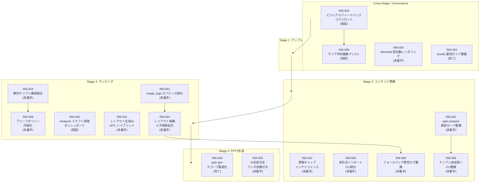

# 開発ロードマップ（大項目）

## 運用方針
- ブランチや PR を跨ぐ開発テーマを本ページで俯瞰し、ステータスの起点とする。
- 各テーマに紐づくタスク詳細は `docs/todo/` 配下で管理し、必ず相互リンクを張る。
- 進捗は「完了済み小項目数 / 総小項目数」を原則とし、更新日は ISO 形式で明記する。
- 評価指標や背景の議事は `docs/notes/` と `docs/requirements/`、設計変更は `docs/design/` を参照する。
- ロードマップから ToDo を切り出す際は、テンプレートに沿って「ブランチ→計画→設計→実装→テスト→関連Issue→PR」までの工程を明文化し、計画段階のみで完了とする場合は判断者・判断日・次判断条件をメモ欄に残す。
- Mermaid 図は未着手・進行中・保留のテーマのみを表示し、完了テーマは個別状況セクションで参照する。

## 全体目標と指標
- **北極星指標**: 月次で社内提案書 120 件を自動生成し、手戻り率（再提出件数 / 総件数）10% 以下を達成する。
- **品質指標**: Analyzer が検知する `critical` issue を 1 ジョブあたり平均 0.5 件以下に抑える。
- **効率指標**: 30 スライド構成を 60 秒以内で PPTX + PDF 出力まで完了させる。
- **運用指標**: 監査ログの欠損率 0% を維持し、ジョブ失敗時の再実行時間を 5 分以内とする。

## 4 工程一覧
| No. | 工程 | 概要 |
| --- | --- | --- |
| 1 | テンプレ | テンプレ資産の整備・抽出・検証・リリースメタ生成を一括実行 |
| 2 | コンテンツ準備 | 入力データをスライド素材へ整形し承認 |
| 3 | マッピング | 章構成承認とレイアウト割付を実施し、`generate_ready.json`／`generate_ready_meta.json` を出力 |
| 4 | PPTX生成 | 最終出力と監査メタ付与 |

## 個別状況
- テーマごとに `RM-xxx` 番号を付与し、ToDo フロントマターの `roadmap_item` と一致させる。

### RM-001 Analyzer / Refiner ルール拡張
- ゴール: 品質診断と自動補正の精度を高め、要件定義書 4.3〜4.4 節の達成度を引き上げる。
- 対象工程: 5（マッピング）・6（PPTX レンダリング）に付随する Analyzer / Refiner 処理
- 参照ドキュメント: [docs/requirements/requirements.md](../requirements/requirements.md), [docs/design/design.md](../design/design.md)
- 参照 ToDo: [docs/todo/archive/20251007-analyzer-layout-consistency.md](../todo/archive/20251007-analyzer-layout-consistency.md)
- 状況: 完了（2025-10-15 更新）
- 期待成果: `contrast_low` 判定の調整、`layout_consistency` 追加、Fix ログの監査連携。

### RM-002 エージェント運用ガイド整備
- ゴール: エージェントが参照する AGENTS.md と連動ドキュメントを体系化し、開発プロセスやテンプレート準備手順を一元管理する。
- 参照ドキュメント: [AGENTS.md](../AGENTS.md), [CONTRIBUTING.md](../CONTRIBUTING.md), [docs/policies/config-and-templates.md](../policies/config-and-templates.md)
- 参照 ToDo: [docs/todo/20251009-samples-expansion.md](../todo/20251009-samples-expansion.md)
- 状況: 完了（2025-10-17 更新）
- 期待成果: テンプレート準備ガイドの整備に加え、最小構成・フル構成サンプルの提供と活用ドキュメントの拡充。
- 関連テーマ: フェーズ1 で整備したサンプルテンプレートと運用ルール、レンダラー改善テーマ（RM-007/008/018）と連携するドキュメント基盤。

### RM-003 ビジュアルフィードバックコパイロット
- ゴール: 生成されたスライドに対し、視覚モデル＋LLM がリアルタイムで「目線導線」「情報の密度」「ブランド逸脱」を可視化し、プレゼンターが WOW と感じる改善提案を提示する。
- 対象工程: 5・6（レンダリング後の評価）＋ フィードバック API 全体
- 参照ドキュメント: [docs/design/design.md](../design/design.md)
- 状況: 保留（2025-10-17 更新）
- 期待成果: スライド PNG + 幾何情報を入力としたフィードバック API、ダッシュボード UI モック、Fix への反映ルール策定。
- 依存: RM-001（Analyzer / Refiner ルール拡張）のログ・指標整備、RM-013（PPTX 解析アナライザー実装）による幾何情報取得、画像生成モデルの選定、GPU 実行基盤との連携。
- 再開条件: ユーザーが明示的に再開指示を出すこと。

### RM-004 営業ナレッジ連携自動化
- ゴール: CRM や案件管理システムから取得した勝ちパターン・競合情報を提案書自動生成に組み込み、ユーザーにとっての「次の一手」を提案する。
- 対象工程: 3・4（コンテンツ準備 / ドラフト構成設計）への外部データ統合
- 参照ドキュメント: [docs/requirements/requirements.md](../requirements/requirements.md)
- 状況: 完了（2025-10-15 更新）
- 完了理由: 案件連携のニーズが解消されたため開発を終了。
- 期待成果: （クローズ時点で未着手）CRM 連携スキーマ定義、勝因レビューの LLM 要約、提案書内へのサジェストブロック挿入。
- 依存: CRM API トークン管理、個人情報マスキング、ジョブスケジューラ。
- 次のアクション: なし（ニーズ解消のためクローズ済み）。

### RM-005 プレゼンストーリーモデラー
- ゴール: ユーザーの案件メモやディスカッションログから、提案書のストーリーラインを AI が共同設計できるよう企画・要件・設計ドキュメントを整備し、工程3でのストーリー要素取り込みを支える。
- 対象工程: 3・4（コンテンツ準備 / ドラフト構成設計）の高度化
- 参照ドキュメント: [docs/notes/20251004-initial-deiscussion.txt](../notes/20251004-initial-deiscussion.txt), [docs/requirements/requirements.md](../requirements/requirements.md), [docs/requirements/stages/stage-03-content-normalization.md](../requirements/stages/stage-03-content-normalization.md)
- 状況: 完了（2025-10-16 更新）
- 期待成果: ストーリー骨子メタ (`story_outline.json`) の要件定義、ストーリーフェーズ分類・章立て整合ロジックの設計メモ、工程3 UI/ワークフローへの差し込み計画。
- 関連テーマ: RM-023（コンテンツ承認オーサリング基盤）で整備する承認メタデータ、LLM プロンプト設計、ユーザー入力メタデータ（客先業界・想定読者）の整備。

### RM-006 ライブ共同編集アシスト
- ゴール: 提案会議中でも AI がライブでスライド修正案・説明コメント・補足資料リンクを提示し、即応性の高いプレゼンを実現する。
- 対象工程: 3・4・5（リアルタイム編集とマッピング）の拡張
- 参照ドキュメント: [docs/design/design.md](../design/design.md)
- 状況: 保留（2025-10-17 更新）
- 期待成果: WebSocket ベースの共同編集プロトコル設計、リアルタイム要約と修正提案、セッション監査ログ。
- 依存: RM-003（ビジュアルフィードバックコパイロット）のフィードバック API、RM-025（マッピング補完エンジン）のリアルタイム適用、RM-026（レンダリング監査統合）の監査メタ連携、低遅延インフラ、アクセス制御、UI コンポーネント設計。

### RM-007 SlideBullet アンカー拡張
- ゴール: SlideBullet 要素がテンプレート内の任意テキスト図形へ挿入できるようレンダラーを拡張し、複数レイアウトでの再利用性を高める。
- 対象工程: 5（マッピング）
- 参照ドキュメント: [docs/AGENTS.md](../AGENTS.md)
- 参照 ToDo: [docs/todo/archive/20251010-renderer-slidebullet-anchor.md](../todo/archive/20251010-renderer-slidebullet-anchor.md)
- 状況: 完了（2025-10-11 更新）
- 達成成果: JSON 仕様でのアンカー指定対応完了、`_resolve_anchor` を用いた統一的な処理実装、プレースホルダー削除機能実装、テストケース追加（全 10 件成功）、CLI 統合テスト検証完了（全 5 件成功）。
- 依存: テンプレートレイアウト命名規則、Open XML SDK による仕上げ処理、PDF 変換時の段落整形。

### RM-008 カスタムテンプレート操作性向上
- ゴール: プレースホルダー名称を活用して画像・テーブル・チャートを配置し、テンプレート側で図形種類を固定しなくてもアンカー指定が有効になる状態を実現する。
- 対象工程: 1・2（テンプレ準備 / 構造抽出）と 5（マッピング）への影響
- 参照 ToDo: [docs/todo/archive/20251009-placeholder-anchor.md](../todo/archive/20251009-placeholder-anchor.md)
- 状況: 完了（2025-10-11 更新）
- 期待成果: プレースホルダーと図形のアンカー混在対応、テンプレート準備ガイドの更新、回帰テストによる互換性確認。
- 依存: レンダラーのアンカー解決ロジック、テンプレート操作ドキュメント、CLI テストスイート。

### RM-009 テンプレート設定自動生成
- ゴール: PPTX テンプレートから `config/branding.json` 同等のスタイル定義を自動生成し、ブランド設定保守の手間を削減する。
- 参照ドキュメント: 未整備（本テーマで作成予定）
- 参照 ToDo: [docs/todo/archive/20251009-branding-config-generator.md](../todo/archive/20251009-branding-config-generator.md)
- 状況: 完了（2025-10-11 更新）
- 期待成果: 抽出対象となるフォント・配色情報の整理、python-pptx で取得可能な属性の調査結果、変換フロー（CLI / スクリプト）の方向性。
- 依存: python-pptx のスタイル取得制約、LibreOffice / Open XML SDK での補完可否、ブランド設定 JSON のスキーマ拡張余地。

### RM-010 テンプレート仕様エクスポート
- ゴール: PPTX テンプレートから `samples/json/sample_jobspec.json` に必要なレイアウト・アンカー情報を抽出し、JSON 雛形を自動生成する。
- 参照ドキュメント: [README.md](../README.md)（extract-template セクション）
- 参照 ToDo: [docs/todo/archive/20251009-template-spec-export.md](../todo/archive/20251009-template-spec-export.md)
- 状況: 完了（2025-10-11 更新）
- 達成成果: `extract-template` CLI コマンドおよび `TemplateExtractorStep` を実装、抽出結果を JSON/YAML で出力可能にし、README に使用手順を追加。単体・統合テストを整備し、テンプレート構造解析フローを確立。
- 依存: python-pptx による図形情報取得、テンプレート命名規則、サンプルテンプレート資産。

### RM-011 レイアウトスタイル統一
- ゴール: テーブル・チャート・画像などのレイアウトスタイルを設定ファイルで統一管理し、ブランド統一感を維持できるようにする。
- 対象工程: 5（マッピング）・6（レンダリング）
- 参照ドキュメント: [docs/design/layout-style-governance.md](../design/layout-style-governance.md)
- 参照 ToDo: [docs/todo/20251011-layout-style-governance.md](../todo/20251011-layout-style-governance.md)
- 状況: 完了（2025-10-17 更新）
- 期待成果: レイアウト用設定スキーマ整備、レンダラーでのスタイル適用、サンプルとテストの更新。
- 依存: RM-008（アンカー混在対応）、RM-009（テンプレート設定自動生成）、RM-010（テンプレート仕様エクスポート）、`config/branding.json` の拡張設計。
- 成果: `layout-style-v1` スキーマとブランド設定テンプレートを確立し、`config/branding.json`／レンダラー適用ロジック／CLI ドキュメントを更新済み。
   - 備考: レイアウト仕様をエクスポートし資料化する拡張は RM-010 完了後の成果を元に新規 Roadmap として検討する。

### RM-012 レンダラーテキスト強化
- ゴール: スライドのサブタイトル・ノート・テキストボックスを含む文章要素をレンダラーで描画し、基本レイアウト要件を満たす。
- 参照ドキュメント: [docs/design/design.md](../design/design.md), [docs/notes/20251009-feature-gap-analysis.md](../notes/20251009-feature-gap-analysis.md)
- 参照 ToDo: [docs/todo/archive/20251011-renderer-text-enhancement.md](../todo/archive/20251011-renderer-text-enhancement.md)
- 状況: 完了（2025-10-11 更新）
- 期待成果: `Slide.subtitle` と `notes` の描画処理実装、`slides[].textboxes[]` スキーマと描画サポート、サンプル／テストの反映。
- 依存: RM-007（SlideBullet アンカー拡張）の仕様調整、`samples/templates/` のレイアウト更新、CLI 統合テスト。

### RM-013 PPTX 解析アナライザー実装
- ゴール: 生成された PPTX を解析して幾何・スタイル情報を収集し、`grid_misaligned` など設計済みルールを含む品質診断を実現する。
- 対象工程: 6（レンダリング後の解析）
- 参照ドキュメント: [docs/requirements/requirements.md](../requirements/requirements.md), [docs/design/design.md](../design/design.md), [docs/notes/20251009-feature-gap-analysis.md](../notes/20251009-feature-gap-analysis.md)
- 参照 ToDo: [docs/todo/archive/20251011-pptx-analyzer-implementation.md](../todo/archive/20251011-pptx-analyzer-implementation.md)
- 状況: 完了（2025-10-16 更新）
- 期待成果: PPTX 読み取りロジックと issue/fix 出力、既存 JSON ベース診断からの移行計画、テストデータ（PPTX）を用いた検証。
- 依存: LibreOffice / Open XML SDK 等の解析ツール選定、RM-012 で追加する描画仕様、CI 環境でのバイナリ比較手法。

### RM-014 自動補正・仕上げ統合
- ゴール: Refiner の自動補正範囲を拡張し、Open XML SDK ベースの Polisher を組み込んで仕上げ工程を自動化する。
- 対象工程: 5（マッピング）・6（レンダリング）および仕上げ工程
- 参照ドキュメント: [docs/design/design.md](../design/design.md), [docs/notes/20251009-feature-gap-analysis.md](../notes/20251009-feature-gap-analysis.md)
- 参照 ToDo: [docs/todo/archive/20251011-automated-polisher-integration.md](../todo/archive/20251011-automated-polisher-integration.md)
- 状況: 完了（2025-10-19 更新）
- 期待成果: フォントサイズ引き上げ・色調整などの安全な自動適用、Polisher プロジェクト雛形と CLI 連携、監査ログへの補正記録。
- 進捗: `pptx gen` に `--polisher` 系オプションを追加し、Python から Open XML Polisher を呼び出すステップと監査メタを実装。`config/rules.json` の `polisher` セクションを拡張済み。`dotnet/Polisher` プロジェクトでフォントサイズ・色調整を自動適用する最小実装を追加。
- 依存: RM-013 の解析結果、RM-026（レンダリング監査統合）のチェックルール、RM-020（PDF 自動生成対応）の出力フロー、.NET 8 実行環境、テンプレート運用ポリシーの更新。

### RM-015 ロードマップ再設計
- ゴール: 全自動パワポ生成パイプラインの戦略を整理し、4 工程（2・3 HITL 含む）のフェーズ構成・KPI・フォールバックポリシーを文書化する。
- 参照ドキュメント: [docs/notes/20251011-roadmap-refresh.md](../notes/20251011-roadmap-refresh.md)
- 参照 ToDo: [docs/todo/archive/20251011-roadmap-refresh.md](../todo/archive/20251011-roadmap-refresh.md)
- 状況: 完了（2025-10-11 更新）
- 期待成果: 工程ごとのタスク整理、レイアウト選定/縮約ポリシーの方針化、HITL 承認フローと監査ログ方針整理。
  - 工程1・2: テンプレ構造抽出 CLI 要件定義と PoC 設計（ToDo 発行予定）、テンプレ運用ポリシー更新。
  - 工程3・4: レイアウトスコアリング指標の設計、AI レビュー評価指標の数値化、承認 UI / API 設計、`docs/design/schema/README.md` のモデル実装。
  - 工程5・6: 監査ログ項目と承認状態遷移の最小セット定義、軽量整合チェックと Polisher 連携の拡張。
  - ドキュメント反映タスクの推進（[docs/notes/20251011-docs-update-plan.md](../notes/20251011-docs-update-plan.md) / [docs/todo/archive/20251011-roadmap-refresh.md](../todo/archive/20251011-roadmap-refresh.md)）

### RM-016 テンプレート命名整合性チェッカー
- ゴール: テンプレート内で同一スライドに重複するプレースホルダー／図形名を検出し、アンカー指定時の衝突を防ぐ運用・実装フローを整える。
- 対象工程: 1・2（テンプレ準備 / 構造抽出）
- 参照ドキュメント: [docs/policies/config-and-templates.md](../policies/config-and-templates.md)
- 参照 ToDo: （未作成 — 着手時に `docs/todo/` へ登録）
- 状況: 完了（2025-10-15 更新）
- 期待成果: テンプレート読込時の名称衝突検知、CLI への警告出力、プレースホルダー命名規則の追加ガイド。
- 依存: RM-008（カスタムテンプレート操作性向上）のアンカー実装、テンプレート運用ポリシー、CLI 構成の拡張余地。

### RM-017 パイプライン機能拡張
- ゴール: JSON スキーマ拡張と自動診断強化によって生成品質を底上げする。
- 参照 ToDo: [docs/todo/archive/20251004-pipeline-enhancements.md](../todo/archive/20251004-pipeline-enhancements.md), [docs/todo/archive/20251010-auto-complete-archive-handling.md](../todo/archive/20251010-auto-complete-archive-handling.md)
- 状況: 7 件中 7 件完了（2025-10-06 更新）、追加修正 1 件完了（2025-10-10 更新）
- 成果: スキーマ拡張、Analyzer 出力整備、テスト追加、関連ドキュメント更新。
- 追加成果: auto_complete_todo.py でアーカイブ済み ToDo の成功判定を実装（PR #146）。
- 依存: RM-002（エージェント運用ガイド整備）。
- 関連テーマ: RM-007/008（レンダラー拡張）、RM-010（テンプレート仕様エクスポート）。

### RM-018 レンダラー リッチコンテンツ対応
- ゴール: 表・画像・グラフをブランドスタイル付きで描画できるレンダラーを実装する。
- 参照 ToDo: [docs/todo/archive/20251005-renderer-rich-content.md](../todo/archive/20251005-renderer-rich-content.md)
- 状況: 完了（2025-10-06 更新）
- 成果: リッチコンテンツ描画処理、テンプレート改善、検証手順の追加。
- 依存: RM-017（パイプライン機能拡張）、RM-007（SlideBullet アンカー拡張）、RM-008（テンプレート操作性向上）。

### RM-019 CLI ツールチェーン整備
- ゴール: 提案書生成と周辺支援機能を単一 CLI へ統合し、テンプレ抽出やサンプル spec 生成を含むワークフロー整備を加速する。
- 参照ドキュメント: [docs/notes/20251011-branding-config-mapping.md](../notes/20251011-branding-config-mapping.md)
- 参照 ToDo: [docs/todo/archive/20251011-cli-toolkit-refactor.md](../todo/archive/20251011-cli-toolkit-refactor.md)
- 状況: 完了（2025-10-15 更新）
- 期待成果: エントリーポイント `pptx` への改称、`gen` / `tpl-extract` サブコマンドの実装、将来の `spec-generate` など支援系機能の導線整備。
- 依存: RM-017（パイプライン機能拡張）、RM-010（テンプレート仕様エクスポート）。
- 関連テーマ: CLI 運用ガイド（`docs/AGENTS.md`）、既存パイプライン構成、PyYAML などの依存パッケージ管理。

### RM-020 PDF 自動生成対応
- ゴール: PPTX 生成直後に PDF 化までを自動化し、配布用資料をワンステップで提供する。
- 参照 ToDo: [docs/todo/archive/20251005-pdf-export-automation.md](../todo/archive/20251005-pdf-export-automation.md)
- 状況: 完了（2025-10-06 更新）
- 成果: PR #152 https://github.com/yurake/pptx_generator/pull/152
- 依存: RM-017（パイプライン機能拡張）、RM-019（CLI ツールチェーン整備）。
- 関連テーマ: LibreOffice 実行環境整備、テンプレート運用ガイド（RM-002）。

### RM-021 テンプレ資産監査パイプライン
- ゴール: テンプレ改訂時に差分と品質を自動診断し、工程 1 の受け渡しを自動化する。
- 対象工程: 1（テンプレ準備）
- 参照ドキュメント: [docs/requirements/stages/stage-01-template-preparation.md](../requirements/stages/stage-01-template-preparation.md)
- 参照 ToDo: [docs/todo/archive/20251012-template-audit-pipeline.md](../todo/archive/20251012-template-audit-pipeline.md)
- 状況: 完了（2025-10-16 更新）
- 期待成果: `uv run pptx tpl-release` による `template_release.json` / `release_report.json` 自動生成と、`golden_runs.json` によるゴールデンサンプル検証ログの取得（達成済み）。
- 依存: RM-016（テンプレ命名整合性チェッカー）、RM-019（CLI ツールチェーン整備）、RM-010（テンプレート仕様エクスポート）、LibreOffice / Open XML SDK の差分検証ワークフロー。

### RM-022 レイアウト解析検証強化
- ゴール: 工程 2 の抽出結果をスキーマ検証・差分可視化で保証し、マッピング前の品質を高める。
- 対象工程: 2（テンプレ構造抽出）
- 参照ドキュメント: [docs/requirements/stages/stage-02-template-structure-extraction.md](../requirements/stages/stage-02-template-structure-extraction.md)
- 参照 ToDo: [docs/todo/archive/20251012-layout-validation-suite.md](../todo/archive/20251012-layout-validation-suite.md)
- 状況: 完了（2025-10-16 更新）
- 期待成果: `layouts.jsonl` スキーマバリデータ、差分レポート可視化、ヒント係数・用途タグ推定ロジック。
- 依存: RM-021（テンプレ資産監査パイプライン）、RM-010（テンプレート仕様エクスポート）、RM-017（パイプライン機能拡張）、python-pptx / Open XML SDK の抽出結果、CI での JSON 検証基盤。

### RM-023 コンテンツ承認オーサリング基盤
- ゴール: 工程 3 の HITL 承認 API と AI レビュー連携を整備し、承認ログを監査可能にする（UI は将来バックログ）。
- 対象工程: 3（コンテンツ準備）
- 参照ドキュメント: [docs/requirements/stages/stage-03-content-normalization.md](../requirements/stages/stage-03-content-normalization.md)
- 参照 ToDo: [docs/todo/archive/20251012-content-approval-platform.md](../todo/archive/20251012-content-approval-platform.md)
- 状況: 完了（2025-10-17 更新）
- 期待成果: 承認 API 設計、AI レビュー（グレード/Auto-fix）の実装方針、禁則語および必須項目のリアルタイム検知。UI ワイヤーは参考資料として整理しつつ実装は後続へ委譲。
- 依存: RM-001（Analyzer / Refiner ルール拡張）、RM-005（プレゼンストーリーモデラー）、RM-022（レイアウト解析検証強化）、RM-017（パイプライン機能拡張）、RM-019（CLI ツールチェーン整備）。
- 関連テーマ: 監査ログ基盤。

### RM-024 ドラフト構成承認フロー整備
- ゴール: 工程 4 の構成管理 API と `layout_hint` 管理を実装し、章立て承認を CLI / API ベースで確実化する。
- 対象工程: 4（ドラフト構成設計）
- 参照ドキュメント: [docs/requirements/stages/stage-04-draft-structuring.md](../requirements/stages/stage-04-draft-structuring.md)
- 参照 ToDo: [docs/todo/archive/20251012-draft-structuring-workbench.md](../todo/archive/20251012-draft-structuring-workbench.md)
- 状況: 完了（2025-10-17 更新）
- 期待成果: layout_hint 候補スコアリング、付録操作履歴、章承認ログを備えた CLI / API。現行運用では `generate_ready.json`／`generate_ready_meta.json` へ統合済み（legacy `draft_*` 出力は参照のみ）。
- 依存: RM-023（コンテンツ承認基盤）、RM-022（レイアウト解析検証強化）、RM-005（プレゼンストーリーモデラー）、RM-017（パイプライン機能拡張）。

### RM-025 マッピング補完エンジン
- ゴール: 工程 5 のスコアリング・フォールバック・AI 補完を実装し、`generate_ready.json` の確度を高める。
- 対象工程: 5（マッピング）
- 参照ドキュメント: [docs/requirements/stages/stage-04-mapping.md](../requirements/stages/stage-04-mapping.md)
- 参照 ToDo: [docs/todo/20251012-mapping-orchestrator.md](../todo/20251012-mapping-orchestrator.md)
- 状況: 完了（2025-10-18 更新）
- 期待成果: レイアウトスコアリング指標とフォールバック制御、AI 補完差分ログ、`generate_ready.json` スキーマ検証ツール。
- 依存: RM-022（レイアウト解析検証強化）、RM-024（ドラフト構成承認フロー）、RM-017（パイプライン機能拡張）、RM-018（レンダラー リッチコンテンツ対応）、LLM 推論基盤。

### RM-026 レンダリング監査統合
- ゴール: 工程 6 の軽量整合チェック・監査メタ・PDF/Polisher 統合を実装し、最終出力の信頼性を確保する。
- 対象工程: 6（PPTX 生成）
- 参照ドキュメント: [docs/requirements/stages/stage-06-rendering.md](../requirements/stages/stage-06-rendering.md)
- 参照 ToDo: [docs/todo/20251012-rendering-audit-integration.md](../todo/20251012-rendering-audit-integration.md)
- 状況: 完了（2025-10-20 更新）
- 期待成果: 軽量整合チェックルールセット、生成ログと承認ログの突合、PDF 変換と Open XML Polisher の統合フロー。
- 依存: RM-025（マッピング補完エンジン）、RM-014（自動補正・仕上げ統合）、RM-020（PDF 自動生成対応）、LibreOffice / Open XML SDK の実行環境、CI でのバイナリ検証手法。

### RM-027 Analyzer テンプレ監査メトリクス整備
- ゴール: Golden Sample Runner と release レポートに Analyzer 指摘を統合し、テンプレ受け渡し時の品質メトリクスを継続的に追跡できるようにする。
- 対象工程: 1（テンプレ準備）
- 参照ドキュメント: [docs/notes/20251016-pptx-analyzer-integration-opportunities.md](../notes/20251016-pptx-analyzer-integration-opportunities.md)
- 状況: 完了（2025-10-16 更新）
- 期待成果: `template_release.json` への指摘件数・種別集約、差分レポートでの件数推移可視化、テンプレ修正手順の runbook 化。
- 依存: RM-013（PPTX 解析アナライザー実装）、RM-021（テンプレ資産監査パイプライン）。

### RM-028 Analyzer 構造抽出差分連携
- ゴール: 抽出したプレースホルダー情報と Analyzer スナップショットを突合し、命名漏れやアンカー欠落を差分レポートで提示できるようにする。
- 対象工程: 2（テンプレ構造抽出）
- 参照ドキュメント: [docs/notes/20251016-pptx-analyzer-integration-opportunities.md](../notes/20251016-pptx-analyzer-integration-opportunities.md)
- 状況: 完了（2025-10-17 更新）
- 期待成果: `diagnostics.json` への Analyzer 警告統合、抽出結果と PPTX 実体を比較する diff レポート出力、命名規約逸脱の自動検知。
- 依存: RM-013（PPTX 解析アナライザー実装）、RM-022（レイアウト解析検証強化）。

### RM-029 Analyzer Review Engine 連携
- ゴール: `analysis.json` の `issues` / `fixes` を Review Engine が参照し、Auto-fix 提案やレビュー判断に Analyzer 情報を反映できるようにする。
- 対象工程: 3（コンテンツ準備）
- 参照ドキュメント: [docs/notes/20251016-pptx-analyzer-integration-opportunities.md](../notes/20251016-pptx-analyzer-integration-opportunities.md)
- 状況: 完了（2025-10-17 更新）
- 期待成果: Analyzer `severity` に基づく差戻しカテゴリタグの UI 表示、Auto-fix 推論での Analyzer 補助、HITL レビューでの効率化指標。`review_engine_analyzer.json` で CLI から Review Engine 連携用データを出力済み。
- 依存: RM-013（PPTX 解析アナライザー実装）、RM-017（パイプライン機能拡張）、RM-023（コンテンツ承認オーサリング基盤）。

### RM-030 Analyzer ドラフト評価ダッシュボード
- ゴール: layout_hint 承認に Analyzer 指摘件数や `layout_consistency` 警告を活用し、構成調整の判断材料を提供する。
- 対象工程: 4（ドラフト構成設計）
- 参照ドキュメント: [docs/notes/20251016-pptx-analyzer-integration-opportunities.md](../notes/20251016-pptx-analyzer-integration-opportunities.md)
- 状況: 保留（2025-10-17 更新）
- 期待成果: Analyzer 統計をドラフトダッシュボードへ表示、`layout_consistency` を再インデント候補へ変換する API、HITL 作業の再作業削減。
- 依存: RM-013（PPTX 解析アナライザー実装）、RM-024（ドラフト構成承認フロー）、RM-005（プレゼンストーリーモデラー）。
- 再開条件: ユーザーが明示的に再開指示を出すこと。

### RM-031 Analyzer マッピング補完連動
- ゴール: マッピング結果に Analyzer 警告を併記し、AI 補完やフォールバック制御のトリガーに活用する。
- 対象工程: 5（マッピング）
- 参照ドキュメント: [docs/notes/20251016-pptx-analyzer-integration-opportunities.md](../notes/20251016-pptx-analyzer-integration-opportunities.md)
- 状況: 完了（2025-10-21 更新）
- 期待成果: `mapping_log.json` への Analyzer 情報追加、`font_min` や `contrast_low` に基づく補完トリガー、自動フォローアップ候補の生成。
- 依存: RM-013（PPTX 解析アナライザー実装）、RM-017（パイプライン機能拡張）、RM-018（レンダラー リッチコンテンツ対応）、RM-025（マッピング補完エンジン）。
- 進捗: mapping_log.json に Analyzer 件数サマリおよびスライド別指摘リストを追加し、SimpleAnalyzerStep から自動連携する実装を追加。ユニット／インテグレーションテストを更新済み。
- 補足 (2025-11-08): `draft_mapping_log.json` にはフォールバック履歴や Analyzer 要約が出力されておらず、記録先が `mapping_log.json` に集約されています。成果物割り当てとドキュメント整合の追加検討が必要です。

### RM-032 Analyzer レンダリング監視統合
- ゴール: レンダリング監査ログと Analyzer 出力を突合し、CI・通知チャネルで品質アラートを自動配信する。
- 対象工程: 6（PPTX レンダリング）
- 参照ドキュメント: [docs/notes/20251016-pptx-analyzer-integration-opportunities.md](../notes/20251016-pptx-analyzer-integration-opportunities.md)
- 参照ノート: [docs/notes/20251021-rm032-monitoring-integration.md](../notes/20251021-rm032-monitoring-integration.md)
- 状況: 完了（2025-10-21 更新）
- 期待成果: Analyzer と監査ログの突合による通知連携、LibreOffice / Polisher 実行後の Analyzer 再走、改善度メトリクスの自動算出、`monitoring_report.json` / `monitoring_summary` を CI から参照可能にする。
- 依存: RM-013（PPTX 解析アナライザー実装）、RM-026（レンダリング監査統合）、RM-014（自動補正・仕上げ統合）、RM-020（PDF 自動生成対応）。
- 次のアクション: 通知チャネル PoC の設計（Slack / Teams 連携）、CI で `monitoring_report.json` を検証するワークフロー整備、改善度メトリクスの可視化ダッシュボード検討。

### RM-033 パイプライン工程3/4独立化準備
- 依存: RM-023（コンテンツ承認オーサリング基盤）、RM-005（プレゼンストーリーモデラー）。
- 目的: 工程3/4を独立CLIとして提供できるよう、インターフェース・テスト観点・運用手順を整理する。
- 状況: 完了（2025-10-19 更新）
- 参照ドキュメント: [docs/design/20251019-stage3-4-cli.md](../design/20251019-stage3-4-cli.md), [docs/notes/20251019-rm033-scope.md](../notes/20251019-rm033-scope.md)
- マイルストーン:
  1. 工程3/4 CLI 分離要件の調査と設計方針整理（ToDo: フォローアップタスク）。
  2. テスト観点棚卸しと再実行手順のドキュメント化。
  3. CLI 実装案のプロトタイプと影響範囲評価。
- 成果: PR #221 https://github.com/yurake/pptx_generator/pull/221

### RM-034 Renderer 段落スタイル再設計
- ゴール: Renderer／Refiner 側でブランド定義に基づく段落スタイル（揃え・行間・余白・インデント）を確実に適用し、Polisher での補正を最小限に抑える。
- 対象工程: 6（PPTX レンダリング）
- 参照ドキュメント: [docs/notes/20251019-polisher-scope-review.md](../notes/20251019-polisher-scope-review.md)
- 参照 ToDo: [docs/todo/archive/20251020-rm-034-renderer-paragraph-style.md](../todo/archive/20251020-rm-034-renderer-paragraph-style.md)
- 状況: 完了（2025-10-20 更新）
- 期待成果: Renderer が段落揃え・行間・段落前後余白・箇条書きインデントをテンプレート／ブランド設定と一致させる。Refiner でのフォント・カラー補正と重複しないよう整理し、Polisher はテンプレ差分と監査ログ出力にフォーカスする。
- 依存: RM-018（レンダラー リッチコンテンツ対応）、RM-019（CLI ツールチェーン整備）、RM-014（自動補正・仕上げ統合）。
- 完了済み: Renderer への段落スタイル適用（2025-10-20）、対応テストの追加。

### RM-035 テンプレートリリース監査強化
- ゴール: テンプレートリリース時の差分検出・品質指標・実行環境を一体管理し、テンプレ受け渡しの信頼性と再現性を高める。
- 対象工程: 1（テンプレ準備）
- 参照ドキュメント: [docs/notes/20251023-roadmap-theme-research.md](../notes/20251023-roadmap-theme-research.md), [docs/notes/20251016-pptx-analyzer-integration-opportunities.md](../notes/20251016-pptx-analyzer-integration-opportunities.md)
- 参照 ToDo: [docs/todo/20251025-rm038-template-patterns.md](../todo/20251025-rm038-template-patterns.md)
- 状況: 完了（2025-10-25 更新）
- 期待成果:
  - テンプレ差分アルゴリズムと `template_release.json` / `release_report.json` への Analyzer 指標集約、品質推移の可視化。
  - ゴールデンサンプル自動生成・再実行フローと廃棄ポリシーを runbook 化し、CI / リリース前レビューへ組み込む。
  - LibreOffice / Open XML Polisher など実行環境のバージョン固定戦略を策定し、監査ログに実行メタを残す。
- 依存: RM-021（テンプレ資産監査パイプライン）、RM-027（Analyzer テンプレ監査メトリクス整備）、RM-014（自動補正・仕上げ統合）、運用ポリシー文書（`docs/policies/config-and-templates.md`）。

### RM-036 ドラフト構成インテリジェンス拡張
- ゴール: layout_hint 候補提示・章テンプレ・差戻し理由テンプレートを体系化し、HITL 構成作業の判断と手戻りを最小化する。
- 対象工程: 4（ドラフト構成設計）
- 参照ドキュメント: [docs/notes/20251023-roadmap-theme-research.md](../notes/20251023-roadmap-theme-research.md), [docs/design/stages/stage-04-draft-structuring.md](../design/stages/stage-04-draft-structuring.md), [docs/notes/20251016-pptx-analyzer-integration-opportunities.md](../notes/20251016-pptx-analyzer-integration-opportunities.md), [docs/notes/20251023-rm036-draft-intelligence.md](../notes/20251023-rm036-draft-intelligence.md)
- 参照 ToDo: [docs/todo/archive/20251023-rm036-draft-intelligence.md](../todo/archive/20251023-rm036-draft-intelligence.md)
- 状況: 完了（2025-10-23 更新）
- 進捗メモ: [docs/notes/20251023-rm036-draft-intelligence.md](../notes/20251023-rm036-draft-intelligence.md)
- 期待成果:
  - 章テンプレプリセットと layout_hint AI 補助の設計／PoC により、候補提示を自動化し承認時間を短縮。
  - Analyzer 指摘件数や `layout_consistency` を Draft ダッシュボードへ連携し、構成見直しの優先度を可視化。
  - 差戻し理由テンプレートと付録判断ルールを整理し、HITL 作業の再作業コストを標準化。
- 依存: RM-024（ドラフト構成承認フロー整備）、RM-031（Analyzer マッピング補完連動）、RM-005（プレゼンストーリーモデラー）、HITL 運用ポリシー。

### RM-037 パイプライン疎結合 CLI 再設計
- ゴール: `pptx mapping` / `pptx gen` を分離し、`generate_ready.json` を中心とした再実行性と監査性の高い CLI パイプラインを構築する。
- 対象工程: 5（マッピング）・6（レンダリング）
- 参照ドキュメント: [docs/notes/20251018-pipeline-decoupling-design.md](../notes/20251018-pipeline-decoupling-design.md), [docs/notes/20251023-roadmap-theme-research.md](../notes/20251023-roadmap-theme-research.md)
- 参照 ToDo: （未作成 — 着手時に `docs/todo/` へ登録）
- 状況: 完了（2025-10-23 更新）
- 期待成果:
  - `pptx mapping` / `pptx gen` サブコマンドの実装と互換性維持した `generate_ready` → `JobSpec` 変換ヘルパの提供。
  - 監査ログ・アーティファクトに `generate_ready` ハッシュや再実行パスを追記し、工程単位でのリトライと検証を容易化。
  - CI / ローカル双方で工程 5→6 の個別再実行ワークフローとトラブルシュート手順を整備。
- 依存: RM-025（マッピング補完エンジン）、RM-026（レンダリング監査統合）、RM-033（パイプライン工程3/4独立化準備）、CLI 運用ポリシー（`docs/AGENTS.md`）。

### RM-038 テンプレートパターン拡充
- ゴール: `templates/templates.pptx` にブランド準拠のページパターンを追加し、工程2・5・6 のレイアウト選択肢を広げる。
- 対象工程: 1（テンプレ準備）
- 参照ドキュメント: [docs/notes/20251023-roadmap-theme-research.md](../notes/20251023-roadmap-theme-research.md)
- 参照 ToDo: [docs/todo/archive/20251025-rm038-template-patterns.md](../todo/archive/20251025-rm038-template-patterns.md)
- 状況: 完了（2025-10-25 更新）
- 期待成果:
  - 新規レイアウト（タイムライン、2軸比較、ファクトシート等）の設計とテンプレ反映、命名規約ガイド更新。
  - `layout-validate` ゴールデン更新、`layouts.jsonl` / `diagnostics.json` におけるヒント拡張、Analyzer スナップショット整備。
  - サンプル spec・マッピングスコアリング調整・レンダリング検証の拡充。
  - 進捗メモ: 2025-10-25 `Timeline Detail` / `Comparison Two Axis` / `Fact Sheet` を追加し、サンプル仕様・テスト・ポリシードキュメントを更新。
- 依存: RM-021（テンプレ資産監査パイプライン）、RM-022（レイアウト解析検証強化）、RM-025（マッピング補完エンジン）。

### RM-039 コンテンツ多形式インポート
- ゴール: 工程3の入力を JSON に加えテキスト・PDF・URL へ対応させ、安全に取得・正規化できるパイプラインを整備する。
- 対象工程: 3（コンテンツ準備）
- 参照ドキュメント: [docs/notes/20251023-roadmap-theme-research.md](../notes/20251023-roadmap-theme-research.md)
- 参照 ToDo: （未作成 — 着手時に `docs/todo/` へ登録）
- 状況: 完了（2025-10-25 更新）
- 期待成果:
  - テキスト・PDF 変換と URL フェッチャーの実装、フォーマット別バリデーション、取得履歴を含む監査ログ。
  - 共通中間フォーマットへの正規化およびメタ情報（出所・取得時刻・利用範囲）の付与。
  - セキュリティ・認証ポリシーと失敗時のリトライ／通知手順の整備。
- 依存: RM-023（コンテンツ承認オーサリング基盤）、RM-017（パイプライン機能拡張）、運用ポリシー（データ取扱い）。

### RM-040 コンテンツ生成AIオーケストレーション
- ゴール: 生成AIを用いたスライド候補整形を目的別ポリシーで制御し、工程3での自動化とレビュー連携を強化する。
- 対象工程: 3（コンテンツ準備）
- 参照ドキュメント: [docs/notes/20251023-roadmap-theme-research.md](../notes/20251023-roadmap-theme-research.md), [docs/design/stages/stage-03-content-normalization.md](../design/stages/stage-03-content-normalization.md)
- 参照 ToDo: （未作成 — 着手時に `docs/todo/` へ登録）
- 状況: 完了（2025-10-26 更新）
- 期待成果:
  - 提案／報告などユースケース別ポリシー定義とプロンプトテンプレート管理、適用状況の監査ログ化。
  - LLM 生成結果と Review Engine / HITL 承認の差分管理、再生成ワークフローの自動化。
  - ポリシー更新フローと品質指標（レビューリードタイム・差戻し率）計測の仕組み。
- 依存: RM-023（コンテンツ承認オーサリング基盤）、RM-029（Analyzer Review Engine 連携）、LLM ガバナンス。

### RM-041 レイアウト生成AI＋HITL ハイブリッド
- ゴール: 工程4で生成AIが章立て・レイアウト配置を提案し、テキストサマリ出力と自然言語指示による修正ループを提供する。
- 対象工程: 4（ドラフト構成設計）
- 参照ドキュメント: [docs/notes/20251023-roadmap-theme-research.md](../notes/20251023-roadmap-theme-research.md), [docs/design/stages/stage-04-draft-structuring.md](../design/stages/stage-04-draft-structuring.md)
- 参照 ToDo: （未作成 — 着手時に `docs/todo/` へ登録）
- 状況: 未着手（2025-10-23 追加）
- 期待成果:
  - 生成AIによる章立て・ページ順・layout_hint 提案と、ページ内配置を文章化したサマリ出力。
  - ユーザーが自然言語で修正指示を出し、AI がレイアウト差分を適用する対話 API／UI。
  - HITL 承認ログとの整合（Before/After 差分記録）と再レビューの優先度付け。
- 依存: RM-024（ドラフト構成承認フロー整備）、RM-036（ドラフト構成インテリジェンス拡張）、LLM 実行基盤、Analyzer 連携。

### RM-042 情報ギャップインテリジェンス
- ゴール: スライド候補生成前に不足情報を検知し、ユーザーへのヒアリングや追記支援を自動化する。
- 対象工程: 3（コンテンツ準備）
- 参照ドキュメント: [docs/notes/20251023-roadmap-theme-research.md](../notes/20251023-roadmap-theme-research.md)
- 参照 ToDo: （未作成 — 着手時に `docs/todo/` へ登録）
- 状況: 未着手（2025-10-23 追加）
- 期待成果:
  - 必須情報チェックリストと生成AIによる質問テンプレートの実装、回答を `content_draft.json` へ反映するフロー。
  - ヒアリング履歴・再問い合わせ管理と承認ログとの連携、ユーザー通知チャネルの整備。
  - オフライン承認（CLI）との統合および監査証跡の保持。
- 依存: RM-023（コンテンツ承認オーサリング基盤）、RM-005（プレゼンストーリーモデラー）、LLM 基盤。

### RM-043 サンプルテンプレ拡充
- ゴール: `samples/templates/templates.pptx` のレイアウトと `samples/` 配下データを拡充し、工程2・5・6の検証用サンプルパターンを増やす。
- 対象工程: 1（テンプレ準備）
- 参照ドキュメント: [docs/notes/20251026-rm043-sample-template-plan.md](../notes/20251026-rm043-sample-template-plan.md), [docs/notes/20251031-rm043-template-restart.md](../notes/20251031-rm043-template-restart.md)
- 参照 ToDo: [docs/todo/archive/20251026-sample-template-expansion.md](../todo/archive/20251026-sample-template-expansion.md)
- 状況: 完了（2025-11-01 更新）
- 期待成果:
  - サンプルテンプレートに追加レイアウトや変種（セクション区切り、比較系など）を実装し、命名規約を `samples/AGENTS.md` へ反映。
  - `samples/json/` や `samples/assets/` のバリエーションを増やし、新レイアウトとブランド設定を組み合わせたゴールデンケースを整備。
  - `layout-validate` ゴールデンや CLI 統合テストで参照するサンプルセットを更新し、アサーションをメタ情報（ハッシュ・統計）で補強。
  - サンプル拡充に伴う運用ガイド・テスト方針の変更点を ToDo と関連ドキュメントへ記録。
- 進捗メモ: 2025-10-31 layout-validate 警告解消／サンプル JSON 拡張を実施、テンプレ分岐 `_bk.pptx` を追加。
- 依存: RM-038（テンプレートパターン拡充）、RM-022（レイアウト解析検証強化）、RM-025（マッピング補完エンジン）。

### RM-044 ジョブスペック雛形自動生成
- 対象工程: 2（テンプレ構造抽出）
- ゴール: テンプレ抽出時にページ単位の spec 雛形を自動生成し、工程3以降で共通利用できる `spec_scaffold.json` を整備する。
- 参照ドキュメント: [docs/requirements/stages/stage-02-template-structure-extraction.md](../requirements/stages/stage-02-template-structure-extraction.md), [docs/design/design.md](../design/design.md), [docs/notes/20251102-stage2-jobspec-overview.md](../notes/20251102-stage2-jobspec-overview.md)
- 参照 ToDo: [docs/todo/archive/20251102-rm044-spec-scaffold.md](../todo/archive/20251102-rm044-spec-scaffold.md)
- 状況: 完了（2025-11-02 更新）
- 達成成果: `tpl-extract` パイプラインで `jobspec.json`（spec scaffold）を自動生成し、`samples/extract/` への成果物提供と CLI ドキュメント更新を完了。工程3 以降で雛形を参照できるようにした。
- 次アクション: ブリーフ非依存のページ雛形構造を定義し、`tpl-extract` 拡張案を設計する。

### RM-045 テンプレ抽出検証ラッパー整備
- 対象工程: 2（テンプレ構造抽出）
- ゴール: `tpl-extract` と `layout-validate` の連続実行を自動化し、抽出直後の検証をワンコマンドで行えるようにする。
- 参照ドキュメント: [README.md](../README.md), [docs/runbooks/](../runbooks/), [docs/notes/20251102-stage2-jobspec-overview.md](../notes/20251102-stage2-jobspec-overview.md)
- 参照 ToDo: [docs/todo/archive/20251102-rm045-template-validation-wrapper.md](../todo/archive/20251102-rm045-template-validation-wrapper.md)
- 状況: 完了（2025-11-02 更新）
- 期待成果: `tpl-extract --validate`（仮）仕様、CI での再実行サンプル、ユーザー向け手順書。
- 次アクション: 抽出結果と同一ディレクトリで検証成果物を取り扱う運用マニュアルの整備、および CI 用サンプルの拡張。

### RM-046 生成AIブリーフ構成自動化
- 対象工程: 3（コンテンツ準備）
- ゴール: 案件側の生情報から生成AIがブリーフ（章構成、メッセージ、支援コンテンツ候補）を作成し、テンプレ依存の情報を持たない抽象カードとして出力する。
- 参照ドキュメント: [docs/requirements/stages/stage-03-content-normalization.md](../requirements/stages/stage-03-content-normalization.md), [docs/design/design.md](../design/design.md), [docs/notes/20251102-stage2-jobspec-overview.md](../notes/20251102-stage2-jobspec-overview.md)
- 参照 ToDo: 作成予定
- 状況: 完了（2025-11-03 更新）
- 期待成果: 生成AIモードの `pptx prepare` 仕様、ブリーフ入力サンプル、HITL 承認ログ維持方針。
- 次アクション: 入力フォーマットと AI プロンプト設計を確定し、ストーリー要素の出力定義を更新する。
- 補足 (2025-11-08): 現状の `pptx prepare` では `brief_log.json` に承認／差戻し履歴が反映されず空配列のまま出力されるため、ログ保存フローの実装課題を本テーマで追跡します。

### RM-047 テンプレ統合構成生成AI連携
- 対象工程: 4（ドラフト構成設計）
- ゴール: 工程3の `brief_cards.json` と工程2の `jobspec.json` を統合し、工程5が利用する `generate_ready.json`・メタ・ログ群を生成できる状態にする。
- 参照ドキュメント: [docs/requirements/stages/stage-04-draft-structuring.md](../requirements/stages/stage-04-draft-structuring.md), [docs/design/draft-structuring-RM047.md](../design/draft-structuring-RM047.md), [docs/design/design.md](../design/design.md), [docs/notes/20251102-stage2-jobspec-overview.md](../notes/20251102-stage2-jobspec-overview.md)
- 参照 ToDo: [docs/todo/archive/20251104-rm047-draft-structuring.md](../todo/archive/20251104-rm047-draft-structuring.md)
- 状況: 完了（2025-11-09 更新）
- 期待成果: `generate_ready` ベースの CLI / API 仕様、カード単位 AI 推薦フロー、HITL ログと差戻し管理の再定義。
- 次アクション: 設計ドキュメントのレビュー完了後、モデル・パイプライン・CLI 実装とテストを実施する。
- 補足 (2025-11-08): `DraftStructuringStep` では `draft_review_log.json` が未更新のまま書き出され、`generate_ready_meta.sections[*].status` も固定値となっています。承認ワークフローの整備・整合調整をこのテーマで管理します。

### RM-048 工程4+5 統合CLI整備
- 対象工程: 4（マッピング）
- ゴール: `pptx outline` → `pptx mapping` の連続実行をラッパー CLI 化し、HITL 後の再実行を容易にする。
- 参照ドキュメント: [README.md](../README.md), [docs/runbooks/](../runbooks/), [docs/design/design.md](../design/design.md), [docs/notes/20251102-stage2-jobspec-overview.md](../notes/20251102-stage2-jobspec-overview.md)
- 参照 ToDo: [docs/todo/archive/20251102-rm048-cli-wrapper.md](../todo/archive/20251102-rm048-cli-wrapper.md)
- 状況: 完了（2025-11-02 更新）
- 期待成果: 新 CLI サブコマンド仕様、`generate_ready.json` 生成テスト、個別コマンドとの互換保証。
- 次アクション: `pptx compose` サブコマンドのドキュメント整備と CI フロー連携案の検討、工程4/5 テレメトリの確認。
- 補足 (2025-11-08): `docs/design/cli-command-reference.md` など一部ドキュメントのオプション表記が旧仕様 (`--generate-ready-filename` 等) のままであり、実装とのギャップ解消が必要です。

### RM-049 pptx gen スコープ最適化
- 対象工程: 5（レンダリング）
- ゴール: `pptx gen` をレンダリング工程専用に再定義し、工程4ラッパーと責務を分離する。
- 参照ドキュメント: [docs/requirements/stages/stage-05-rendering.md](../requirements/stages/stage-05-rendering.md), [docs/runbooks/support.md](../runbooks/support.md), [docs/notes/20251102-stage2-jobspec-overview.md](../notes/20251102-stage2-jobspec-overview.md)
- 参照 ToDo: 作成予定
- 状況: 完了（2025-11-09 更新）
- 期待成果: CLI オプション整理、既存テスト更新、移行ガイド。
- 次アクション: 既存 `pptx gen` の呼び出し箇所を棚卸しし、後方互換サポート方針を決める。

### RM-050 ロードマップ参照整備
- 対象工程: 横断（ドキュメント運用）
- ゴール: ロードマップ項目にジョブスペック再設計ノートなどの参照リンクを追加し、関連ドキュメントの所在を明確化する。
- 参照ドキュメント: [docs/notes/20251102-stage2-jobspec-overview.md](../notes/20251102-stage2-jobspec-overview.md), [AGENTS.md](../AGENTS.md), [docs/policies/task-management.md](../policies/task-management.md)
- 参照 ToDo: [docs/todo/archive/20251102-rm050-roadmap-link.md](../todo/archive/20251102-rm050-roadmap-link.md)
- 状況: 完了（2025-11-01 更新）
- 期待成果: RM-044〜RM-049 など関連項目の参照ドキュメント欄が統一され、Plan 承認内容の転記運用が徹底されている状態。
- 次アクション: 参照追加後の運用フローを確認し、追加の参照整備が必要なロードマップ項目を棚卸しする。

### RM-051 テンプレ工程統合集約
- 対象工程: 1（テンプレ準備）
- ゴール: 現行の工程1/2を統合し、`uv run pptx template` による抽出・検証の自動実行を標準化する。
- 参照ドキュメント: [README.md](../README.md), [docs/design/cli-command-reference.md](../design/cli-command-reference.md), [docs/notes/20251103-template-pipeline-integration.md](../notes/20251103-template-pipeline-integration.md)
- 参照 ToDo: [docs/todo/archive/20251103-rm-051-template-integration.md](../todo/archive/20251103-rm-051-template-integration.md)
- 状況: 完了（2025-11-03 更新）
- 期待成果: `uv run pptx template` の正式ドキュメント整備、テンプレ工程を含む全資料の 4 工程体系への更新、`tpl-extract` / `layout-validate` / `tpl-release` の詳細オプション整理。
- 次アクション: ロードマップ全体の工程表記差し替え、CI でのテンプレ検証ジョブ自動化検討、残タスクのフォローアップ。

### RM-052 ドキュメント可読性向上
- ゴール: README と `docs/requirements`・`docs/design` の要点を整理し、工程別に参照しやすいナビゲーションと概要サマリを整備する。
- 対象工程: 全工程（共通ドキュメント整備）
- 参照ドキュメント: [README.md](../README.md), [docs/requirements/requirements.md](../requirements/requirements.md), [docs/design/design.md](../design/design.md)
- 参照 ToDo: [docs/todo/archive/20251031-rm052-docs-readability.md](../todo/archive/20251031-rm052-docs-readability.md)
- 状況: 完了（2025-11-08 更新）
- 期待成果: 工程サマリの再構成、FAQ/導線の追記、技術詳細と運用手順の分離、用語集リンクの整備を完了。
- 次アクション: なし（完了済みテーマとして運用に移行）

### RM-053 サンプル資産整備
- 対象工程: 4（レンダリング）
- ゴール: ユーザーと同一手順で生成した PPTX/PDF サンプルを整理し、`.pptx/gen/` の構造と同期した `samples/` 配下の構成を整える。
- 参照ドキュメント: [README.md](../README.md), [docs/runbooks/support.md](../runbooks/support.md)
- 参照 ToDo: [docs/todo/archive/20251104-rm053-samples-refresh.md](../todo/archive/20251104-rm053-samples-refresh.md)（作成予定）
- 状況: 完了（2025-11-04 更新）
- 期待成果: CLI 操作手順の検証ログと生成物をサンプルとして共有し、ユーザー導線に沿った資料準備が可能な状態。
- 次アクション: CLI 手順を確認しながらサンプル生成し、`samples/` 配下を `.pptx` 出力構造に合わせて再編する計画を策定。

### RM-054 静的テンプレ構成統合プランニング
- 対象工程: 2〜3（コンテンツ準備 / マッピング）
- ゴール: 静的テンプレート向けに Blueprint 情報を扱えるよう工程2のカード生成と工程3のマッピング責務を再設計し、動的テンプレートとの二重運用を確立する。
- 参照ドキュメント: [docs/requirements/stages/stage-02-content-normalization.md](../requirements/stages/stage-02-content-normalization.md), [docs/requirements/stages/stage-03-mapping.md](../requirements/stages/stage-03-mapping.md), [docs/notes/20251105-static-template-integration.md](../notes/20251105-static-template-integration.md), [docs/design/rm054-static-template-blueprint.md](../design/rm054-static-template-blueprint.md)
- 参照 ToDo: [docs/todo/20251109-rm054-static-blueprint-plan.md](../todo/20251109-rm054-static-blueprint-plan.md)
- 状況: 進行中（2025-11-09 更新）
- 期待成果: テンプレ layout_mode 定義案、工程2成果物スキーマ拡張方針、工程3フォールバック／監査の静的モード対応メモ、`pptx prepare` の `--mode (dynamic|static)` 必須化と監査ログ連携の仕様整理、Blueprint 運用設計メモ整備。

### RM-055 AI生成文言フッタ自動付与
- 対象工程: 4（レンダリング・仕上げ）
- ゴール: PPTX 出力の先頭スライド下部へ AI 生成であることを示す定型文を自動配置し、PDF 変換後も文言を維持する。
- 参照ドキュメント: 作成予定
- 参照 ToDo: 作成予定
- 関連Issue: [#271](https://github.com/yurake/pptx_generator/issues/271)
- 状況: 未着手（2025-11-05 追加）
- 期待成果: PPTX/ PDF 双方での文言表示統一、ブランド別テンプレとの整合確認、生成プロセスへの設定パラメータ追加方針整理。
- 次アクション: 文言挿入位置とテンプレ依存ルールの要件定義を行い、CLI オプションと既存レンダリングテストへの反映手順を策定する。

### RM-056 多形式インポートCLI統合
- 対象工程: 2（コンテンツ準備）
- ゴール: `ContentImportService` を CLI に統合し、PDF・URL・data URI など多形式ソースから工程2用ブリーフを自動生成できるようにする。
- 参照ドキュメント: [docs/notes/20251105-cli-input-formats-verification.md](../notes/20251105-cli-input-formats-verification.md)
- 参照 ToDo: （未作成 — 着手時に `docs/todo/` へ登録）
- 状況: 未着手（2025-11-05 追加）
- 期待成果:
  - CLI レイヤーで PDF や URL を指定可能にし、LibreOffice 連携を含む変換パイプラインを標準実装する。
  - 取得元メタ情報（URL、取得時刻、ハッシュ）を監査ログへ記録し、既存 JSON 入力と同一スキーマで扱えるようにする。
  - 多形式入力時の失敗ハンドリングとユーザー通知、ライセンス・認証要件の整理。
- 次アクション: CLI サブコマンド設計（オプション構成、ContentImportService 呼び出し）とテキスト化品質の評価指標を定義し、README や `docs/requirements/` を含む関連ドキュメント更新の計画を立てる。

### RM-057 JobSpec スキャフォールド整合
- 対象工程: 3（マッピング）
- ゴール: テンプレ抽出で生成する `jobspec.json` を工程3の `JobSpec` スキーマへ適合させ、`pptx compose` で直接利用できるようにする。
- 参照ドキュメント: [docs/notes/20251105-jobspec-scaffold-validation.md](../notes/20251105-jobspec-scaffold-validation.md)
- 参照 ToDo: [docs/todo/20251108-rm059-jobspec-scaffold.md](../todo/20251108-rm059-jobspec-scaffold.md)
- 状況: 完了（2025-11-08 更新）
- 期待成果:
  - スキャフォールド出力で不足している `meta.title` / `auth` などの必須フィールド補完ロジックを実装する。
  - `placeholders` ベースのテンプレ情報を工程3の `Slide` 構造（textboxes / images 等）へ変換するマッピング仕様を確立し、余剰プロパティによるバリデーションエラーを解消する。
  - README や `docs/requirements/stages/stage-03-mapping.md` にテンプレ抽出〜マッピング間のフロー変更を反映する。
- 成果:
  - `tpl-extract` で生成される `jobspec.json` について `meta.*`・`auth` などの必須項目補完とデフォルト値整備を実施し、工程3 `JobSpec` スキーマへ準拠させた。
  - `placeholders` 情報を工程3の `Slide` 定義へ正規化する変換パイプラインを実装し、`pptx compose` 実行時のバリデーションエラーを解消した。
  - 更新内容を `docs/requirements/stages/stage-03-mapping.md`・`README`・監査ログ運用に反映し、テンプレ抽出からマッピング利用までのフローを整備した。
- 次アクション: JobSpec スキーマ拡張やテンプレ抽出仕様変更が発生した際に差分検証を実施し、変換ロジックのアップデート方針を定期レビューする。

### RM-058 ブリーフポリシー内製化
- 対象工程: 2（コンテンツ準備）
- ゴール: `config/brief_policies/default.json` への依存を解消し、ブリーフ骨子の定義をコードまたは他工程の成果物に統合する。
- 参照ドキュメント: [docs/notes/20251105-brief-policy-removal.md](../notes/20251105-brief-policy-removal.md)
- 参照 ToDo: （未作成 — 着手時に `docs/todo/` へ登録）
- 状況: 未着手（2025-11-05 追加）
- 期待成果:
  - `BriefAIOrchestrator` へ渡すポリシーを内製化またはテンプレ/JobSpec からの自動導出へ置き換え、外部 JSON を不要にする。
  - CLI `prepare` と関連ドキュメント（README、`docs/design/cli-command-reference.md`、`docs/requirements/stages/stage-02-content-normalization.md`）の仕様を更新する。
  - 既存 tests/ が参照するポリシー設定を刷新し、新フローの品質を担保する。
- 依存: RM-054（静的テンプレ構成統合プランニング）、RM-046（生成AIブリーフ構成自動化）、テンプレ Blueprint 設計。
- 次アクション: ポリシー定義の新たな取得先と初期値、テスト更新方針を整理し、CLI 実装の改修範囲を明確化する。

### RM-059 Mermaid 図自動レンダリング
- ゴール: README の Mermaid 図を手描き風 PNG に自動変換し、コード更新と連動して画像を再生成できる CI を整備する。
- 対象工程: 横断（ドキュメント／ナレッジ共有）
- 参照ドキュメント: [docs/notes/20251105-mermaid-render-automation.md](../notes/20251105-mermaid-render-automation.md)
- 参照 ToDo: （未作成 — 着手時に `docs/todo/` へ登録）
- 状況: 未着手（2025-11-05 追加）
- 期待成果:
  - `diagrams/` にソースを管理し、生成 PNG/SVG を `assets/diagrams/` 配下へ出力する構成を整備する。
  - README 内の自動埋め込みタグを通じて PNG を挿入／更新し、Mermaid ブロックの差分に追従できる GitHub Actions を構築する。
  - 差分ノイズを抑制（handDrawnSeed 固定等）し、将来的な draw.io 連携や別テーマへの拡張にも耐えられる構成を確立する。
- 次アクション: フォルダ構成・スクリプト・ワークフローの初期実装案を作成し、試験運用で生成物の安定性とレビュー負荷を評価する。

### RM-060 Stage3 ID 整合性強制
- 対象工程: 3（マッピング）
- ゴール: BriefCard と JobSpec のスライド ID 不整合を即検知し、工程3の処理を停止する品質ゲートを確立する。
- 参照ドキュメント: [docs/requirements/stages/stage-03-mapping.md](../requirements/stages/stage-03-mapping.md)
- 参照 ToDo: [docs/todo/20251108-rm060-stage3-id-strict-check.md](../todo/20251108-rm060-stage3-id-strict-check.md)、[docs/todo/archive/20251108-rm060-id-alignment.md](../todo/archive/20251108-rm060-id-alignment.md)、[docs/todo/archive/20251108-rm060-card-sync.md](../todo/archive/20251108-rm060-card-sync.md)
- 状況: 完了（2025-11-09 更新）
- 期待成果:
  - DraftStructuringStep が ID 不一致を検知した際に例外を送出し、CLI 実行も明示的に失敗する。
  - ログやエラーメッセージで欠損カード ID や参照ファイルを特定でき、運用チームが迅速に復旧できる。
  - Slide ID Aligner が AI による整合候補と信頼度を算出し、`content_approved` を補正することでカード枚数と JobSpec のスライドを同期させる。
  - generate_ready のスライド数が BriefCard のカード数と一致し、ドキュメント・テスト・運用手順が更新されている。
- 次アクション: Slide ID アライメントの閾値チューニングとログ出力の監査項目を整理し、残る CLI メッセージ調整・運用ドキュメントの細部を確定する。

### RM-061 usage_tags ガバナンス強化
- 対象工程: 3（マッピング）
- ゴール: `usage_tags` の付与・利用をガバナンスし、レイアウト意図と `intent`/`type_hint` の一致具合を安定させる。
- 参照ドキュメント: [docs/notes/20251109-usage-tags-scoring.md](../notes/20251109-usage-tags-scoring.md)
- 参照 ToDo: [docs/todo/20251109-rm061-usage-tags-governance.md](../todo/20251109-rm061-usage-tags-governance.md)
- 状況: 未着手（2025-11-09 追加）
- 期待成果:
  - `_derive_usage_tags` のロジックを調整し、`title` タグを意図的レイアウトに限定する。
  - layout_validation にタグ過剰付与の診断を追加し、CI で逸脱を検知する。
  - 生成 AI が返すレイアウト分類を `usage_tags` 語彙へ正規化する仕組みを整備する。
- 次アクション: 抽出ルールの改修案とバリデーション仕様、AI 正規化フローの実装範囲を整理し、Plan 承認へ進める。

### RM-062 pptx prepare 承認モード整備
- 対象工程: 2（コンテンツ準備）
- ゴール: `pptx prepare --approved` オプションの仕様をドキュメントへ反映し、承認モードで生成される成果物の取り扱いを運用手順と整合させる。
- 参照ドキュメント: [docs/design/cli-command-reference.md](../design/cli-command-reference.md), [README.md](../README.md), [docs/runbooks/story-outline-ops.md](../runbooks/story-outline-ops.md)
- 参照 ToDo: （未作成 — 着手時に `docs/todo/` へ登録）
- 状況: 未着手（2025-11-10 追加）
- 期待成果:
  - CLI リファレンスおよびクイックスタートに `--approved` 指定時の挙動と成果物差分を追記し、HITL 承認フローとの整合を明文化する。
  - 承認モード利用時の監査ログ記録と後工程での扱い方を `docs/runbooks/story-outline-ops.md` など運用ドキュメントへ反映する。
  - 既存テスト（`test_prepare_sets_cards_approved_when_flag_enabled`）のカバレッジ説明を記載し、追加で必要な監査メタ検証の方針を整理する。
- 依存: RM-046（生成AIブリーフ構成自動化）

### RM-063 assets 運用ガイド整備
- 対象工程: 横断（ブランド資産・ドキュメント運用）
- ゴール: `assets/` ディレクトリの役割と更新手順を README として整備し、ブランド資産の管理方針を明文化する。
- 参照ドキュメント: （作成予定: `assets/README.md`）、[docs/AGENTS.md](../AGENTS.md)
- 参照 ToDo: （未作成 — 着手時に `docs/todo/` へ登録）
- 状況: 完了（2025-11-09 更新）
- 期待成果:
  - `assets/` 配下の構造、命名規則、公開範囲を整理した README を提供し、参照ドキュメントからリンクできるようにする。
  - ロゴや図版の生成手順・再現性を明記し、機微情報の取り扱いルールを共有する。
  - 自動生成図版（Mermaid など）のソース配置と更新フローを定義し、関連スクリプトへの導線を示す。
- 依存: RM-052（ドキュメント可読性向上）

### RM-064 レイアウト候補メタ情報拡充
- 対象工程: 3（マッピング）
- ゴール: LLM に渡すレイアウト候補へ構造・制約のメタ情報を追加し、`pptx compose` のスコアリング精度と説明性を向上させる。
- 参照ドキュメント: [docs/notes/20251110-layout-ai-candidate-metadata.md](../notes/20251110-layout-ai-candidate-metadata.md)
- 参照 ToDo: （未作成 — 着手時に `docs/todo/` へ登録）
- 状況: 未着手（2025-11-10 追加）
- 期待成果:
  - `candidate_layouts` へ `usage_tags`・`text_hint` などの要約を添付し、LLM が構造・制約を理解できるようにする。
  - `LayoutProfile` から抽出する属性とシリアライズ形式を再設計し、ポリシー／プロンプトとの互換性を保ったまま拡張する。
  - スコアリング結果ログと根拠説明を強化し、監査・テストの観点を整備する。
- 依存: RM-047（テンプレ統合構成生成AI連携）、RM-061（usage_tags ガバナンス強化）

### RM-065 フォールバック警告ログ整備
- 対象工程: 横断（CLI / パイプライン）
- ゴール: ユーザー指定から既定値へフォールバックした際に必ず `WARNING` ログを出力し、運用監視で即座に把握できるようにする。
- 参照ドキュメント: [docs/notes/20251110-fallback-warning-logging.md](../notes/20251110-fallback-warning-logging.md)
- 参照 ToDo: （未作成 — 着手時に `docs/todo/` へ登録）
- 状況: 未着手（2025-11-10 追加）
- 期待成果:
  - Mapping / Renderer など主要フォールバック箇所を棚卸し、警告ログの共通フォーマットと重複抑制方針を整備する。
  - `fallback_report.json` やマッピングログに記録される情報をログにも反映し、CLI 実行ログだけでフォールバックの有無を判断できるようにする。
  - 警告ログ出力を検証するテストを追加し、リグレッションを防止する。
- 依存: RM-048（工程4+5 統合CLI整備）、RM-064（レイアウト候補メタ情報拡充）

### RM-066 テンプレ指定統一 CLI整備
- 対象工程: 横断（CLI）
- ゴール: `pptx compose` / `pptx mapping` から `--template` オプションを削除し、テンプレート参照を `jobspec`/`generate_ready` に一本化する。
- 参照ドキュメント: [docs/notes/20251110-template-option-consolidation.md](../notes/20251110-template-option-consolidation.md)
- 参照 ToDo: （未作成 — 着手時に `docs/todo/` へ登録）
- 状況: 未着手（2025-11-10 追加）
- 期待成果:
  - CLI 実装から `--template` を撤廃し、テンプレート情報が欠落した場合は明確なエラーメッセージを提示する。
  - README や CLI リファレンスを更新し、工程1で埋め込んだテンプレ情報を活用するフローを周知する。
  - 既存スクリプト・テストへの影響を洗い出し、テンプレ参照の一貫性を検証する。
- 依存: RM-062（pptx prepare 承認モード整備）、RM-048（工程4+5 統合CLI整備）

- `Service-F Distributor` の通知チャネル整備（Teams / Slack）と監査ログ統合。運用要件（docs/requirements/requirements.md の 5. 出力と配布）で求められる保存先連携・通知を実現し、`docs/notes/20251009-feature-gap-analysis.md` の指摘に基づき対応方針を再整理する。
- CLI / REST API の認証方式統一（OAuth2 / SAS トークン）とキー管理ドキュメントの追加。
- `reverse_engineer.py` PoC による既存 PPTX からの spec 逆生成検討。
- 専用 UI（Content Board / Storyboard）の実装および操作ログ整備。現フェーズは API／CLI ベースで運用し、UI は後続で再評価する。
