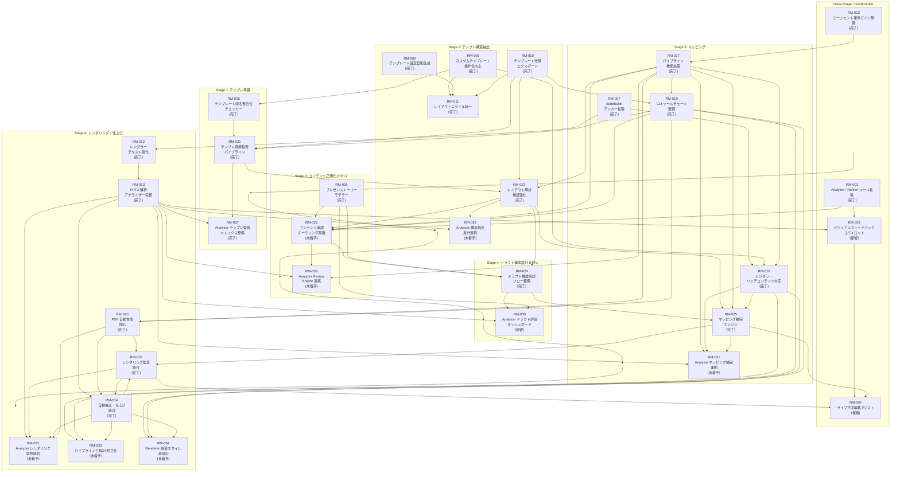

# 開発ロードマップ（大項目）

## 運用方針
- ブランチや PR を跨ぐ開発テーマを本ページで俯瞰し、ステータスの起点とする。
- 各テーマに紐づくタスク詳細は `docs/todo/` 配下で管理し、必ず相互リンクを張る。
- 進捗は「完了済み小項目数 / 総小項目数」を原則とし、更新日は ISO 形式で明記する。
- 評価指標や背景の議事は `docs/notes/` と `docs/requirements/`、設計変更は `docs/design/` を参照する。
- ロードマップから ToDo を切り出す際は、テンプレートに沿って「ブランチ→計画→設計→実装→テスト→関連Issue→PR」までの工程を明文化し、計画段階のみで完了とする場合は判断者・判断日・次判断条件をメモ欄に残す。

## 全体目標と指標
- **北極星指標**: 月次で社内提案書 120 件を自動生成し、手戻り率（再提出件数 / 総件数）10% 以下を達成する。
- **品質指標**: Analyzer が検知する `critical` issue を 1 ジョブあたり平均 0.5 件以下に抑える。
- **効率指標**: 30 スライド構成を 60 秒以内で PPTX + PDF 出力まで完了させる。
- **運用指標**: 監査ログの欠損率 0% を維持し、ジョブ失敗時の再実行時間を 5 分以内とする。

## 6 工程一覧
| No. | 工程 | 概要 |
| --- | --- | --- |
| 1 | テンプレ準備 | テンプレ資産 (.pptx) の整備と版管理 |
| 2 | テンプレ構造抽出 | レイアウト構造 JSON / ヒント値の生成 |
| 3 | コンテンツ正規化 (HITL) | 入力データをスライド素材へ整形し承認 |
| 4 | ドラフト構成設計 (HITL) | 章立て・ページ順・layout_hint を確定 |
| 5 | マッピング | レイアウト割付と `rendering_ready.json` 作成 |
| 6 | PPTX レンダリング | 最終出力と監査メタ付与 |

## 個別状況
- テーマごとに `RM-xxx` 番号を付与し、ToDo フロントマターの `roadmap_item` と一致させる。

### RM-001 Analyzer / Refiner ルール拡張
- ゴール: 品質診断と自動補正の精度を高め、要件定義書 4.3〜4.4 節の達成度を引き上げる。
- 対象工程: 5（マッピング）・6（PPTX レンダリング）に付随する Analyzer / Refiner 処理
- 参照ドキュメント: [docs/requirements/requirements.md](../requirements/requirements.md), [docs/design/design.md](../design/design.md)
- 参照 ToDo: [docs/todo/archive/20251007-analyzer-layout-consistency.md](../todo/archive/20251007-analyzer-layout-consistency.md)
- 状況: 完了（2025-10-15 更新）
- 期待成果: `contrast_low` 判定の調整、`layout_consistency` 追加、Fix ログの監査連携。

### RM-002 エージェント運用ガイド整備
- ゴール: エージェントが参照する AGENTS.md と連動ドキュメントを体系化し、開発プロセスやテンプレート準備手順を一元管理する。
- 参照ドキュメント: [AGENTS.md](../AGENTS.md), [CONTRIBUTING.md](../CONTRIBUTING.md), [docs/policies/config-and-templates.md](../policies/config-and-templates.md)
- 参照 ToDo: [docs/todo/20251009-samples-expansion.md](../todo/20251009-samples-expansion.md)
- 状況: 完了（2025-10-17 更新）
- 期待成果: テンプレート準備ガイドの整備に加え、最小構成・フル構成サンプルの提供と活用ドキュメントの拡充。
- 関連テーマ: フェーズ1 で整備したサンプルテンプレートと運用ルール、レンダラー改善テーマ（RM-007/008/018）と連携するドキュメント基盤。

### RM-003 ビジュアルフィードバックコパイロット
- ゴール: 生成されたスライドに対し、視覚モデル＋LLM がリアルタイムで「目線導線」「情報の密度」「ブランド逸脱」を可視化し、プレゼンターが WOW と感じる改善提案を提示する。
- 対象工程: 5・6（レンダリング後の評価）＋ フィードバック API 全体
- 参照ドキュメント: [docs/design/design.md](../design/design.md)
- 状況: 保留（2025-10-17 更新）
- 期待成果: スライド PNG + 幾何情報を入力としたフィードバック API、ダッシュボード UI モック、Fix への反映ルール策定。
- 依存: RM-001（Analyzer / Refiner ルール拡張）のログ・指標整備、RM-013（PPTX 解析アナライザー実装）による幾何情報取得、画像生成モデルの選定、GPU 実行基盤との連携。
- 再開条件: ユーザーが明示的に再開指示を出すこと。

### RM-004 営業ナレッジ連携自動化
- ゴール: CRM や案件管理システムから取得した勝ちパターン・競合情報を提案書自動生成に組み込み、ユーザーにとっての「次の一手」を提案する。
- 対象工程: 3・4（コンテンツ正規化 / ドラフト構成設計）への外部データ統合
- 参照ドキュメント: [docs/requirements/requirements.md](../requirements/requirements.md)
- 状況: 完了（2025-10-15 更新）
- 完了理由: 案件連携のニーズが解消されたため開発を終了。
- 期待成果: （クローズ時点で未着手）CRM 連携スキーマ定義、勝因レビューの LLM 要約、提案書内へのサジェストブロック挿入。
- 依存: CRM API トークン管理、個人情報マスキング、ジョブスケジューラ。
- 次のアクション: なし（ニーズ解消のためクローズ済み）。

### RM-005 プレゼンストーリーモデラー
- ゴール: ユーザーの案件メモやディスカッションログから、提案書のストーリーラインを AI が共同設計できるよう企画・要件・設計ドキュメントを整備し、工程3でのストーリー要素取り込みを支える。
- 対象工程: 3・4（コンテンツ正規化 / ドラフト構成設計）の高度化
- 参照ドキュメント: [docs/notes/20251004-initial-deiscussion.txt](../notes/20251004-initial-deiscussion.txt), [docs/requirements/requirements.md](../requirements/requirements.md), [docs/requirements/stages/stage-03-content-normalization.md](../requirements/stages/stage-03-content-normalization.md)
- 状況: 完了（2025-10-16 更新）
- 期待成果: ストーリー骨子メタ (`story_outline.json`) の要件定義、ストーリーフェーズ分類・章立て整合ロジックの設計メモ、工程3 UI/ワークフローへの差し込み計画。
- 関連テーマ: RM-023（コンテンツ承認オーサリング基盤）で整備する承認メタデータ、LLM プロンプト設計、ユーザー入力メタデータ（客先業界・想定読者）の整備。

### RM-006 ライブ共同編集アシスト
- ゴール: 提案会議中でも AI がライブでスライド修正案・説明コメント・補足資料リンクを提示し、即応性の高いプレゼンを実現する。
- 対象工程: 3・4・5（リアルタイム編集とマッピング）の拡張
- 参照ドキュメント: [docs/design/design.md](../design/design.md)
- 状況: 保留（2025-10-17 更新）
- 期待成果: WebSocket ベースの共同編集プロトコル設計、リアルタイム要約と修正提案、セッション監査ログ。
- 依存: RM-003（ビジュアルフィードバックコパイロット）のフィードバック API、RM-025（マッピング補完エンジン）のリアルタイム適用、RM-026（レンダリング監査統合）の監査メタ連携、低遅延インフラ、アクセス制御、UI コンポーネント設計。
- 再開条件: ユーザーが明示的に再開指示を出すこと。

### RM-007 SlideBullet アンカー拡張
- ゴール: SlideBullet 要素がテンプレート内の任意テキスト図形へ挿入できるようレンダラーを拡張し、複数レイアウトでの再利用性を高める。
- 対象工程: 5（マッピング）
- 参照ドキュメント: [docs/AGENTS.md](../AGENTS.md)
- 参照 ToDo: [docs/todo/archive/20251010-renderer-slidebullet-anchor.md](../todo/archive/20251010-renderer-slidebullet-anchor.md)
- 状況: 完了（2025-10-11 更新）
- 達成成果: JSON 仕様でのアンカー指定対応完了、`_resolve_anchor` を用いた統一的な処理実装、プレースホルダー削除機能実装、テストケース追加（全 10 件成功）、CLI 統合テスト検証完了（全 5 件成功）。
- 依存: テンプレートレイアウト命名規則、Open XML SDK による仕上げ処理、PDF 変換時の段落整形。

### RM-008 カスタムテンプレート操作性向上
- ゴール: プレースホルダー名称を活用して画像・テーブル・チャートを配置し、テンプレート側で図形種類を固定しなくてもアンカー指定が有効になる状態を実現する。
- 対象工程: 1・2（テンプレ準備 / 構造抽出）と 5（マッピング）への影響
- 参照 ToDo: [docs/todo/archive/20251009-placeholder-anchor.md](../todo/archive/20251009-placeholder-anchor.md)
- 状況: 完了（2025-10-11 更新）
- 期待成果: プレースホルダーと図形のアンカー混在対応、テンプレート準備ガイドの更新、回帰テストによる互換性確認。
- 依存: レンダラーのアンカー解決ロジック、テンプレート操作ドキュメント、CLI テストスイート。

### RM-009 テンプレート設定自動生成
- ゴール: PPTX テンプレートから `config/branding.json` 同等のスタイル定義を自動生成し、ブランド設定保守の手間を削減する。
- 参照ドキュメント: 未整備（本テーマで作成予定）
- 参照 ToDo: [docs/todo/archive/20251009-branding-config-generator.md](../todo/archive/20251009-branding-config-generator.md)
- 状況: 完了（2025-10-11 更新）
- 期待成果: 抽出対象となるフォント・配色情報の整理、python-pptx で取得可能な属性の調査結果、変換フロー（CLI / スクリプト）の方向性。
- 依存: python-pptx のスタイル取得制約、LibreOffice / Open XML SDK での補完可否、ブランド設定 JSON のスキーマ拡張余地。

### RM-010 テンプレート仕様エクスポート
- ゴール: PPTX テンプレートから `samples/json/sample_spec.json` に必要なレイアウト・アンカー情報を抽出し、JSON 雛形を自動生成する。
- 参照ドキュメント: [README.md](../README.md)（extract-template セクション）
- 参照 ToDo: [docs/todo/archive/20251009-template-spec-export.md](../todo/archive/20251009-template-spec-export.md)
- 状況: 完了（2025-10-11 更新）
- 達成成果: `extract-template` CLI コマンドおよび `TemplateExtractorStep` を実装、抽出結果を JSON/YAML で出力可能にし、README に使用手順を追加。単体・統合テストを整備し、テンプレート構造解析フローを確立。
- 依存: python-pptx による図形情報取得、テンプレート命名規則、サンプルテンプレート資産。

### RM-011 レイアウトスタイル統一
- ゴール: テーブル・チャート・画像などのレイアウトスタイルを設定ファイルで統一管理し、ブランド統一感を維持できるようにする。
- 対象工程: 5（マッピング）・6（レンダリング）
- 参照ドキュメント: [docs/design/layout-style-governance.md](../design/layout-style-governance.md)
- 参照 ToDo: [docs/todo/20251011-layout-style-governance.md](../todo/20251011-layout-style-governance.md)
- 状況: 完了（2025-10-17 更新）
- 期待成果: レイアウト用設定スキーマ整備、レンダラーでのスタイル適用、サンプルとテストの更新。
- 依存: RM-008（アンカー混在対応）、RM-009（テンプレート設定自動生成）、RM-010（テンプレート仕様エクスポート）、`config/branding.json` の拡張設計。
- 成果: `layout-style-v1` スキーマとブランド設定テンプレートを確立し、`config/branding.json`／レンダラー適用ロジック／CLI ドキュメントを更新済み。
   - 備考: レイアウト仕様をエクスポートし資料化する拡張は RM-010 完了後の成果を元に新規 Roadmap として検討する。

### RM-012 レンダラーテキスト強化
- ゴール: スライドのサブタイトル・ノート・テキストボックスを含む文章要素をレンダラーで描画し、基本レイアウト要件を満たす。
- 参照ドキュメント: [docs/design/design.md](../design/design.md), [docs/notes/20251009-feature-gap-analysis.md](../notes/20251009-feature-gap-analysis.md)
- 参照 ToDo: [docs/todo/archive/20251011-renderer-text-enhancement.md](../todo/archive/20251011-renderer-text-enhancement.md)
- 状況: 完了（2025-10-11 更新）
- 期待成果: `Slide.subtitle` と `notes` の描画処理実装、`slides[].textboxes[]` スキーマと描画サポート、サンプル／テストの反映。
- 依存: RM-007（SlideBullet アンカー拡張）の仕様調整、`samples/templates/` のレイアウト更新、CLI 統合テスト。

### RM-013 PPTX 解析アナライザー実装
- ゴール: 生成された PPTX を解析して幾何・スタイル情報を収集し、`grid_misaligned` など設計済みルールを含む品質診断を実現する。
- 対象工程: 6（レンダリング後の解析）
- 参照ドキュメント: [docs/requirements/requirements.md](../requirements/requirements.md), [docs/design/design.md](../design/design.md), [docs/notes/20251009-feature-gap-analysis.md](../notes/20251009-feature-gap-analysis.md)
- 参照 ToDo: [docs/todo/archive/20251011-pptx-analyzer-implementation.md](../todo/archive/20251011-pptx-analyzer-implementation.md)
- 状況: 完了（2025-10-16 更新）
- 期待成果: PPTX 読み取りロジックと issue/fix 出力、既存 JSON ベース診断からの移行計画、テストデータ（PPTX）を用いた検証。
- 依存: LibreOffice / Open XML SDK 等の解析ツール選定、RM-012 で追加する描画仕様、CI 環境でのバイナリ比較手法。

### RM-014 自動補正・仕上げ統合
- ゴール: Refiner の自動補正範囲を拡張し、Open XML SDK ベースの Polisher を組み込んで仕上げ工程を自動化する。
- 対象工程: 5（マッピング）・6（レンダリング）および仕上げ工程
- 参照ドキュメント: [docs/design/design.md](../design/design.md), [docs/notes/20251009-feature-gap-analysis.md](../notes/20251009-feature-gap-analysis.md)
- 参照 ToDo: [docs/todo/archive/20251011-automated-polisher-integration.md](../todo/archive/20251011-automated-polisher-integration.md)
- 状況: 完了（2025-10-19 更新）
- 期待成果: フォントサイズ引き上げ・色調整などの安全な自動適用、Polisher プロジェクト雛形と CLI 連携、監査ログへの補正記録。
- 進捗: `pptx gen` に `--polisher` 系オプションを追加し、Python から Open XML Polisher を呼び出すステップと監査メタを実装。`config/rules.json` の `polisher` セクションを拡張済み。`dotnet/Polisher` プロジェクトでフォントサイズ・色調整を自動適用する最小実装を追加。
- 依存: RM-013 の解析結果、RM-026（レンダリング監査統合）のチェックルール、RM-020（PDF 自動生成対応）の出力フロー、.NET 8 実行環境、テンプレート運用ポリシーの更新。

### RM-015 ロードマップ再設計
- ゴール: 全自動パワポ生成パイプラインの戦略を整理し、6 工程（3・4 HITL 含む）のフェーズ構成・KPI・フォールバックポリシーを文書化する。
- 参照ドキュメント: [docs/notes/20251011-roadmap-refresh.md](../notes/20251011-roadmap-refresh.md)
- 参照 ToDo: [docs/todo/archive/20251011-roadmap-refresh.md](../todo/archive/20251011-roadmap-refresh.md)
- 状況: 完了（2025-10-11 更新）
- 期待成果: 工程ごとのタスク整理、レイアウト選定/縮約ポリシーの方針化、HITL 承認フローと監査ログ方針整理。
  - 工程1・2: テンプレ構造抽出 CLI 要件定義と PoC 設計（ToDo 発行予定）、テンプレ運用ポリシー更新。
  - 工程3・4: レイアウトスコアリング指標の設計、AI レビュー評価指標の数値化、承認 UI / API 設計、`docs/design/schema/README.md` のモデル実装。
  - 工程5・6: 監査ログ項目と承認状態遷移の最小セット定義、軽量整合チェックと Polisher 連携の拡張。
  - ドキュメント反映タスクの推進（[docs/notes/20251011-docs-update-plan.md](../notes/20251011-docs-update-plan.md) / [docs/todo/archive/20251011-roadmap-refresh.md](../todo/archive/20251011-roadmap-refresh.md)）

### RM-016 テンプレート命名整合性チェッカー
- ゴール: テンプレート内で同一スライドに重複するプレースホルダー／図形名を検出し、アンカー指定時の衝突を防ぐ運用・実装フローを整える。
- 対象工程: 1・2（テンプレ準備 / 構造抽出）
- 参照ドキュメント: [docs/policies/config-and-templates.md](../policies/config-and-templates.md)
- 参照 ToDo: （未作成 — 着手時に `docs/todo/` へ登録）
- 状況: 完了（2025-10-15 更新）
- 期待成果: テンプレート読込時の名称衝突検知、CLI への警告出力、プレースホルダー命名規則の追加ガイド。
- 依存: RM-008（カスタムテンプレート操作性向上）のアンカー実装、テンプレート運用ポリシー、CLI 構成の拡張余地。

### RM-017 パイプライン機能拡張
- ゴール: JSON スキーマ拡張と自動診断強化によって生成品質を底上げする。
- 参照 ToDo: [docs/todo/archive/20251004-pipeline-enhancements.md](../todo/archive/20251004-pipeline-enhancements.md), [docs/todo/archive/20251010-auto-complete-archive-handling.md](../todo/archive/20251010-auto-complete-archive-handling.md)
- 状況: 7 件中 7 件完了（2025-10-06 更新）、追加修正 1 件完了（2025-10-10 更新）
- 成果: スキーマ拡張、Analyzer 出力整備、テスト追加、関連ドキュメント更新。
- 追加成果: auto_complete_todo.py でアーカイブ済み ToDo の成功判定を実装（PR #146）。
- 依存: RM-002（エージェント運用ガイド整備）。
- 関連テーマ: RM-007/008（レンダラー拡張）、RM-010（テンプレート仕様エクスポート）。

### RM-018 レンダラー リッチコンテンツ対応
- ゴール: 表・画像・グラフをブランドスタイル付きで描画できるレンダラーを実装する。
- 参照 ToDo: [docs/todo/archive/20251005-renderer-rich-content.md](../todo/archive/20251005-renderer-rich-content.md)
- 状況: 完了（2025-10-06 更新）
- 成果: リッチコンテンツ描画処理、テンプレート改善、検証手順の追加。
- 依存: RM-017（パイプライン機能拡張）、RM-007（SlideBullet アンカー拡張）、RM-008（テンプレート操作性向上）。

### RM-019 CLI ツールチェーン整備
- ゴール: 提案書生成と周辺支援機能を単一 CLI へ統合し、テンプレ抽出やサンプル spec 生成を含むワークフロー整備を加速する。
- 参照ドキュメント: [docs/notes/20251011-branding-config-mapping.md](../notes/20251011-branding-config-mapping.md)
- 参照 ToDo: [docs/todo/archive/20251011-cli-toolkit-refactor.md](../todo/archive/20251011-cli-toolkit-refactor.md)
- 状況: 完了（2025-10-15 更新）
- 期待成果: エントリーポイント `pptx` への改称、`gen` / `tpl-extract` サブコマンドの実装、将来の `spec-generate` など支援系機能の導線整備。
- 依存: RM-017（パイプライン機能拡張）、RM-010（テンプレート仕様エクスポート）。
- 関連テーマ: CLI 運用ガイド（`docs/AGENTS.md`）、既存パイプライン構成、PyYAML などの依存パッケージ管理。

### RM-020 PDF 自動生成対応
- ゴール: PPTX 生成直後に PDF 化までを自動化し、配布用資料をワンステップで提供する。
- 参照 ToDo: [docs/todo/archive/20251005-pdf-export-automation.md](../todo/archive/20251005-pdf-export-automation.md)
- 状況: 完了（2025-10-06 更新）
- 成果: PR #152 https://github.com/yurake/pptx_generator/pull/152
- 依存: RM-017（パイプライン機能拡張）、RM-019（CLI ツールチェーン整備）。
- 関連テーマ: LibreOffice 実行環境整備、テンプレート運用ガイド（RM-002）。

### RM-021 テンプレ資産監査パイプライン
- ゴール: テンプレ改訂時に差分と品質を自動診断し、工程 1 の受け渡しを自動化する。
- 対象工程: 1（テンプレ準備）
- 参照ドキュメント: [docs/requirements/stages/stage-01-template-preparation.md](../requirements/stages/stage-01-template-preparation.md)
- 参照 ToDo: [docs/todo/archive/20251012-template-audit-pipeline.md](../todo/archive/20251012-template-audit-pipeline.md)
- 状況: 完了（2025-10-16 更新）
- 期待成果: `uv run pptx tpl-release` による `template_release.json` / `release_report.json` 自動生成と、`golden_runs.json` によるゴールデンサンプル検証ログの取得（達成済み）。
- 依存: RM-016（テンプレ命名整合性チェッカー）、RM-019（CLI ツールチェーン整備）、RM-010（テンプレート仕様エクスポート）、LibreOffice / Open XML SDK の差分検証ワークフロー。

### RM-022 レイアウト解析検証強化
- ゴール: 工程 2 の抽出結果をスキーマ検証・差分可視化で保証し、マッピング前の品質を高める。
- 対象工程: 2（テンプレ構造抽出）
- 参照ドキュメント: [docs/requirements/stages/stage-02-template-structure-extraction.md](../requirements/stages/stage-02-template-structure-extraction.md)
- 参照 ToDo: [docs/todo/archive/20251012-layout-validation-suite.md](../todo/archive/20251012-layout-validation-suite.md)
- 状況: 完了（2025-10-16 更新）
- 期待成果: `layouts.jsonl` スキーマバリデータ、差分レポート可視化、ヒント係数・用途タグ推定ロジック。
- 依存: RM-021（テンプレ資産監査パイプライン）、RM-010（テンプレート仕様エクスポート）、RM-017（パイプライン機能拡張）、python-pptx / Open XML SDK の抽出結果、CI での JSON 検証基盤。

### RM-023 コンテンツ承認オーサリング基盤
- ゴール: 工程 3 の HITL 承認 API と AI レビュー連携を整備し、承認ログを監査可能にする（UI は将来バックログ）。
- 対象工程: 3（コンテンツ正規化）
- 参照ドキュメント: [docs/requirements/stages/stage-03-content-normalization.md](../requirements/stages/stage-03-content-normalization.md)
- 参照 ToDo: [docs/todo/archive/20251012-content-approval-platform.md](../todo/archive/20251012-content-approval-platform.md)
- 状況: 完了（2025-10-17 更新）
- 期待成果: 承認 API 設計、AI レビュー（グレード/Auto-fix）の実装方針、禁則語および必須項目のリアルタイム検知。UI ワイヤーは参考資料として整理しつつ実装は後続へ委譲。
- 依存: RM-001（Analyzer / Refiner ルール拡張）、RM-005（プレゼンストーリーモデラー）、RM-022（レイアウト解析検証強化）、RM-017（パイプライン機能拡張）、RM-019（CLI ツールチェーン整備）。
- 関連テーマ: 監査ログ基盤。

### RM-024 ドラフト構成承認フロー整備
- ゴール: 工程 4 の構成管理 API と `layout_hint` 管理を実装し、章立て承認を CLI / API ベースで確実化する。
- 対象工程: 4（ドラフト構成設計）
- 参照ドキュメント: [docs/requirements/stages/stage-04-draft-structuring.md](../requirements/stages/stage-04-draft-structuring.md)
- 参照 ToDo: [docs/todo/archive/20251012-draft-structuring-workbench.md](../todo/archive/20251012-draft-structuring-workbench.md)
- 状況: 完了（2025-10-17 更新）
- 期待成果: layout_hint 候補スコアリング、付録操作履歴、章承認ログを備えた CLI / API、`draft_draft.json`／`draft_approved.json` の出力整備。
- 依存: RM-023（コンテンツ承認基盤）、RM-022（レイアウト解析検証強化）、RM-005（プレゼンストーリーモデラー）、RM-017（パイプライン機能拡張）。

### RM-025 マッピング補完エンジン
- ゴール: 工程 5 のスコアリング・フォールバック・AI 補完を実装し、`rendering_ready.json` の確度を高める。
- 対象工程: 5（マッピング）
- 参照ドキュメント: [docs/requirements/stages/stage-05-mapping.md](../requirements/stages/stage-05-mapping.md)
- 参照 ToDo: [docs/todo/20251012-mapping-orchestrator.md](../todo/20251012-mapping-orchestrator.md)
- 状況: 完了（2025-10-18 更新）
- 期待成果: レイアウトスコアリング指標とフォールバック制御、AI 補完差分ログ、`rendering_ready.json` スキーマ検証ツール。
- 依存: RM-022（レイアウト解析検証強化）、RM-024（ドラフト構成承認フロー）、RM-017（パイプライン機能拡張）、RM-018（レンダラー リッチコンテンツ対応）、LLM 推論基盤。

### RM-026 レンダリング監査統合
- ゴール: 工程 6 の軽量整合チェック・監査メタ・PDF/Polisher 統合を実装し、最終出力の信頼性を確保する。
- 対象工程: 6（PPTX 生成）
- 参照ドキュメント: [docs/requirements/stages/stage-06-rendering.md](../requirements/stages/stage-06-rendering.md)
- 参照 ToDo: [docs/todo/20251012-rendering-audit-integration.md](../todo/20251012-rendering-audit-integration.md)
- 状況: 完了（2025-10-20 更新）
- 期待成果: 軽量整合チェックルールセット、生成ログと承認ログの突合、PDF 変換と Open XML Polisher の統合フロー。
- 依存: RM-025（マッピング補完エンジン）、RM-014（自動補正・仕上げ統合）、RM-020（PDF 自動生成対応）、LibreOffice / Open XML SDK の実行環境、CI でのバイナリ検証手法。

### RM-027 Analyzer テンプレ監査メトリクス整備
- ゴール: Golden Sample Runner と release レポートに Analyzer 指摘を統合し、テンプレ受け渡し時の品質メトリクスを継続的に追跡できるようにする。
- 対象工程: 1（テンプレ準備）
- 参照ドキュメント: [docs/notes/20251016-pptx-analyzer-integration-opportunities.md](../notes/20251016-pptx-analyzer-integration-opportunities.md)
- 状況: 完了（2025-10-16 更新）
- 期待成果: `template_release.json` への指摘件数・種別集約、差分レポートでの件数推移可視化、テンプレ修正手順の runbook 化。
- 依存: RM-013（PPTX 解析アナライザー実装）、RM-021（テンプレ資産監査パイプライン）。

### RM-028 Analyzer 構造抽出差分連携
- ゴール: 抽出したプレースホルダー情報と Analyzer スナップショットを突合し、命名漏れやアンカー欠落を差分レポートで提示できるようにする。
- 対象工程: 2（テンプレ構造抽出）
- 参照ドキュメント: [docs/notes/20251016-pptx-analyzer-integration-opportunities.md](../notes/20251016-pptx-analyzer-integration-opportunities.md)
- 状況: 完了（2025-10-17 更新）
- 期待成果: `diagnostics.json` への Analyzer 警告統合、抽出結果と PPTX 実体を比較する diff レポート出力、命名規約逸脱の自動検知。
- 依存: RM-013（PPTX 解析アナライザー実装）、RM-022（レイアウト解析検証強化）。

### RM-029 Analyzer Review Engine 連携
- ゴール: `analysis.json` の `issues` / `fixes` を Review Engine が参照し、Auto-fix 提案やレビュー判断に Analyzer 情報を反映できるようにする。
- 対象工程: 3（コンテンツ正規化）
- 参照ドキュメント: [docs/notes/20251016-pptx-analyzer-integration-opportunities.md](../notes/20251016-pptx-analyzer-integration-opportunities.md)
- 状況: 完了（2025-10-17 更新）
- 期待成果: Analyzer `severity` に基づく差戻しカテゴリタグの UI 表示、Auto-fix 推論での Analyzer 補助、HITL レビューでの効率化指標。`review_engine_analyzer.json` で CLI から Review Engine 連携用データを出力済み。
- 依存: RM-013（PPTX 解析アナライザー実装）、RM-017（パイプライン機能拡張）、RM-023（コンテンツ承認オーサリング基盤）。

### RM-030 Analyzer ドラフト評価ダッシュボード
- ゴール: layout_hint 承認に Analyzer 指摘件数や `layout_consistency` 警告を活用し、構成調整の判断材料を提供する。
- 対象工程: 4（ドラフト構成設計）
- 参照ドキュメント: [docs/notes/20251016-pptx-analyzer-integration-opportunities.md](../notes/20251016-pptx-analyzer-integration-opportunities.md)
- 状況: 保留（2025-10-17 更新）
- 期待成果: Analyzer 統計をドラフトダッシュボードへ表示、`layout_consistency` を再インデント候補へ変換する API、HITL 作業の再作業削減。
- 依存: RM-013（PPTX 解析アナライザー実装）、RM-024（ドラフト構成承認フロー）、RM-005（プレゼンストーリーモデラー）。
- 再開条件: ユーザーが明示的に再開指示を出すこと。

### RM-031 Analyzer マッピング補完連動
- ゴール: マッピング結果に Analyzer 警告を併記し、AI 補完やフォールバック制御のトリガーに活用する。
- 対象工程: 5（マッピング）
- 参照ドキュメント: [docs/notes/20251016-pptx-analyzer-integration-opportunities.md](../notes/20251016-pptx-analyzer-integration-opportunities.md)
- 状況: 未着手（2025-10-16 追加）
- 期待成果: `mapping_log.json` への Analyzer 情報追加、`font_min` や `contrast_low` に基づく補完トリガー、自動フォローアップ候補の生成。
- 依存: RM-013（PPTX 解析アナライザー実装）、RM-017（パイプライン機能拡張）、RM-018（レンダラー リッチコンテンツ対応）、RM-025（マッピング補完エンジン）。
- 次のアクション: 補完ルールと Analyzer 指摘のマッピング整理、マッピングログ拡張設計、AI 補完シミュレーションの検証計画立案。

### RM-032 Analyzer レンダリング監視統合
- ゴール: レンダリング監査ログと Analyzer 出力を突合し、CI・通知チャネルで品質アラートを自動配信する。
- 対象工程: 6（PPTX レンダリング）
- 参照ドキュメント: [docs/notes/20251016-pptx-analyzer-integration-opportunities.md](../notes/20251016-pptx-analyzer-integration-opportunities.md)
- 状況: 未着手（2025-10-16 追加）
- 期待成果: Analyzer と監査ログの突合による通知連携、LibreOffice / Polisher 実行後の Analyzer 再走、改善度メトリクスの自動算出。
- 依存: RM-013（PPTX 解析アナライザー実装）、RM-026（レンダリング監査統合）、RM-014（自動補正・仕上げ統合）、RM-020（PDF 自動生成対応）。
- 次のアクション: 通知チャネル PoC の設計、再解析ジョブのスケジュール定義、CI ブリッジロジックのプロトタイプ作成。

### RM-033 パイプライン工程3/4独立化準備
- 依存: RM-023（コンテンツ承認オーサリング基盤）、RM-005（プレゼンストーリーモデラー）。
- 目的: 工程3/4を独立CLIとして提供できるよう、インターフェース・テスト観点・運用手順を整理する。
- マイルストーン:
  1. 工程3/4 CLI 分離要件の調査と設計方針整理（ToDo: フォローアップタスク）。
  2. テスト観点棚卸しと再実行手順のドキュメント化。
  3. CLI 実装案のプロトタイプと影響範囲評価。

### RM-034 Renderer 段落スタイル再設計
- ゴール: Renderer／Refiner 側でブランド定義に基づく段落スタイル（揃え・行間・余白・インデント）を確実に適用し、Polisher での補正を最小限に抑える。
- 対象工程: 6（PPTX レンダリング）
- 参照ドキュメント: [docs/notes/20251019-polisher-scope-review.md](../notes/20251019-polisher-scope-review.md)
- 参照 ToDo: （未作成 — 着手時に `docs/todo/` へ登録）
- 状況: 未着手（2025-10-19 追加）
- 期待成果: Renderer が段落揃え・行間・段落前後余白・箇条書きインデントをテンプレート／ブランド設定と一致させる。Refiner でのフォント・カラー補正と重複しないよう整理し、Polisher はテンプレ差分と監査ログ出力にフォーカスする。
- 依存: RM-018（レンダラー リッチコンテンツ対応）、RM-019（CLI ツールチェーン整備）、RM-014（自動補正・仕上げ統合）。
- 次のアクション: Renderer の段落スタイル適用実装、対応テストの追加、Polisher Scope ドキュメントの更新。

## バックログ
- `Service-F Distributor` の通知チャネル整備（Teams / Slack）と監査ログ統合。運用要件（docs/requirements/requirements.md の 5. 出力と配布）で求められる保存先連携・通知を実現し、`docs/notes/20251009-feature-gap-analysis.md` の指摘に基づき対応方針を再整理する。
- CLI / REST API の認証方式統一（OAuth2 / SAS トークン）とキー管理ドキュメントの追加。
- `reverse_engineer.py` PoC による既存 PPTX からの spec 逆生成検討。
- 専用 UI（Content Board / Storyboard）の実装および操作ログ整備。現フェーズは API／CLI ベースで運用し、UI は後続で再評価する。

## 更新履歴
- 2025-10-05: 初版作成。
- 2025-10-05: 全体目標、フェーズ計画、バックログを追記。
- 2025-10-06: PDF 自動生成の実装状況と監査ログ出力機能を追記。
- 2025-10-07: PDF 自動生成対応を完了テーマへ移動。
- 2025-10-09: RM-002 を再開し、サンプル拡充タスクと参照ドキュメントを追記。
- 2025-10-09: RM-012〜RM-014 を追加し、通知チャネル整備のバックログ情報を更新。
