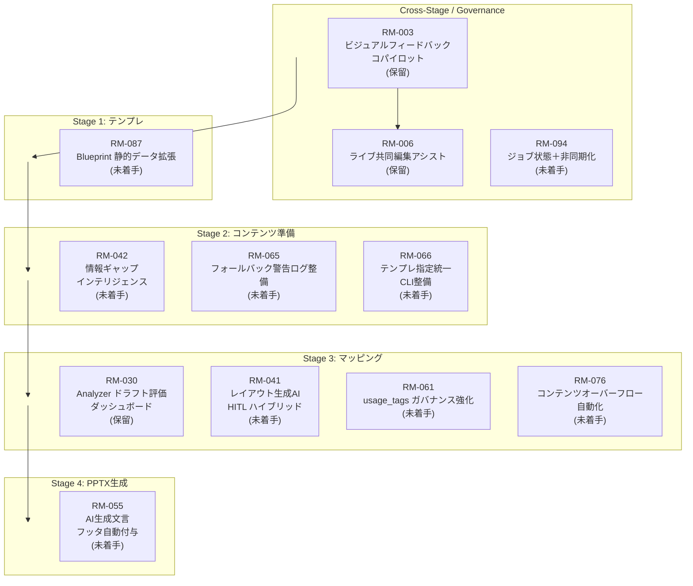

# 開発ロードマップ（大項目）

## 運用方針
- ブランチや PR を跨ぐ開発テーマを本ページで俯瞰し、ステータスの起点とする。
- 各テーマに紐づくタスク詳細は `docs/todo/` 配下で管理し、必ず相互リンクを張る。
- 進捗は「完了済み小項目数 / 総小項目数」を原則とし、更新日は ISO 形式で明記する。
- 評価指標や背景の議事は `docs/notes/` と `docs/requirements/`、設計変更は `docs/design/` を参照する。
- ロードマップから ToDo を切り出す際は、テンプレートに沿って「ブランチ→計画→設計→実装→テスト→関連Issue→PR」までの stage を明文化し、計画段階のみで完了とする場合は判断者・判断日・次判断条件をメモ欄に残す。
- Mermaid 図は未着手・進行中・保留のテーマのみを表示し、完了テーマは個別状況セクションで参照する。

## 全体目標と指標
- **北極星指標**: 月次で社内提案書 120 件を自動生成し、手戻り率（再提出件数 / 総件数）10% 以下を達成する。
- **品質指標**: Analyzer が検知する `critical` issue を 1 ジョブあたり平均 0.5 件以下に抑える。
- **効率指標**: 30 スライド構成を 60 秒以内で PPTX + PDF 出力まで完了させる。
- **運用指標**: 監査ログの欠損率 0% を維持し、ジョブ失敗時の再実行時間を 5 分以内とする。

## 4 stage 一覧
| No. | stage | 概要 |
| --- | --- | --- |
| 1 | テンプレ | テンプレ資産の整備・抽出・検証・リリースメタ生成を一括実行 |
| 2 | コンテンツ準備 | 入力データをスライド素材へ整形し承認 |
| 3 | マッピング | 章構成承認とレイアウト割付を実施し、`generate_ready.json`／`generate_ready_meta.json` を出力 |
| 4 | PPTX生成 | 最終出力と監査メタ付与 |

```mermaid
flowchart TB
    subgraph GOV["Cross-Stage / Governance"]
        direction TB
        GOV_ANCHOR(( ))
        RM003["RM-003<br/>ビジュアルフィードバック<br/>コパイロット<br/>(保留)"]
        RM006["RM-006<br/>ライブ共同編集アシスト<br/>(保留)"]
        RM094["RM-094<br/>ジョブ状態＋非同期化<br/>(未着手)"]
    end

    subgraph ST1["Stage 1: テンプレ"]
        direction TB
        ST1_ANCHOR(( ))
        RM087["RM-087<br/>Blueprint 静的データ拡張<br/>(未着手)"]
    end

    subgraph ST2["Stage 2: コンテンツ準備"]
        direction TB
        ST2_ANCHOR(( ))
        RM042["RM-042<br/>情報ギャップ<br/>インテリジェンス<br/>(未着手)"]
        RM065["RM-065<br/>フォールバック警告ログ整備<br/>(未着手)"]
        RM066["RM-066<br/>テンプレ指定統一<br/>CLI整備<br/>(未着手)"]
    end

    subgraph ST3["Stage 3: マッピング"]
        direction TB
        ST3_ANCHOR(( ))
        RM030["RM-030<br/>Analyzer ドラフト評価<br/>ダッシュボード<br/>(保留)"]
        RM041["RM-041<br/>レイアウト生成AI<br/>HITL ハイブリッド<br/>(未着手)"]
        RM061["RM-061<br/>usage_tags ガバナンス強化<br/>(未着手)"]
        RM076["RM-076<br/>コンテンツオーバーフロー自動化<br/>(未着手)"]
    end

    subgraph ST4["Stage 4: PPTX生成"]
        direction TB
        ST4_ANCHOR(( ))
        RM055["RM-055<br/>AI生成文言<br/>フッタ自動付与<br/>(未着手)"]
    end

    style GOV_ANCHOR fill:transparent,stroke:transparent
    style ST1_ANCHOR fill:transparent,stroke:transparent
    style ST2_ANCHOR fill:transparent,stroke:transparent
    style ST3_ANCHOR fill:transparent,stroke:transparent
    style ST4_ANCHOR fill:transparent,stroke:transparent

    GOV_ANCHOR --> ST1_ANCHOR --> ST2_ANCHOR --> ST3_ANCHOR --> ST4_ANCHOR

    RM003 --> RM006
```

## 個別状況
- テーマごとに `RM-xxx` 番号を付与し、ToDo フロントマターの `roadmap_item` と一致させる。

### RM-001 Analyzer / Refiner ルール拡張
- ゴール: 品質診断と自動補正の精度を高め、要件定義書 4.3〜4.4 節の達成度を引き上げる。
- 対象 stage: 5（マッピング）・6（PPTX レンダリング）に付随する Analyzer / Refiner 処理
- 参照ドキュメント: [docs/requirements/requirements.md](../requirements/requirements.md), [docs/design/design.md](../design/design.md)
- 参照 ToDo: [docs/todo/archive/20251007-analyzer-layout-consistency.md](../todo/archive/20251007-analyzer-layout-consistency.md)
- 依存: なし（Analyzer / Refiner ルール拡張の基盤テーマ）
- 状況: 完了（2025-10-15 更新）
- 期待成果: `contrast_low` 判定の調整、`layout_consistency` 追加、Fix ログの監査連携。

### RM-002 エージェント運用ガイド整備
- ゴール: エージェントが参照する AGENTS.md と連動ドキュメントを体系化し、開発プロセスやテンプレート準備手順を一元管理する。
- 参照ドキュメント: [AGENTS.md](../AGENTS.md), [CONTRIBUTING.md](../CONTRIBUTING.md), [docs/policies/config-and-templates.md](../policies/config-and-templates.md)
- 参照 ToDo: [docs/todo/20251009-samples-expansion.md](../todo/20251009-samples-expansion.md)
- 依存: なし（エージェント運用ガイド整備の出発点）
- 状況: 完了（2025-10-17 更新）
- 期待成果: テンプレート準備ガイドの整備に加え、最小構成・フル構成サンプルの提供と活用ドキュメントの拡充。
- 関連テーマ: フェーズ1 で整備したサンプルテンプレートと運用ルール、レンダラー改善テーマ（RM-007/008/018）と連携するドキュメント基盤。

### RM-003 ビジュアルフィードバックコパイロット
- ゴール: 生成されたスライドに対し、視覚モデル＋LLM がリアルタイムで「目線導線」「情報の密度」「ブランド逸脱」を可視化し、プレゼンターが WOW と感じる改善提案を提示する。
- 対象 stage: 5・6（レンダリング後の評価）＋ フィードバック API 全体
- 参照ドキュメント: [docs/design/design.md](../design/design.md)
- 状況: 保留（2025-10-17 更新）
- 期待成果: スライド PNG + 幾何情報を入力としたフィードバック API、ダッシュボード UI モック、Fix への反映ルール策定。
- 依存: RM-001（Analyzer / Refiner ルール拡張）のログ・指標整備、RM-013（PPTX 解析アナライザー実装）による幾何情報取得、画像生成モデルの選定、GPU 実行基盤との連携。
- 再開条件: ユーザーが明示的に再開指示を出すこと。

### RM-004 営業ナレッジ連携自動化
- ゴール: CRM や案件管理システムから取得した勝ちパターン・競合情報を提案書自動生成に組み込み、ユーザーにとっての「次の一手」を提案する。
- 対象 stage: 3・4（コンテンツ準備 / ドラフト構成設計）への外部データ統合
- 参照ドキュメント: [docs/requirements/requirements.md](../requirements/requirements.md)
- 状況: 完了（2025-10-15 更新）
- 完了理由: 案件連携のニーズが解消されたため開発を終了。
- 期待成果: （クローズ時点で未着手）CRM 連携スキーマ定義、勝因レビューの LLM 要約、提案書内へのサジェストブロック挿入。
- 依存: CRM API トークン管理、個人情報マスキング、ジョブスケジューラ。
- 次のアクション: なし（ニーズ解消のためクローズ済み）。

### RM-005 プレゼンストーリーモデラー
- ゴール: ユーザーの案件メモやディスカッションログから、提案書のストーリーラインを AI が共同設計できるよう企画・要件・設計ドキュメントを整備し、stage 3 でのストーリー要素取り込みを支える。
- 対象 stage: 3・4（コンテンツ準備 / ドラフト構成設計）の高度化
- 参照ドキュメント: [docs/notes/20251004-initial-deiscussion.txt](../notes/20251004-initial-deiscussion.txt), [docs/requirements/requirements.md](../requirements/requirements.md), [docs/requirements/stages/stage-02-prepare.md](../requirements/stages/stage-02-prepare.md)
- 依存: RM-023（コンテンツ承認オーサリング基盤）のメタデータ整備
- 状況: 完了（2025-10-16 更新）
- 期待成果: ストーリー骨子メタ (`story_outline.json`) の要件定義、ストーリーフェーズ分類・章立て整合ロジックの設計メモ、stage 3 UI/ワークフローへの差し込み計画。
- 関連テーマ: RM-023（コンテンツ承認オーサリング基盤）で整備する承認メタデータ、LLM プロンプト設計、ユーザー入力メタデータ（客先業界・想定読者）の整備。

### RM-006 ライブ共同編集アシスト
- ゴール: 提案会議中でも AI がライブでスライド修正案・説明コメント・補足資料リンクを提示し、即応性の高いプレゼンを実現する。
- 対象 stage: 3・4・5（リアルタイム編集とマッピング）の拡張
- 参照ドキュメント: [docs/design/design.md](../design/design.md)
- 状況: 保留（2025-10-17 更新）
- 期待成果: WebSocket ベースの共同編集プロトコル設計、リアルタイム要約と修正提案、セッション監査ログ。
- 依存: RM-003（ビジュアルフィードバックコパイロット）のフィードバック API、RM-025（マッピング補完エンジン）のリアルタイム適用、RM-026（レンダリング監査統合）の監査メタ連携、低遅延インフラ、アクセス制御、UI コンポーネント設計。

### RM-007 SlideBullet アンカー拡張
- ゴール: SlideBullet 要素がテンプレート内の任意テキスト図形へ挿入できるようレンダラーを拡張し、複数レイアウトでの再利用性を高める。
- 対象 stage: 5（マッピング）
- 参照ドキュメント: [docs/AGENTS.md](../AGENTS.md)
- 参照 ToDo: [docs/todo/archive/20251010-renderer-slidebullet-anchor.md](../todo/archive/20251010-renderer-slidebullet-anchor.md)
- 状況: 完了（2025-10-11 更新）
- 達成成果: JSON 仕様でのアンカー指定対応完了、`_resolve_anchor` を用いた統一的な処理実装、プレースホルダー削除機能実装、テストケース追加（全 10 件成功）、CLI 統合テスト検証完了（全 5 件成功）。
- 依存: テンプレートレイアウト命名規則、Open XML SDK による仕上げ処理、PDF 変換時の段落整形。

### RM-008 カスタムテンプレート操作性向上
- ゴール: プレースホルダー名称を活用して画像・テーブル・チャートを配置し、テンプレート側で図形種類を固定しなくてもアンカー指定が有効になる状態を実現する。
- 対象 stage: 1・2（テンプレ準備 / 構造抽出）と 5（マッピング）への影響
- 参照 ToDo: [docs/todo/archive/20251009-placeholder-anchor.md](../todo/archive/20251009-placeholder-anchor.md)
- 状況: 完了（2025-10-11 更新）
- 期待成果: プレースホルダーと図形のアンカー混在対応、テンプレート準備ガイドの更新、回帰テストによる互換性確認。
- 依存: レンダラーのアンカー解決ロジック、テンプレート操作ドキュメント、CLI テストスイート。

### RM-009 テンプレート設定自動生成
- ゴール: PPTX テンプレートからスタイル定義 (`branding.json` スナップショット) を自動生成し、ブランド設定保守の手間を削減する。
- 参照ドキュメント: 未整備（本テーマで作成予定）
- 参照 ToDo: [docs/todo/archive/20251009-branding-config-generator.md](../todo/archive/20251009-branding-config-generator.md)
- 状況: 完了（2025-10-11 更新）
- 期待成果: 抽出対象となるフォント・配色情報の整理、python-pptx で取得可能な属性の調査結果、変換フロー（CLI / スクリプト）の方向性。
- 依存: python-pptx のスタイル取得制約、LibreOffice / Open XML SDK での補完可否、ブランド設定 JSON のスキーマ拡張余地。

### RM-010 テンプレート仕様エクスポート
- ゴール: PPTX テンプレートから `samples/json/sample_jobspec.json` に必要なレイアウト・アンカー情報を抽出し、JSON 雛形を自動生成する。
- 参照ドキュメント: [README.md](../README.md)（extract-template セクション）
- 参照 ToDo: [docs/todo/archive/20251009-template-spec-export.md](../todo/archive/20251009-template-spec-export.md)
- 状況: 完了（2025-10-11 更新）
- 達成成果: `extract-template` CLI コマンドおよび `TemplateExtractorStep` を実装、抽出結果を JSON/YAML で出力可能にし、README に使用手順を追加。単体・統合テストを整備し、テンプレート構造解析フローを確立。
- 依存: python-pptx による図形情報取得、テンプレート命名規則、サンプルテンプレート資産。

### RM-011 レイアウトスタイル統一
- ゴール: テーブル・チャート・画像などのレイアウトスタイルを設定ファイルで統一管理し、ブランド統一感を維持できるようにする。
- 対象 stage: 5（マッピング）・6（レンダリング）
- 参照ドキュメント: [docs/design/stages/stage-01-style-governance.md](../design/stages/stage-01-style-governance.md)
- 参照 ToDo: [docs/todo/20251011-layout-style-governance.md](../todo/20251011-layout-style-governance.md)
- 状況: 完了（2025-10-17 更新）
- 期待成果: レイアウト用設定スキーマ整備、レンダラーでのスタイル適用、サンプルとテストの更新。
- 依存: RM-008（アンカー混在対応）、RM-009（テンプレート設定自動生成）、RM-010（テンプレート仕様エクスポート）、テンプレ抽出 `branding.json` の拡張設計。
- 成果: `layout-style-v1` スキーマとブランド設定テンプレートを確立し、テンプレ抽出 `branding.json`／レンダラー適用ロジック／CLI ドキュメントを更新済み。
   - 備考: レイアウト仕様をエクスポートし資料化する拡張は RM-010 完了後の成果を元に新規 Roadmap として検討する。

### RM-012 レンダラーテキスト強化
- ゴール: スライドのサブタイトル・ノート・テキストボックスを含む文章要素をレンダラーで描画し、基本レイアウト要件を満たす。
- 参照ドキュメント: [docs/design/design.md](../design/design.md), [docs/notes/20251009-feature-gap-analysis.md](../notes/20251009-feature-gap-analysis.md)
- 参照 ToDo: [docs/todo/archive/20251011-renderer-text-enhancement.md](../todo/archive/20251011-renderer-text-enhancement.md)
- 状況: 完了（2025-10-11 更新）
- 期待成果: `Slide.subtitle` と `notes` の描画処理実装、`slides[].textboxes[]` スキーマと描画サポート、サンプル／テストの反映。
- 依存: RM-007（SlideBullet アンカー拡張）の仕様調整、`samples/templates/` のレイアウト更新、CLI 統合テスト。

### RM-013 PPTX 解析アナライザー実装
- ゴール: 生成された PPTX を解析して幾何・スタイル情報を収集し、`grid_misaligned` など設計済みルールを含む品質診断を実現する。
- 対象 stage: 6（レンダリング後の解析）
- 参照ドキュメント: [docs/requirements/requirements.md](../requirements/requirements.md), [docs/design/design.md](../design/design.md), [docs/notes/20251009-feature-gap-analysis.md](../notes/20251009-feature-gap-analysis.md)
- 参照 ToDo: [docs/todo/archive/20251011-pptx-analyzer-implementation.md](../todo/archive/20251011-pptx-analyzer-implementation.md)
- 状況: 完了（2025-10-16 更新）
- 期待成果: PPTX 読み取りロジックと issue/fix 出力、既存 JSON ベース診断からの移行計画、テストデータ（PPTX）を用いた検証。
- 依存: LibreOffice / Open XML SDK 等の解析ツール選定、RM-012 で追加する描画仕様、CI 環境でのバイナリ比較手法。

### RM-014 自動補正・仕上げ統合
- ゴール: Refiner の自動補正範囲を拡張し、Open XML SDK ベースの Polisher を組み込んで仕上げ stage を自動化する。
- 対象 stage: 5（マッピング）・6（レンダリング）および仕上げ stage
- 参照ドキュメント: [docs/design/design.md](../design/design.md), [docs/notes/20251009-feature-gap-analysis.md](../notes/20251009-feature-gap-analysis.md)
- 参照 ToDo: [docs/todo/archive/20251011-automated-polisher-integration.md](../todo/archive/20251011-automated-polisher-integration.md)
- 状況: 完了（2025-10-19 更新）
- 期待成果: フォントサイズ引き上げ・色調整などの安全な自動適用、Polisher プロジェクト雛形と CLI 連携、監査ログへの補正記録。
- 進捗: `pptx gen` に `--polisher` 系オプションを追加し、Python から Open XML Polisher を呼び出すステップと監査メタを実装。`src/pptx_generator/config/pipeline_rules.json` の `polisher` セクションを拡張済み。`dotnet/Polisher` プロジェクトでフォントサイズ・色調整を自動適用する最小実装を追加。
- 依存: RM-013 の解析結果、RM-026（レンダリング監査統合）のチェックルール、RM-020（PDF 自動生成対応）の出力フロー、.NET 8 実行環境、テンプレート運用ポリシーの更新。

### RM-015 ロードマップ再設計
- ゴール: 全自動パワポ生成パイプラインの戦略を整理し、4 stage（2・3 HITL 含む）のフェーズ構成・KPI・フォールバックポリシーを文書化する。
- 参照ドキュメント: [docs/notes/20251011-roadmap-refresh.md](../notes/20251011-roadmap-refresh.md)
- 参照 ToDo: [docs/todo/archive/20251011-roadmap-refresh.md](../todo/archive/20251011-roadmap-refresh.md)
- 依存: RM-001・RM-002 で定義した指標と運用方針
- 状況: 完了（2025-10-11 更新）
- 期待成果: stage ごとのタスク整理、レイアウト選定/縮約ポリシーの方針化、HITL 承認フローと監査ログ方針整理。
  - stage 1・2: テンプレ構造抽出 CLI 要件定義と PoC 設計（ToDo 発行予定）、テンプレ運用ポリシー更新。
  - stage 3・4: レイアウトスコアリング指標の設計、AI レビュー評価指標の数値化、承認 UI / API 設計、`docs/design/schema/README.md` のモデル実装。
  - stage 5・6: 監査ログ項目と承認状態遷移の最小セット定義、軽量整合チェックと Polisher 連携の拡張。
  - ドキュメント反映タスクの推進（[docs/notes/20251011-docs-update-plan.md](../notes/20251011-docs-update-plan.md) / [docs/todo/archive/20251011-roadmap-refresh.md](../todo/archive/20251011-roadmap-refresh.md)）

### RM-016 テンプレート命名整合性チェッカー
- ゴール: テンプレート内で同一スライドに重複するプレースホルダー／図形名を検出し、アンカー指定時の衝突を防ぐ運用・実装フローを整える。
- 対象 stage: 1・2（テンプレ準備 / 構造抽出）
- 参照ドキュメント: [docs/policies/config-and-templates.md](../policies/config-and-templates.md)
- 参照 ToDo: [docs/todo/20251204-rm086-static-hooks.md](../todo/20251204-rm086-static-hooks.md)
- 状況: 完了（2025-10-15 更新）
- 期待成果: テンプレート読込時の名称衝突検知、CLI への警告出力、プレースホルダー命名規則の追加ガイド。
- 依存: RM-008（カスタムテンプレート操作性向上）のアンカー実装、テンプレート運用ポリシー、CLI 構成の拡張余地。

### RM-017 パイプライン機能拡張
- ゴール: JSON スキーマ拡張と自動診断強化によって生成品質を底上げする。
- 参照 ToDo: [docs/todo/archive/20251004-pipeline-enhancements.md](../todo/archive/20251004-pipeline-enhancements.md), [docs/todo/archive/20251010-auto-complete-archive-handling.md](../todo/archive/20251010-auto-complete-archive-handling.md)
- 状況: 7 件中 7 件完了（2025-10-06 更新）、追加修正 1 件完了（2025-10-10 更新）
- 成果: スキーマ拡張、Analyzer 出力整備、テスト追加、関連ドキュメント更新。
- 追加成果: auto_complete_todo.py でアーカイブ済み ToDo の成功判定を実装（PR #146）。
- 依存: RM-002（エージェント運用ガイド整備）。
- 関連テーマ: RM-007/008（レンダラー拡張）、RM-010（テンプレート仕様エクスポート）。

### RM-018 レンダラー リッチコンテンツ対応
- ゴール: 表・画像・グラフをブランドスタイル付きで描画できるレンダラーを実装する。
- 参照 ToDo: [docs/todo/archive/20251005-renderer-rich-content.md](../todo/archive/20251005-renderer-rich-content.md)
- 状況: 完了（2025-10-06 更新）
- 成果: リッチコンテンツ描画処理、テンプレート改善、検証手順の追加。
- 依存: RM-017（パイプライン機能拡張）、RM-007（SlideBullet アンカー拡張）、RM-008（テンプレート操作性向上）。

### RM-019 CLI ツールチェーン整備
- ゴール: 提案書生成と周辺支援機能を単一 CLI へ統合し、テンプレ抽出やサンプル spec 生成を含むワークフロー整備を加速する。
- 参照ドキュメント: [docs/notes/20251011-branding-config-mapping.md](../notes/20251011-branding-config-mapping.md)
- 参照 ToDo: [docs/todo/archive/20251011-cli-toolkit-refactor.md](../todo/archive/20251011-cli-toolkit-refactor.md)
- 状況: 完了（2025-10-15 更新）
- 期待成果: エントリーポイント `pptx` への改称、`gen` / `tpl-extract` サブコマンドの実装、将来の `spec-generate` など支援系機能の導線整備。
- 依存: RM-017（パイプライン機能拡張）、RM-010（テンプレート仕様エクスポート）。
- 関連テーマ: CLI 運用ガイド（`docs/AGENTS.md`）、既存パイプライン構成、PyYAML などの依存パッケージ管理。

### RM-020 PDF 自動生成対応
- ゴール: PPTX 生成直後に PDF 化までを自動化し、配布用資料をワンステップで提供する。
- 参照 ToDo: [docs/todo/archive/20251005-pdf-export-automation.md](../todo/archive/20251005-pdf-export-automation.md)
- 状況: 完了（2025-10-06 更新）
- 成果: PR #152 https://github.com/yurake/pptx_generator/pull/152
- 依存: RM-017（パイプライン機能拡張）、RM-019（CLI ツールチェーン整備）。
- 関連テーマ: LibreOffice 実行環境整備、テンプレート運用ガイド（RM-002）。

### RM-021 テンプレ資産監査パイプライン
- ゴール: テンプレ改訂時に差分と品質を自動診断し、stage 1 の受け渡しを自動化する。
- 対象 stage: 1（テンプレ準備）
- 参照ドキュメント: [docs/requirements/stages/stage-01-template.md](../requirements/stages/stage-01-template.md)
- 参照 ToDo: [docs/todo/archive/20251012-template-audit-pipeline.md](../todo/archive/20251012-template-audit-pipeline.md)
- 状況: 完了（2025-10-16 更新）
- 期待成果: `uv run pptx tpl-release` による `template_release.json` / `release_report.json` 自動生成と、`golden_runs.json` によるゴールデンサンプル検証ログの取得（達成済み）。
- 依存: RM-016（テンプレ命名整合性チェッカー）、RM-019（CLI ツールチェーン整備）、RM-010（テンプレート仕様エクスポート）、LibreOffice / Open XML SDK の差分検証ワークフロー。

### RM-022 レイアウト解析検証強化
- ゴール: stage 2 の抽出結果をスキーマ検証・差分可視化で保証し、マッピング前の品質を高める。
- 対象 stage: 2（テンプレ構造抽出）
- 参照ドキュメント: [docs/requirements/stages/stage-01-template.md](../requirements/stages/stage-01-template.md)
- 参照 ToDo: [docs/todo/archive/20251012-layout-validation-suite.md](../todo/archive/20251012-layout-validation-suite.md)
- 状況: 完了（2025-10-16 更新）
- 期待成果: `layouts.jsonl` スキーマバリデータ、差分レポート可視化、ヒント係数・用途タグ推定ロジック。
- 依存: RM-021（テンプレ資産監査パイプライン）、RM-010（テンプレート仕様エクスポート）、RM-017（パイプライン機能拡張）、python-pptx / Open XML SDK の抽出結果、CI での JSON 検証基盤。

### RM-023 コンテンツ承認オーサリング基盤
- ゴール: stage 3 の HITL 承認 API と AI レビュー連携を整備し、承認ログを監査可能にする（UI は将来バックログ）。
- 対象 stage: 3（コンテンツ準備）
- 参照ドキュメント: [docs/requirements/stages/stage-02-prepare.md](../requirements/stages/stage-02-prepare.md)
- 参照 ToDo: [docs/todo/archive/20251012-content-approval-platform.md](../todo/archive/20251012-content-approval-platform.md)
- 状況: 完了（2025-10-17 更新）
- 期待成果: 承認 API 設計、AI レビュー（グレード/Auto-fix）の実装方針、禁則語および必須項目のリアルタイム検知。UI ワイヤーは参考資料として整理しつつ実装は後続へ委譲。
- 依存: RM-001（Analyzer / Refiner ルール拡張）、RM-005（プレゼンストーリーモデラー）、RM-022（レイアウト解析検証強化）、RM-017（パイプライン機能拡張）、RM-019（CLI ツールチェーン整備）。
- 関連テーマ: 監査ログ基盤。

### RM-024 ドラフト構成承認フロー整備
- ゴール: stage 3 の構成管理 API と `layout_hint` 管理を実装し、章立て承認を CLI / API ベースで確実化する。
- 対象 stage: 3（Compose）
- 参照ドキュメント: [docs/requirements/stages/stage-03-compose.md](../requirements/stages/stage-03-compose.md)
- 参照 ToDo: [docs/todo/archive/20251012-draft-structuring-workbench.md](../todo/archive/20251012-draft-structuring-workbench.md)
- 状況: 完了（2025-10-17 更新）
- 期待成果: layout_hint 候補スコアリング、付録操作履歴、章承認ログを備えた CLI / API。現行運用では `generate_ready.json`／`generate_ready_meta.json` へ統合済み（legacy `draft_*` 出力は参照のみ）。
- 依存: RM-023（コンテンツ承認基盤）、RM-022（レイアウト解析検証強化）、RM-005（プレゼンストーリーモデラー）、RM-017（パイプライン機能拡張）。

### RM-025 マッピング補完エンジン
- ゴール: stage 5 のスコアリング・フォールバック・AI 補完を実装し、`generate_ready.json` の確度を高める。
- 対象 stage: 5（マッピング）
- 参照ドキュメント: [docs/requirements/stages/stage-04-mapping.md](../requirements/stages/stage-04-mapping.md)
- 参照 ToDo: [docs/todo/20251012-mapping-orchestrator.md](../todo/20251012-mapping-orchestrator.md)
- 状況: 完了（2025-10-18 更新）
- 期待成果: レイアウトスコアリング指標とフォールバック制御、AI 補完差分ログ、`generate_ready.json` スキーマ検証ツール。
- 依存: RM-022（レイアウト解析検証強化）、RM-024（ドラフト構成承認フロー）、RM-017（パイプライン機能拡張）、RM-018（レンダラー リッチコンテンツ対応）、LLM 推論基盤。

### RM-026 レンダリング監査統合
- ゴール: stage 6 の軽量整合チェック・監査メタ・PDF/Polisher 統合を実装し、最終出力の信頼性を確保する。
- 対象 stage: 6（PPTX 生成）
- 参照ドキュメント: [docs/requirements/stages/stage-06-rendering.md](../requirements/stages/stage-06-rendering.md)
- 参照 ToDo: [docs/todo/20251012-rendering-audit-integration.md](../todo/20251012-rendering-audit-integration.md)
- 状況: 完了（2025-10-20 更新）
- 期待成果: 軽量整合チェックルールセット、生成ログと承認ログの突合、PDF 変換と Open XML Polisher の統合フロー。
- 依存: RM-025（マッピング補完エンジン）、RM-014（自動補正・仕上げ統合）、RM-020（PDF 自動生成対応）、LibreOffice / Open XML SDK の実行環境、CI でのバイナリ検証手法。

### RM-027 Analyzer テンプレ監査メトリクス整備
- ゴール: Golden Sample Runner と release レポートに Analyzer 指摘を統合し、テンプレ受け渡し時の品質メトリクスを継続的に追跡できるようにする。
- 対象 stage: 1（テンプレ準備）
- 参照ドキュメント: [docs/notes/20251016-pptx-analyzer-integration-opportunities.md](../notes/20251016-pptx-analyzer-integration-opportunities.md)
- 状況: 完了（2025-10-16 更新）
- 期待成果: `template_release.json` への指摘件数・種別集約、差分レポートでの件数推移可視化、テンプレ修正手順の runbook 化。
- 依存: RM-013（PPTX 解析アナライザー実装）、RM-021（テンプレ資産監査パイプライン）。

### RM-028 Analyzer 構造抽出差分連携
- ゴール: 抽出したプレースホルダー情報と Analyzer スナップショットを突合し、命名漏れやアンカー欠落を差分レポートで提示できるようにする。
- 対象 stage: 2（テンプレ構造抽出）
- 参照ドキュメント: [docs/notes/20251016-pptx-analyzer-integration-opportunities.md](../notes/20251016-pptx-analyzer-integration-opportunities.md)
- 状況: 完了（2025-10-17 更新）
- 期待成果: `diagnostics.json` への Analyzer 警告統合、抽出結果と PPTX 実体を比較する diff レポート出力、命名規約逸脱の自動検知。
- 依存: RM-013（PPTX 解析アナライザー実装）、RM-022（レイアウト解析検証強化）。

### RM-029 Analyzer Review Engine 連携
- ゴール: `analysis.json` の `issues` / `fixes` を Review Engine が参照し、Auto-fix 提案やレビュー判断に Analyzer 情報を反映できるようにする。
- 対象 stage: 3（コンテンツ準備）
- 参照ドキュメント: [docs/notes/20251016-pptx-analyzer-integration-opportunities.md](../notes/20251016-pptx-analyzer-integration-opportunities.md)
- 状況: 完了（2025-10-17 更新）
- 期待成果: Analyzer `severity` に基づく差戻しカテゴリタグの UI 表示、Auto-fix 推論での Analyzer 補助、HITL レビューでの効率化指標。`review_engine_analyzer.json` で CLI から Review Engine 連携用データを出力済み。
- 依存: RM-013（PPTX 解析アナライザー実装）、RM-017（パイプライン機能拡張）、RM-023（コンテンツ承認オーサリング基盤）。

### RM-030 Analyzer ドラフト評価ダッシュボード
- ゴール: layout_hint 承認に Analyzer 指摘件数や `layout_consistency` 警告を活用し、構成調整の判断材料を提供する。
- 対象 stage: 4（ドラフト構成設計）
- 参照ドキュメント: [docs/notes/20251016-pptx-analyzer-integration-opportunities.md](../notes/20251016-pptx-analyzer-integration-opportunities.md)
- 状況: 保留（2025-10-17 更新）
- 期待成果: Analyzer 統計をドラフトダッシュボードへ表示、`layout_consistency` を再インデント候補へ変換する API、HITL 作業の再作業削減。
- 依存: RM-013（PPTX 解析アナライザー実装）、RM-024（ドラフト構成承認フロー）、RM-005（プレゼンストーリーモデラー）。
- 再開条件: ユーザーが明示的に再開指示を出すこと。

### RM-031 Analyzer マッピング補完連動
- ゴール: マッピング結果に Analyzer 警告を併記し、AI 補完やフォールバック制御のトリガーに活用する。
- 対象 stage: 5（マッピング）
- 参照ドキュメント: [docs/notes/20251016-pptx-analyzer-integration-opportunities.md](../notes/20251016-pptx-analyzer-integration-opportunities.md)
- 状況: 完了（2025-10-21 更新）
- 期待成果: `mapping_log.json` への Analyzer 情報追加、`font_min` や `contrast_low` に基づく補完トリガー、自動フォローアップ候補の生成。
- 依存: RM-013（PPTX 解析アナライザー実装）、RM-017（パイプライン機能拡張）、RM-018（レンダラー リッチコンテンツ対応）、RM-025（マッピング補完エンジン）。
- 進捗: mapping_log.json に Analyzer 件数サマリおよびスライド別指摘リストを追加し、SimpleAnalyzerStep から自動連携する実装を追加。ユニット／インテグレーションテストを更新済み。
- 補足 (2025-11-08): `draft_mapping_log.json` にはフォールバック履歴や Analyzer 要約が出力されておらず、記録先が `mapping_log.json` に集約されています。成果物割り当てとドキュメント整合の追加検討が必要です。

### RM-032 Analyzer レンダリング監視統合
- ゴール: レンダリング監査ログと Analyzer 出力を突合し、CI・通知チャネルで品質アラートを自動配信する。
- 対象 stage: 6（PPTX レンダリング）
- 参照ドキュメント: [docs/notes/20251016-pptx-analyzer-integration-opportunities.md](../notes/20251016-pptx-analyzer-integration-opportunities.md)
- 参照ノート: [docs/notes/20251021-rm032-monitoring-integration.md](../notes/20251021-rm032-monitoring-integration.md)
- 状況: 完了（2025-10-21 更新）
- 期待成果: Analyzer と監査ログの突合による通知連携、LibreOffice / Polisher 実行後の Analyzer 再走、改善度メトリクスの自動算出、`monitoring_report.json` / `monitoring_summary` を CI から参照可能にする。
- 依存: RM-013（PPTX 解析アナライザー実装）、RM-026（レンダリング監査統合）、RM-014（自動補正・仕上げ統合）、RM-020（PDF 自動生成対応）。
- 次のアクション: 通知チャネル PoC の設計（Slack / Teams 連携）、CI で `monitoring_report.json` を検証するワークフロー整備、改善度メトリクスの可視化ダッシュボード検討。

### RM-033 パイプライン stage 3/4独立化準備
- 依存: RM-023（コンテンツ承認オーサリング基盤）、RM-005（プレゼンストーリーモデラー）。
- 目的: stage 3/4を独立CLIとして提供できるよう、インターフェース・テスト観点・運用手順を整理する。
- 状況: 完了（2025-10-19 更新）
- 参照ドキュメント: [docs/design/cli/cli-command-reference.md](../design/cli/cli-command-reference.md), [docs/design/stages/stage-03-compose.md](../design/stages/stage-03-compose.md), [docs/notes/20251019-rm033-scope.md](../notes/20251019-rm033-scope.md)
- マイルストーン:
  1. stage 3/4 CLI 分離要件の調査と設計方針整理（ToDo: フォローアップタスク）。
  2. テスト観点棚卸しと再実行手順のドキュメント化。
  3. CLI 実装案のプロトタイプと影響範囲評価。
- 成果: PR #221 https://github.com/yurake/pptx_generator/pull/221

### RM-034 Renderer 段落スタイル再設計
- ゴール: Renderer／Refiner 側でブランド定義に基づく段落スタイル（揃え・行間・余白・インデント）を確実に適用し、Polisher での補正を最小限に抑える。
- 対象 stage: 6（PPTX レンダリング）
- 参照ドキュメント: [docs/notes/20251019-polisher-scope-review.md](../notes/20251019-polisher-scope-review.md)
- 参照 ToDo: [docs/todo/archive/20251020-rm-034-renderer-paragraph-style.md](../todo/archive/20251020-rm-034-renderer-paragraph-style.md)
- 状況: 完了（2025-10-20 更新）
- 期待成果: Renderer が段落揃え・行間・段落前後余白・箇条書きインデントをテンプレート／ブランド設定と一致させる。Refiner でのフォント・カラー補正と重複しないよう整理し、Polisher はテンプレ差分と監査ログ出力にフォーカスする。
- 依存: RM-018（レンダラー リッチコンテンツ対応）、RM-019（CLI ツールチェーン整備）、RM-014（自動補正・仕上げ統合）。
- 完了済み: Renderer への段落スタイル適用（2025-10-20）、対応テストの追加。

### RM-035 テンプレートリリース監査強化
- ゴール: テンプレートリリース時の差分検出・品質指標・実行環境を一体管理し、テンプレ受け渡しの信頼性と再現性を高める。
- 対象 stage: 1（テンプレ準備）
- 参照ドキュメント: [docs/notes/20251023-roadmap-theme-research.md](../notes/20251023-roadmap-theme-research.md), [docs/notes/20251016-pptx-analyzer-integration-opportunities.md](../notes/20251016-pptx-analyzer-integration-opportunities.md)
- 参照 ToDo: [docs/todo/20251025-rm038-template-patterns.md](../todo/20251025-rm038-template-patterns.md)
- 状況: 完了（2025-10-25 更新）
- 期待成果:
  - テンプレ差分アルゴリズムと `template_release.json` / `release_report.json` への Analyzer 指標集約、品質推移の可視化。
  - ゴールデンサンプル自動生成・再実行フローと廃棄ポリシーを runbook 化し、CI / リリース前レビューへ組み込む。
  - LibreOffice / Open XML Polisher など実行環境のバージョン固定戦略を策定し、監査ログに実行メタを残す。
- 依存: RM-021（テンプレ資産監査パイプライン）、RM-027（Analyzer テンプレ監査メトリクス整備）、RM-014（自動補正・仕上げ統合）、運用ポリシー文書（`docs/policies/config-and-templates.md`）。

### RM-036 ドラフト構成インテリジェンス拡張
- ゴール: layout_hint 候補提示・章テンプレ・差戻し理由テンプレートを体系化し、HITL 構成作業の判断と手戻りを最小化する。
- 対象 stage: 4（ドラフト構成設計）
- 参照ドキュメント: [docs/notes/20251023-roadmap-theme-research.md](../notes/20251023-roadmap-theme-research.md), [docs/design/stages/stage-03-compose.md](../design/stages/stage-03-compose.md), [docs/notes/20251016-pptx-analyzer-integration-opportunities.md](../notes/20251016-pptx-analyzer-integration-opportunities.md), [docs/notes/20251023-rm036-draft-intelligence.md](../notes/20251023-rm036-draft-intelligence.md)
- 参照 ToDo: [docs/todo/archive/20251023-rm036-draft-intelligence.md](../todo/archive/20251023-rm036-draft-intelligence.md)
- 状況: 完了（2025-10-23 更新）
- 進捗メモ: [docs/notes/20251023-rm036-draft-intelligence.md](../notes/20251023-rm036-draft-intelligence.md)
- 期待成果:
  - 章テンプレプリセットと layout_hint AI 補助の設計／PoC により、候補提示を自動化し承認時間を短縮。
  - Analyzer 指摘件数や `layout_consistency` を Draft ダッシュボードへ連携し、構成見直しの優先度を可視化。
  - 差戻し理由テンプレートと付録判断ルールを整理し、HITL 作業の再作業コストを標準化。
- 依存: RM-024（ドラフト構成承認フロー整備）、RM-031（Analyzer マッピング補完連動）、RM-005（プレゼンストーリーモデラー）、HITL 運用ポリシー。

### RM-037 パイプライン疎結合 CLI 再設計
- ゴール: `pptx mapping` / `pptx gen` を分離し、`generate_ready.json` を中心とした再実行性と監査性の高い CLI パイプラインを構築する。
- 対象 stage: 5（マッピング）・6（レンダリング）
- 参照ドキュメント: [docs/notes/20251018-pipeline-decoupling-design.md](../notes/20251018-pipeline-decoupling-design.md), [docs/notes/20251023-roadmap-theme-research.md](../notes/20251023-roadmap-theme-research.md)
- 参照 ToDo: [docs/todo/20251204-rm086-static-hooks.md](../todo/20251204-rm086-static-hooks.md)
- 状況: 完了（2025-10-23 更新）
- 期待成果:
  - `pptx mapping` / `pptx gen` サブコマンドの実装と互換性維持した `generate_ready` → `JobSpec` 変換ヘルパの提供。
  - 監査ログ・アーティファクトに `generate_ready` ハッシュや再実行パスを追記し、stage 単位でのリトライと検証を容易化。
  - CI / ローカル双方で stage 5→6 の個別再実行ワークフローとトラブルシュート手順を整備。
- 依存: RM-025（マッピング補完エンジン）、RM-026（レンダリング監査統合）、RM-033（パイプライン stage 3/4独立化準備）、CLI 運用ポリシー（`docs/AGENTS.md`）。

### RM-038 テンプレートパターン拡充
- ゴール: `templates/templates.pptx` にブランド準拠のページパターンを追加し、stage 2・5・6 のレイアウト選択肢を広げる。
- 対象 stage: 1（テンプレ準備）
- 参照ドキュメント: [docs/notes/20251023-roadmap-theme-research.md](../notes/20251023-roadmap-theme-research.md)
- 参照 ToDo: [docs/todo/archive/20251025-rm038-template-patterns.md](../todo/archive/20251025-rm038-template-patterns.md)
- 状況: 完了（2025-10-25 更新）
- 期待成果:
  - 新規レイアウト（タイムライン、2軸比較、ファクトシート等）の設計とテンプレ反映、命名規約ガイド更新。
  - `layout-validate` ゴールデン更新、`layouts.jsonl` / `diagnostics.json` におけるヒント拡張、Analyzer スナップショット整備。
  - サンプル spec・マッピングスコアリング調整・レンダリング検証の拡充。
  - 進捗メモ: 2025-10-25 `Timeline Detail` / `Comparison Two Axis` / `Fact Sheet` を追加し、サンプル仕様・テスト・ポリシードキュメントを更新。
- 依存: RM-021（テンプレ資産監査パイプライン）、RM-022（レイアウト解析検証強化）、RM-025（マッピング補完エンジン）。

### RM-039 コンテンツ多形式インポート
- ゴール: stage 3 の入力を JSON に加えテキスト・PDF・URL へ対応させ、安全に取得・正規化できるパイプラインを整備する。
- 対象 stage: 3（コンテンツ準備）
- 参照ドキュメント: [docs/notes/20251023-roadmap-theme-research.md](../notes/20251023-roadmap-theme-research.md)
- 参照 ToDo: （未作成 — 着手時に `docs/todo/` へ登録）
- 状況: 完了（2025-10-25 更新）
- 期待成果:
  - テキスト・PDF 変換と URL フェッチャーの実装、フォーマット別バリデーション、取得履歴を含む監査ログ。
  - 共通中間フォーマットへの正規化およびメタ情報（出所・取得時刻・利用範囲）の付与。
  - セキュリティ・認証ポリシーと失敗時のリトライ／通知手順の整備。
- 依存: RM-023（コンテンツ承認オーサリング基盤）、RM-017（パイプライン機能拡張）、運用ポリシー（データ取扱い）。

### RM-040 コンテンツ生成AIオーケストレーション
- ゴール: 生成AIを用いたスライド候補整形を目的別ポリシーで制御し、stage 3 での自動化とレビュー連携を強化する。
- 対象 stage: 3（コンテンツ準備）
- 参照ドキュメント: [docs/notes/20251023-roadmap-theme-research.md](../notes/20251023-roadmap-theme-research.md), [docs/design/stages/stage-02-prepare.md](../design/stages/stage-02-prepare.md)
- 参照 ToDo: （未作成 — 着手時に `docs/todo/` へ登録）
- 状況: 完了（2025-10-26 更新）
- 期待成果:
  - 提案／報告などユースケース別ポリシー定義とプロンプトテンプレート管理、適用状況の監査ログ化。
  - LLM 生成結果と Review Engine / HITL 承認の差分管理、再生成ワークフローの自動化。
  - ポリシー更新フローと品質指標（レビューリードタイム・差戻し率）計測の仕組み。
- 依存: RM-023（コンテンツ承認オーサリング基盤）、RM-029（Analyzer Review Engine 連携）、LLM ガバナンス。

### RM-041 レイアウト生成AI＋HITL ハイブリッド
- ゴール: stage 4 で生成AIが章立て・レイアウト配置を提案し、テキストサマリ出力と自然言語指示による修正ループを提供する。
- 対象 stage: 4（ドラフト構成設計）
- 参照ドキュメント: [docs/notes/20251023-roadmap-theme-research.md](../notes/20251023-roadmap-theme-research.md), [docs/design/stages/stage-03-compose.md](../design/stages/stage-03-compose.md)
- 参照 ToDo: （未作成 — 着手時に `docs/todo/` へ登録）
- 状況: 保留（2025-11-30 更新）
- 期待成果:
  - 生成AIによる章立て・ページ順・layout_hint 提案と、ページ内配置を文章化したサマリ出力。
  - ユーザーが自然言語で修正指示を出し、AI がレイアウト差分を適用する対話 API／UI。
  - HITL 承認ログとの整合（Before/After 差分記録）と再レビューの優先度付け。
- 依存: RM-024（ドラフト構成承認フロー整備）、RM-036（ドラフト構成インテリジェンス拡張）、LLM 実行基盤、Analyzer 連携。

### RM-042 情報ギャップインテリジェンス
- ゴール: スライド候補生成前に不足情報を検知し、ユーザーへのヒアリングや追記支援を自動化する。
- 対象 stage: 3（コンテンツ準備）
- 参照ドキュメント: [docs/notes/20251023-roadmap-theme-research.md](../notes/20251023-roadmap-theme-research.md)
- 参照 ToDo: （未作成 — 着手時に `docs/todo/` へ登録）
- 状況: 保留（2025-11-30 更新）
- 期待成果:
  - 必須情報チェックリストと生成AIによる質問テンプレートの実装、回答を `content_draft.json` へ反映するフロー。
  - ヒアリング履歴・再問い合わせ管理と承認ログとの連携、ユーザー通知チャネルの整備。
  - オフライン承認（CLI）との統合および監査証跡の保持。
- 依存: RM-023（コンテンツ承認オーサリング基盤）、RM-005（プレゼンストーリーモデラー）、LLM 基盤。

### RM-043 サンプルテンプレ拡充
- ゴール: `samples/templates/templates.pptx` のレイアウトと `samples/` 配下データを拡充し、stage 2・5・6の検証用サンプルパターンを増やす。
- 対象 stage: 1（テンプレ準備）
- 参照ドキュメント: [docs/notes/20251026-rm043-sample-template-plan.md](../notes/20251026-rm043-sample-template-plan.md), [docs/notes/20251031-rm043-template-restart.md](../notes/20251031-rm043-template-restart.md)
- 参照 ToDo: [docs/todo/archive/20251026-sample-template-expansion.md](../todo/archive/20251026-sample-template-expansion.md)
- 状況: 完了（2025-11-01 更新）
- 期待成果:
  - サンプルテンプレートに追加レイアウトや変種（セクション区切り、比較系など）を実装し、命名規約を `samples/AGENTS.md` へ反映。
  - `samples/json/` や `samples/assets/` のバリエーションを増やし、新レイアウトとブランド設定を組み合わせたゴールデンケースを整備。
  - `layout-validate` ゴールデンや CLI 統合テストで参照するサンプルセットを更新し、アサーションをメタ情報（ハッシュ・統計）で補強。
  - サンプル拡充に伴う運用ガイド・テスト方針の変更点を ToDo と関連ドキュメントへ記録。
- 進捗メモ: 2025-10-31 layout-validate 警告解消／サンプル JSON 拡張を実施、テンプレ分岐 `_bk.pptx` を追加。
- 依存: RM-038（テンプレートパターン拡充）、RM-022（レイアウト解析検証強化）、RM-025（マッピング補完エンジン）。

### RM-044 ジョブスペック雛形自動生成
- 対象 stage: 2（テンプレ構造抽出）
- ゴール: テンプレ抽出時にページ単位の spec 雛形を自動生成し、stage 3 以降で共通利用できる `spec_scaffold.json` を整備する。
- 参照ドキュメント: [docs/requirements/stages/stage-01-template.md](../requirements/stages/stage-01-template.md), [docs/design/design.md](../design/design.md), [docs/notes/20251102-stage2-jobspec-overview.md](../notes/20251102-stage2-jobspec-overview.md)
- 参照 ToDo: [docs/todo/archive/20251102-rm044-spec-scaffold.md](../todo/archive/20251102-rm044-spec-scaffold.md)
- 依存: RM-010（テンプレート仕様エクスポート）
- 状況: 完了（2025-11-02 更新）
- 達成成果: `tpl-extract` パイプラインで `jobspec.json`（spec scaffold）を自動生成し、`samples/extract/` への成果物提供と CLI ドキュメント更新を完了。stage 3 以降で雛形を参照できるようにした。
- 次アクション: プレペア非依存のページ雛形構造を定義し、`tpl-extract` 拡張案を設計する。

### RM-045 テンプレ抽出検証ラッパー整備
- 対象 stage: 2（テンプレ構造抽出）
- ゴール: `tpl-extract` と `layout-validate` の連続実行を自動化し、抽出直後の検証をワンコマンドで行えるようにする。
- 参照ドキュメント: [README.md](../README.md), [docs/runbooks/](../runbooks/), [docs/notes/20251102-stage2-jobspec-overview.md](../notes/20251102-stage2-jobspec-overview.md)
- 参照 ToDo: [docs/todo/archive/20251102-rm045-template-validation-wrapper.md](../todo/archive/20251102-rm045-template-validation-wrapper.md)
- 依存: RM-044（ジョブスペック雛形自動生成）
- 状況: 完了（2025-11-02 更新）
- 期待成果: `tpl-extract --validate`（仮）仕様、CI での再実行サンプル、ユーザー向け手順書。
- 次アクション: 抽出結果と同一ディレクトリで検証成果物を取り扱う運用マニュアルの整備、および CI 用サンプルの拡張。

### RM-046 生成AIプレペア構成自動化
- 対象 stage: 2（コンテンツ準備）
- ゴール: 案件側の生情報から生成AIがプレペア（章構成、メッセージ、支援コンテンツ候補）を作成し、テンプレ依存の情報を持たない抽象カードとして出力する。
- 参照ドキュメント: [docs/requirements/stages/stage-02-prepare.md](../requirements/stages/stage-02-prepare.md), [docs/design/design.md](../design/design.md), [docs/notes/20251102-stage2-jobspec-overview.md](../notes/20251102-stage2-jobspec-overview.md), [docs/notes/20251102-rm046-prepare-analysis.md](../notes/20251102-rm046-prepare-analysis.md)
- 参照 ToDo: 作成予定
- 依存: RM-005（プレゼンストーリーモデラー）
- 状況: 完了（2025-11-03 更新）
- 期待成果: 生成AIモードの `pptx prepare` 仕様、プレペア入力サンプル、HITL 承認ログ維持方針。
- 次アクション: 入力フォーマットと AI プロンプト設計を確定し、ストーリー要素の出力定義を更新する。
- 補足 (2025-11-08): 現状の `pptx prepare` では `prepare_log.json` に承認／差戻し履歴が反映されず空配列のまま出力されるため、ログ保存フローの実装課題を本テーマで追跡します。

### RM-047 テンプレ統合構成生成AI連携
- 対象 stage: 3（Compose）
- ゴール: stage 3 の `prepare_card.json` と stage 2 の `jobspec.json` を統合し、stage 5 が利用する `generate_ready.json`・メタ・ログ群を生成できる状態にする。
- 参照ドキュメント: [docs/requirements/stages/stage-03-compose.md](../requirements/stages/stage-03-compose.md), [docs/design/stages/stage-03-compose.md](../design/stages/stage-03-compose.md), [docs/design/design.md](../design/design.md), [docs/notes/20251102-stage2-jobspec-overview.md](../notes/20251102-stage2-jobspec-overview.md)
- 参照 ToDo: [docs/todo/archive/20251104-rm047-draft-structuring.md](../todo/archive/20251104-rm047-draft-structuring.md)
- 依存: RM-044（テンプレ雛形生成）・RM-046（生成AIプレペア）
- 状況: 完了（2025-11-09 更新）
- 期待成果: `generate_ready` ベースの CLI / API 仕様、カード単位 AI 推薦フロー、HITL ログと差戻し管理の再定義。
- 次アクション: 設計ドキュメントのレビュー完了後、モデル・パイプライン・CLI 実装とテストを実施する。
- 補足 (2025-11-08): `DraftStructuringStep` では `draft_review_log.json` が未更新のまま書き出され、`generate_ready_meta.sections[*].status` も固定値となっています。承認ワークフローの整備・整合調整をこのテーマで管理します。

### RM-048 stage 4+5 統合CLI整備
- 対象 stage: 4（マッピング）
- ゴール: `pptx outline` → `pptx mapping` の連続実行をラッパー CLI 化し、HITL 後の再実行を容易にする。
- 参照ドキュメント: [README.md](../README.md), [docs/runbooks/](../runbooks/), [docs/design/design.md](../design/design.md), [docs/notes/20251102-stage2-jobspec-overview.md](../notes/20251102-stage2-jobspec-overview.md)
- 参照 ToDo: [docs/todo/archive/20251102-rm048-cli-wrapper.md](../todo/archive/20251102-rm048-cli-wrapper.md)
- 依存: RM-047（テンプレ統合構成生成AI連携）
- 状況: 完了（2025-11-02 更新）
- 期待成果: 新 CLI サブコマンド仕様、`generate_ready.json` 生成テスト、個別コマンドとの互換保証。
- 次アクション: `pptx compose` サブコマンドのドキュメント整備と CI フロー連携案の検討、stage 4/5 テレメトリの確認。
- 補足 (2025-11-08): `docs/design/cli/cli-command-reference.md` など一部ドキュメントのオプション表記が旧仕様 (`--generate-ready-filename` 等) のままであり、実装とのギャップ解消が必要です。

### RM-049 pptx gen スコープ最適化
- 対象 stage: 4（PPTX 生成）
- ゴール: `pptx gen` をレンダリング stage 専用に再定義し、stage 4 ラッパーと責務を分離する。
- 参照ドキュメント: [docs/requirements/stages/stage-04-gen.md](../requirements/stages/stage-04-gen.md), [docs/runbooks/support.md](../runbooks/support.md), [docs/notes/20251102-stage2-jobspec-overview.md](../notes/20251102-stage2-jobspec-overview.md)
- 参照 ToDo: 作成予定
- 依存: RM-047（generate_ready 統合）・RM-048（stage 4+5 統合CLI）
- 状況: 完了（2025-11-09 更新）
- 期待成果: CLI オプション整理、既存テスト更新、移行ガイド。
- 次アクション: 既存 `pptx gen` の呼び出し箇所を棚卸しし、後方互換サポート方針を決める。

### RM-050 ロードマップ参照整備
- 対象 stage: 横断（ドキュメント運用）
- ゴール: ロードマップ項目にジョブスペック再設計ノートなどの参照リンクを追加し、関連ドキュメントの所在を明確化する。
- 参照ドキュメント: [docs/notes/20251102-stage2-jobspec-overview.md](../notes/20251102-stage2-jobspec-overview.md), [AGENTS.md](../AGENTS.md), [docs/policies/task-management.md](../policies/task-management.md)
- 参照 ToDo: [docs/todo/archive/20251102-rm050-roadmap-link.md](../todo/archive/20251102-rm050-roadmap-link.md)
- 依存: RM-015（ロードマップ再設計）
- 状況: 完了（2025-11-01 更新）
- 期待成果: RM-044〜RM-049 など関連項目の参照ドキュメント欄が統一され、Plan 承認内容の転記運用が徹底されている状態。
- 次アクション: 参照追加後の運用フローを確認し、追加の参照整備が必要なロードマップ項目を棚卸しする。

### RM-051 テンプレ 統合集約
- 対象 stage: 1（テンプレ準備）
- ゴール: 現行の stage 1/2を統合し、`uv run pptx template` による抽出・検証の自動実行を標準化する。
- 参照ドキュメント: [README.md](../README.md), [docs/design/cli/cli-command-reference.md](../design/cli/cli-command-reference.md), [docs/notes/20251103-template-pipeline-integration.md](../notes/20251103-template-pipeline-integration.md)
- 参照 ToDo: [docs/todo/archive/20251103-rm-051-template-integration.md](../todo/archive/20251103-rm-051-template-integration.md)
- 依存: RM-043（サンプルテンプレ拡充）・RM-045（テンプレ抽出検証ラッパー）
- 状況: 完了（2025-11-03 更新）
- 期待成果: `uv run pptx template` の正式ドキュメント整備、テンプレ を含む全資料の 4 stage 体系への更新、`tpl-extract` / `layout-validate` / `tpl-release` の詳細オプション整理。
- 次アクション: ロードマップ全体の stage 表記差し替え、CI でのテンプレ検証ジョブ自動化検討、残タスクのフォローアップ。

### RM-052 ドキュメント可読性向上
- ゴール: README と `docs/requirements`・`docs/design` の要点を整理し、stage 別に参照しやすいナビゲーションと概要サマリを整備する。
- 対象 stage: 全 stage（共通ドキュメント整備）
- 参照ドキュメント: [README.md](../README.md), [docs/requirements/requirements.md](../requirements/requirements.md), [docs/design/design.md](../design/design.md)
- 参照 ToDo: [docs/todo/archive/20251031-rm052-docs-readability.md](../todo/archive/20251031-rm052-docs-readability.md)
- 依存: RM-002（エージェント運用ガイド整備）・RM-015（ロードマップ再設計）
- 状況: 完了（2025-11-08 更新）
- 期待成果: stage サマリの再構成、FAQ/導線の追記、技術詳細と運用手順の分離、用語集リンクの整備を完了。
- 次アクション: なし（完了済みテーマとして運用に移行）

### RM-053 サンプル資産整備
- 対象 stage: 4（レンダリング）
- ゴール: ユーザーと同一手順で生成した PPTX/PDF サンプルを整理し、`.pptx/gen/` の構造と同期した `samples/` 配下の構成を整える。
- 参照ドキュメント: [README.md](../README.md), [docs/runbooks/support.md](../runbooks/support.md)
- 参照 ToDo: [docs/todo/archive/20251104-rm053-samples-refresh.md](../todo/archive/20251104-rm053-samples-refresh.md)（作成予定）
- 依存: RM-043（サンプルテンプレ拡充）
- 状況: 完了（2025-11-04 更新）
- 期待成果: CLI 操作手順の検証ログと生成物をサンプルとして共有し、ユーザー導線に沿った資料準備が可能な状態。
- 次アクション: CLI 手順を確認しながらサンプル生成し、`samples/` 配下を `.pptx` 出力構造に合わせて再編する計画を策定。

### RM-054 静的テンプレ構成統合プランニング
- 対象 stage: 2〜3（コンテンツ準備 / マッピング）
- ゴール: 静的テンプレート向けに Blueprint 情報を扱えるよう stage 2 のカード生成と stage 3 のマッピング責務を再設計し、動的テンプレートとの二重運用を確立する。
- 参照ドキュメント: [docs/requirements/stages/stage-02-prepare.md](../requirements/stages/stage-02-prepare.md), [docs/requirements/stages/stage-03-compose.md](../requirements/stages/stage-03-compose.md), [docs/notes/20251105-static-template-integration.md](../notes/20251105-static-template-integration.md), [docs/design/stages/stage-02-static-blueprint.md](../design/stages/stage-02-static-blueprint.md)
- 参照 ToDo: [docs/todo/archive/20251109-rm054-static-blueprint-plan.md](../todo/archive/20251109-rm054-static-blueprint-plan.md)
- 依存: RM-044（ジョブスペック雛形自動生成）・RM-047（テンプレ統合構成生成AI連携）
- 状況: 完了（2025-11-22 更新）
- 期待成果: テンプレ layout_mode 定義案、stage 2 成果物スキーマ拡張方針、stage 3 フォールバック／監査の静的モード対応メモ、`pptx prepare` の `--mode (dynamic|static)` 必須化と監査ログ連携の仕様整理、Blueprint 運用設計メモ整備。

### RM-055 AI生成文言フッタ自動付与
- 対象 stage: 4（レンダリング・仕上げ）
- ゴール: PPTX 出力の先頭スライド下部へ AI 生成であることを示す定型文を自動配置し、PDF 変換後も文言を維持する。
- 参照ドキュメント: 作成予定
- 参照 ToDo: 作成予定
- 関連Issue: [#271](https://github.com/yurake/pptx_generator/issues/271)
- 依存: RM-014（自動補正・仕上げ統合）・RM-049（pptx gen スコープ最適化）
- 状況: 未着手（2025-11-05 追加）
- 期待成果: PPTX/ PDF 双方での文言表示統一、ブランド別テンプレとの整合確認、生成プロセスへの設定パラメータ追加方針整理。
- 次アクション: 文言挿入位置とテンプレ依存ルールの要件定義を行い、CLI オプションと既存レンダリングテストへの反映手順を策定する。

### RM-056 多形式インポートCLI統合
- 対象 stage: 2（コンテンツ準備）
- ゴール: `ContentImportService` を CLI に統合し、PDF・URL・data URI など多形式ソースから stage 2 用プレペアを自動生成できるようにする。
- 参照ドキュメント: [docs/notes/20251105-cli-input-formats-verification.md](../notes/20251105-cli-input-formats-verification.md)
- 参照 ToDo: （未作成 — 着手時に `docs/todo/` へ登録）
- 依存: RM-046（生成AIプレペア構成自動化）
- 状況: 完了（2025-12-05 更新）
- 期待成果:
  - CLI レイヤーで PDF や URL を指定可能にし、LibreOffice 連携を含む変換パイプラインを標準実装する。
  - 取得元メタ情報（URL、取得時刻、ハッシュ）を監査ログへ記録し、既存 JSON 入力と同一スキーマで扱えるようにする。
  - 多形式入力時の失敗ハンドリングとユーザー通知、ライセンス・認証要件の整理。
- 次アクション: CLI サブコマンド設計（オプション構成、ContentImportService 呼び出し）とテキスト化品質の評価指標を定義し、README や `docs/requirements/` を含む関連ドキュメント更新の計画を立てる。

### RM-057 JobSpec スキャフォールド整合
- 対象 stage: 3（マッピング）
- ゴール: テンプレ抽出で生成する `jobspec.json` を stage 3 の `JobSpec` スキーマへ適合させ、`pptx compose` で直接利用できるようにする。
- 参照ドキュメント: [docs/notes/20251105-jobspec-scaffold-validation.md](../notes/20251105-jobspec-scaffold-validation.md)
- 参照 ToDo: [docs/todo/20251108-rm059-jobspec-scaffold.md](../todo/20251108-rm059-jobspec-scaffold.md)
- 依存: RM-044（ジョブスペック雛形自動生成）
- 状況: 完了（2025-11-08 更新）
- 期待成果:
  - スキャフォールド出力で不足している `meta.title` / `auth` などの必須フィールド補完ロジックを実装する。
  - `placeholders` ベースのテンプレ情報を stage 3 の `Slide` 構造（textboxes / images 等）へ変換するマッピング仕様を確立し、余剰プロパティによるバリデーションエラーを解消する。
  - README や `docs/requirements/stages/stage-03-compose.md` にテンプレ抽出〜マッピング間のフロー変更を反映する。
- 成果:
  - `tpl-extract` で生成される `jobspec.json` について `meta.*`・`auth` などの必須項目補完とデフォルト値整備を実施し、stage 3 `JobSpec` スキーマへ準拠させた。
  - `placeholders` 情報を stage 3 の `Slide` 定義へ正規化する変換パイプラインを実装し、`pptx compose` 実行時のバリデーションエラーを解消した。
  - 更新内容を `docs/requirements/stages/stage-03-compose.md`・`README`・監査ログ運用に反映し、テンプレ抽出からマッピング利用までのフローを整備した。
- 次アクション: JobSpec スキーマ拡張やテンプレ抽出仕様変更が発生した際に差分検証を実施し、変換ロジックのアップデート方針を定期レビューする。

### RM-058 プレペア骨子内製化
- 対象 stage: 2（コンテンツ準備）
- ゴール: 外部ポリシーファイルに頼らず、Blueprint / 入力メタデータから骨子（story_phase・intent）を導出できるようにする。
- 参照ドキュメント: [docs/notes/20251105-prepare-policy-removal.md](../notes/20251105-prepare-policy-removal.md)
- 参照 ToDo: [docs/todo/archive/20251206-rm058-prepare-policy-internalization.md](../todo/archive/20251206-rm058-prepare-policy-internalization.md)
- 状況: 完了（2025-12-06 更新）
- 期待成果:
  - `PrepareAIOrchestrator` が Blueprint / 入力意図から直接骨子を推論し、`story_phase` は任意・可変語彙として扱える。
  - CLI `prepare` と関連ドキュメント（README、`docs/requirements/stages/stage-02-prepare.md` など）から外部ポリシー依存を撤廃し、新しいテストシナリオを整備する。
  - Stage3 以降のマッピング／レイアウト推奨が意図タグ中心で動作し、`policy_id` は監査上 `null` となる。
- 依存: RM-054（静的テンプレ構成統合プランニング）、RM-046（生成AIプレペア構成自動化）、テンプレ Blueprint 設計。
- 次アクション: Stage2〜3 のコード改修・ドキュメント更新・テストを着地させ、Blueprint / intent を利用したワークフローを実運用に組み込む。

### RM-059 Mermaid 図自動レンダリング
- ゴール: README の Mermaid 図を手描き風 PNG に自動変換し、コード更新と連動して画像を再生成できる CI を整備する。
- 対象 stage: 横断（ドキュメント／ナレッジ共有）
- 参照ドキュメント: [docs/notes/20251105-mermaid-render-automation.md](../notes/20251105-mermaid-render-automation.md)
- 参照 ToDo: （未作成 — 着手時に `docs/todo/` へ登録）
- 依存: RM-002（エージェント運用ガイド整備）・RM-050（ロードマップ参照整備）
- 状況: 完了（2025-11-30 更新）
- 期待成果:
  - `diagrams/` にソースを管理し、生成 PNG/SVG を `docs/assets/diagrams/` 配下へ出力する構成を整備する。
  - README 内の自動埋め込みタグを通じて PNG を挿入／更新し、Mermaid ブロックの差分に追従できる GitHub Actions を構築する。
  - 差分ノイズを抑制（handDrawnSeed 固定等）し、将来的な draw.io 連携や別テーマへの拡張にも耐えられる構成を確立する。
- 次アクション: フォルダ構成・スクリプト・ワークフローの初期実装案を作成し、試験運用で生成物の安定性とレビュー負荷を評価する。

### RM-060 Stage3 ID 整合性強制
- 対象 stage: 3（マッピング）
- ゴール: PrepareCard と JobSpec のスライド ID 不整合を即検知し、stage 3 の処理を停止する品質ゲートを確立する。
- 参照ドキュメント: [docs/requirements/stages/stage-03-compose.md](../requirements/stages/stage-03-compose.md)
- 参照 ToDo: [docs/todo/20251108-rm060-stage3-id-strict-check.md](../todo/20251108-rm060-stage3-id-strict-check.md)、[docs/todo/archive/20251108-rm060-id-alignment.md](../todo/archive/20251108-rm060-id-alignment.md)、[docs/todo/archive/20251108-rm060-card-sync.md](../todo/archive/20251108-rm060-card-sync.md)
- 依存: RM-047（テンプレ統合構成生成AI連携）
- 状況: 完了（2025-11-09 更新）
- 期待成果:
  - DraftStructuringStep が ID 不一致を検知した際に例外を送出し、CLI 実行も明示的に失敗する。
  - ログやエラーメッセージで欠損カード ID や参照ファイルを特定でき、運用チームが迅速に復旧できる。
  - Slide ID Aligner が AI による整合候補と信頼度を算出し、`content_approved` を補正することでカード枚数と JobSpec のスライドを同期させる。
  - generate_ready のスライド数が PrepareCard のカード数と一致し、ドキュメント・テスト・運用手順が更新されている。
- 次アクション: Slide ID アライメントの閾値チューニングとログ出力の監査項目を整理し、残る CLI メッセージ調整・運用ドキュメントの細部を確定する。

### RM-061 usage_tags ガバナンス強化
- 対象 stage: 1（テンプレ）→3（マッピング）
- ゴール: Stage1 で usage_tags を生成 AI に統一し、Stage3 推薦でも同じ canonical 語彙を参照してレイアウト意図と `intent`/`type_hint` の整合を高める。
- 参照ドキュメント: [docs/notes/20251109-usage-tags-scoring.md](../notes/20251109-usage-tags-scoring.md)
- 参照 ToDo: [docs/todo/archive/20251109-rm061-usage-tags-governance.md](../todo/archive/20251109-rm061-usage-tags-governance.md)
- 依存: RM-044（ジョブスペック雛形自動生成）・RM-047（テンプレ統合構成生成AI連携）
- 状況: 完了（2025-11-16 更新）
- 期待成果:
- テンプレ抽出コマンドで Template AI を既定起動し、`src/pptx_generator/config/usage_tags.json` に定義した canonical 語彙と説明を LLM プロンプトへ渡して usage_tags を正規化する。
  - `diagnostics.json.template_ai` と CLI ログで推論状況・未知語・フォールバックを可視化し、監査できるようにする。
  - Stage3 の推奨スコアリングが同じ語彙を利用するよう整合評価を行い、差分があれば policy／スコアリングルールを調整する。
- 次アクション: Stage3 layout_ai policy との語彙整合とスコアリング差異をレビューし、必要なテスト・ドキュメント更新を反映する。完了後は RM-064 へバトンする。

### RM-062 pptx prepare 承認モード整備
- 対象 stage: 2（コンテンツ準備）
- ゴール: `pptx prepare` におけるカード承認モードを廃止し、承認状態は PrepareStore / prepare_log 側で管理する方針へ更新する。
- 参照ドキュメント: [docs/design/cli/cli-command-reference.md](../design/cli/cli-command-reference.md), [README.md](../README.md), [docs/runbooks/story-outline-ops.md](../runbooks/story-outline-ops.md)
- 参照 ToDo: （未作成 — 着手時に `docs/todo/` へ登録）
- 状況: 完了（2025-11-24 更新）
- 期待成果:
-  - CLI リファレンスおよびクイックスタートから `--approved` オプションを削除し、承認ステータスは API / PrepareStore のワークフローで扱うことを明記する。
-  - `docs/runbooks/story-outline-ops.md` など運用ドキュメントで、カード承認は prepare_log / prepare_store を通じて行う手順へ更新する。
-  - テスト計画を更新し、CLI 側ではステータス付与を検証しない旨と、PrepareStore/API テストで承認フローを担保する旨を整理する。
- 依存: RM-046（生成AIプレペア構成自動化）

### RM-063 assets 運用ガイド整備
- 対象 stage: 横断（ブランド資産・ドキュメント運用）
- ゴール: `docs/assets/` ディレクトリの役割と更新手順を README として整備し、ブランド資産の管理方針を明文化する。
- 参照ドキュメント: （作成予定: `docs/assets/README.md`）、[docs/AGENTS.md](../AGENTS.md)
- 参照 ToDo: （未作成 — 着手時に `docs/todo/` へ登録）
- 状況: 完了（2025-11-09 更新）
- 期待成果:
  - `docs/assets/` 配下の構造、命名規則、公開範囲を整理した README を提供し、参照ドキュメントからリンクできるようにする。
  - ロゴや図版の生成手順・再現性を明記し、機微情報の取り扱いルールを共有する。
  - 自動生成図版（Mermaid など）のソース配置と更新フローを定義し、関連スクリプトへの導線を示す。
- 依存: RM-052（ドキュメント可読性向上）

### RM-064 レイアウト候補メタ情報拡充
- 対象 stage: 3（マッピング）
- ゴール: LLM に渡すレイアウト候補へ構造・制約のメタ情報を追加し、`pptx compose` のスコアリング精度と説明性を向上させる。
- 参照ドキュメント: [docs/notes/20251110-layout-ai-candidate-metadata.md](../notes/20251110-layout-ai-candidate-metadata.md), [docs/notes/20251109-usage-tags-scoring.md](../notes/20251109-usage-tags-scoring.md)
- 参照 ToDo: [docs/todo/archive/20251109-rm064-layout-ai-metadata.md](../todo/archive/20251109-rm064-layout-ai-metadata.md)
- 状況: 完了（2025-11-23 更新）
- 期待成果:
  - `candidate_layouts` へ `usage_tags`・`text_hint` などの要約を添付し、LLM が構造・制約を理解できるようにする。
  - `LayoutProfile` から抽出する属性とシリアライズ形式を再設計し、ポリシー／プロンプトとの互換性を保ったまま拡張する。
  - スコアリング結果ログと根拠説明を強化し、監査・テストの観点を整備する。
- 依存: RM-047（テンプレ統合構成生成AI連携）、RM-061（usage_tags ガバナンス強化）
- 進捗メモ: Stage3 `layout_ai` でテンプレ構造メタを利用しタグ正規化を行う機構を整備済み。Stage1 連携と layout_ai policy 再設計は未着手。
- 次アクション: 旧 `content_ai`（Slide ID アライメント担当）の名称と責務を再整理し、`slide_ai` 系の命名へ統一するリファクタリング方針を検討する。

### RM-065 フォールバック警告ログ整備
- 対象 stage: 横断（CLI / パイプライン）
- ゴール: ユーザー指定から既定値へフォールバックした際に必ず `WARNING` ログを出力し、運用監視で即座に把握できるようにする。
- 参照ドキュメント: [docs/notes/20251110-fallback-warning-logging.md](../notes/20251110-fallback-warning-logging.md)
- 参照 ToDo: （未作成 — 着手時に `docs/todo/` へ登録）
- 状況: 完了（2025-11-26 更新）
- 期待成果:
  - Mapping / Renderer など主要フォールバック箇所を棚卸し、警告ログの共通フォーマットと重複抑制方針を整備する。
  - `fallback_report.json` やマッピングログに記録される情報をログにも反映し、CLI 実行ログだけでフォールバックの有無を判断できるようにする。
  - 警告ログ出力を検証するテストを追加し、リグレッションを防止する。
- 依存: RM-048（stage 4+5 統合CLI整備）、RM-064（レイアウト候補メタ情報拡充）

### RM-066 テンプレ指定統一 CLI整備
- 対象 stage: 横断（CLI）
- ゴール: `pptx compose` / `pptx mapping` から `--template` オプションを削除し、テンプレート参照を `jobspec`/`generate_ready` に一本化する。
- 参照ドキュメント: [docs/notes/20251110-template-option-consolidation.md](../notes/20251110-template-option-consolidation.md)
- 参照 ToDo: （未作成 — 着手時に `docs/todo/` へ登録）
- 状況: 完了（2025-11-26 更新）
- 期待成果:
  - CLI 実装から `--template` を撤廃し、テンプレート情報が欠落した場合は明確なエラーメッセージを提示する。
  - README や CLI リファレンスを更新し、stage 1 で埋め込んだテンプレ情報を活用するフローを周知する。
  - 既存スクリプト・テストへの影響を洗い出し、テンプレ参照の一貫性を検証する。
- 依存: RM-062（pptx prepare 承認モード整備）、RM-048（stage 4+5 統合CLI整備）

### RM-067 スケジュールスライド自動生成
- 対象 stage: 3・4（ドラフト構成 / PPTX 生成）
- ゴール: JobSpec で管理するマイルストーンやフェーズ情報からスケジュールスライドを自動生成し、stage 4 で一貫したタイムライン表現を提供する。
- 参照ドキュメント: （未作成 — 着手時に `docs/notes/` へ登録）
- 参照 ToDo: （未作成 — 着手時に `docs/todo/` へ登録）
- 状況: 完了（2025-12-16 更新）
- 期待成果:
  - Stage3 でマイルストーン情報を集約し、スケジュールテンプレートへマッピングする共通モジュールを設計する。
  - レイアウト選択時にガント・ロードマップ等の図版を自動割当し、Draft Mapping ログにスケジュール根拠を記録する。
  - LLM 推薦およびヒューリスティック双方で利用可能なプロンプト／policy を整備し、CLI テストで回帰を担保する。
- 依存: RM-047（テンプレ統合構成生成AI連携）、RM-064（レイアウト候補メタ情報拡充）
- 次アクション: JobSpec のマイルストーンスキーマとテンプレート側のスケジュール図形設計を棚卸しし、ToDo を新規作成する。

### RM-068 ContentElements 制約見直し
- 対象 stage: 3・4（ドラフト構成 / PPTX 生成）
- ゴール: `ContentElements.body` の 6 行 / 40 文字制限を撤廃し、prepare / compose 段階では全文保持しつつ、レンダリング stage でレイアウトごとのトリミング方針へ移行する。
- 参照ドキュメント: [docs/todo/20251116-rm054-prepare-card-schema.md](../todo/20251116-rm054-prepare-card-schema.md)
- 参照 ToDo: （未作成 — 着手時に `docs/todo/` へ登録）
- 依存: RM-047（テンプレ統合構成生成AI連携）
- 状況: 完了（2025-11-24 更新）
- 期待成果:
- `src/pptx_generator/models.ContentElements` のバリデーションを再設計し、カード本文の段落数・文字数を柔軟に扱えるようにする（`SlideBullet.text` や title/subtitle の固定上限を撤廃し、`src/pptx_generator/config/pipeline_rules.json` からも長さ・階層の閾値を除外してレンダリング stage へ委譲する）。
  - DraftStructuring / compose パイプラインが `prepare_card.json` の本文を損失なく `generate_ready.json` へ引き渡す仕組みを整備し、制約緩和後もテストで担保する。
  - 新方針を `docs/requirements/stages/stage-02-prepare.md` や `docs/design/schema/stage-03-compose.md` など関連ドキュメントへ反映し、stage 別のトリミング責務を定義する。
- 次アクション: 要件整理とレイアウト別許容文字数の検討を行い、UI サイドの設計見直しタスク（別イシュー想定）との調整を進める。

### RM-069 コンテキスト設計ガイド整備
- 対象領域: README / AGENTS / docs 配下の構造・運用ルール
- ゴール: コンテキスト設計ポリシー（upfront はサマリのみ、オンデマンド参照、階層管理、必要時注入）を明文化し、ドキュメント群へ段階的に反映する。
- 参照ドキュメント: [docs/notes/20250214-context-engineering-hand-off.md](../notes/20250214-context-engineering-hand-off.md)
- 参照 ToDo: （未作成 — 着手時に `docs/todo/` へ登録）
- 依存: RM-002（エージェント運用ガイド整備）・RM-052（ドキュメント可読性向上）
- 状況: 完了（2025-11-28 更新）
- 期待成果:
  - `docs/policies/context-engineering.md`（仮称）を新設し、README / AGENTS / Runbook の記述テンプレートと参照順を定義する。
  - トップレベル README / AGENTS をサマリ中心の構成へ見直し、詳細は下位ドキュメントへ誘導するリンクを整備する。
  - Runbook の記述フォーマットを「前提 / 入力 / 手順 / 失敗時 / 関連資料」で統一し、必要に応じてテンプレート化する。
  - ToDo テンプレートおよび運用ガイドに、設計・実装方針メモと参照資料リンクの記載ルールを追加する。
- 次アクション: ポリシー文書草案の作成とレビュー、README / AGENTS のドラフト更新方針を決定し、順次反映するための ToDo を作成する。

### RM-070 開発プロセス運用ルール見直し
- ゴール: Approval-First Development Policy に基づく ToDo／ロードマップ／ブランチ運用を統一し、循環参照や記録漏れを防止する。
- 対象領域: Cross-Stage / Governance（ToDo 運用、ロードマップ保守、自動化スクリプト）
- 参照ドキュメント: [AGENTS.md](../AGENTS.md), [docs/policies/task-management.md](../policies/task-management.md), [docs/todo/template.md](../todo/template.md), [docs/roadmap/roadmap.md](./roadmap.md)
- 参照 ToDo: [docs/todo/archive/20251122-rm070-dev-process-guidance.md](../todo/archive/20251122-rm070-dev-process-guidance.md)
- 依存: RM-002（エージェント運用ガイド整備）
- 状況: 完了（2025-11-22 更新）
- 期待成果:
  - ToDo 作成時に既存 `RM-xxx` を必須とするルールと lint 検証を導入し、ロードマップとの整合性を常に確保する。
  - ブランチ命名を `prefix/rmxxx-slug` 形式へ統一し、テンプレート・ガイド・自動チェックを整備する。
  - `RM-000` を活用したロードマップ追加プロセスを明文化し、循環参照を排除する。
  - ToDo 目的欄・Issue 連携での RM 表示を標準化し、起票・レビュー時にテーマが即座に識別できるようにする。
- Mermaid 図から完了テーマを除外し、`todo-auto-complete` 等の自動化で完了時の扱いを一貫させる。
- 関連テーマ: RM-002（エージェント運用ガイド整備）、RM-059（Mermaid 図自動レンダリング）
- 次アクション: ポリシー更新の定着状況を四半期ごとにレビューし、必要に応じて lint・自動化スクリプトをチューニングする。

### RM-071 Template AI マルチプロバイダ対応
- 対象 stage: 1（テンプレ抽出）
- ゴール: Template AI が Stage2/Stage3 と同等の LLM プロバイダ群（Azure OpenAI / Anthropic Claude / AWS Bedrock など）を利用できるようにし、環境依存の制約を解消する。
- 参照ドキュメント: [docs/notes/20251123-template-ai-provider-expansion.md](../notes/20251123-template-ai-provider-expansion.md)
- 参照 ToDo: [docs/todo/archive/20251123-rm071-template-ai-providers.md](../todo/archive/20251123-rm071-template-ai-providers.md)
- 状況: 完了（2025-11-23 更新）
- 期待成果:
  - Template AI クライアントが共通 LLM ラッパーを利用し、OpenAI 以外のプロバイダへ切り替え可能になる。
  - policy / README / requirements に各プロバイダの設定手順を追記し、本番構成でも Stage1 が動作する。
  - `diagnostics.json.template_ai` に推論プロバイダ情報を出力し、テストでプロバイダ切替が検証される。
- 依存: RM-061（usage_tags ガバナンス強化）、RM-064（レイアウト候補メタ情報拡充）

### RM-072 slide_alignment 命名と責務の再整理
- 対象 stage: 3（マッピング／SlideIdAligner）
- ゴール: 旧 `content_ai` 名で運用している SlideIdAligner 系コンポーネントの名称とドキュメントを、実際の責務（カードと JobSpec スライドの整合）に合わせて `slide_ai` へ改称し、layout AI と混同しないよう整理する。
- 参照ドキュメント: [docs/design/schema/stage-03-compose.md](./stage-03-compose.md)
- 参照 ToDo: （未作成 — 着手時に `docs/todo/` へ登録）
- 状況: 完了（2025-11-27 更新）
- 期待成果:
  - `pptx_generator.slide_ai` モジュール、ロガー名、policy ファイルなどの名称を `slide_ai` 系へ統一し、ログや CLI からも役割が一目で分かる状態にする。
  - 設計ドキュメント／CLI リファレンスの用語を更新し、layout AI との用途の違いを明記する。
  - リネーム後も既存テスト・設定が正常に動作することを確認し、必要に応じて移行手順をドキュメント化する。
- 依存: RM-064（レイアウト候補メタ情報拡充）

### RM-073 README 多言語展開整備
- 対象領域: ルート `README.md`（日本語版）と多言語版 README（英語・中国語）
- ゴール: ルート README の更新内容を英語版・中国語版にも速やかに反映できる運用を確立し、三言語の内容差分を最小化する。
- 参照ドキュメント: [docs/notes/README-i18n-plan.md](../notes/README-i18n-plan.md), [docs/runbooks/readme-i18n.md](../runbooks/readme-i18n.md)
- 参照 ToDo: [docs/todo/archive/20251130-rm073-readme-multilang.md](../todo/archive/20251130-rm073-readme-multilang.md)
- 状況: 完了（2025-11-30 更新）
- 達成成果:
  - `README.en.md`・`README.zh.md` を整備し、日本語版と共通のセクション構成・Language switcher を導入。
  - `.locales/translate_readme.py` と GitHub Actions ワークフローを追加し、README 差分の自動翻訳と CI 連携を実装。
  - `docs/runbooks/readme-i18n.md` へ運用手順と差分検知方法を整理し、レビュー時のチェックポイントを明文化。
- 依存: RM-002（エージェント運用ガイド整備）、RM-070（開発プロセス運用ルール見直し）

### RM-074 README バッジ整備と静的解析導入
- 対象領域: ルート `README.md`、CI（GitHub Actions）、静的解析（SonarCloud）
- ゴール: README に主要バッジ（ライセンス／ビルド／Python バージョン／SonarCloud）を追加し、CI・静的解析の整備と共に視覚的に状態を把握できるようにする。
- 参照ドキュメント: （作成予定: `docs/notes/README-badges-plan.md`）
- 参照 ToDo: （未作成 — 着手時に `docs/todo/` へ登録）
- 状況: 完了（2025-11-24 更新）
- 期待成果:
  - SonarCloud プロジェクトを設定し、CI から静的解析を実行できるようにする。
  - README にライセンスバッジ、GitHub Actions バッジ、Python バージョンバッジ、SonarCloud バッジを追加し、運用手順を整備する。
  - バッジ更新を README の更新フローに組み込み、他言語版への展開方針も合わせて検討する。
- 依存: RM-072（slide_alignment 命名と責務の再整理）、RM-073（README 多言語展開整備）

### RM-075 GitHub ラベル運用整備
- 対象領域: リポジトリの Issue / PR 運用、ラベルポリシー、CI（GitHub Actions）
- ゴール: GitHub Actions を用いた自動ラベリングと既存ラベルの整理により、課題・レビューのトリアージを効率化する。
- 参照ドキュメント: （着手後に `docs/policies/` や `docs/runbooks/` を整備予定）
- 参照 ToDo: [docs/todo/archive/20251124-github-label-governance.md](../todo/archive/20251124-github-label-governance.md)
- 状況: 完了（2025-11-24 更新）
- 期待成果:
  - ラベル分類指針と命名規約を整理し、既存ラベルの棚卸し・統合・削除ポリシーを確立する。
  - Issue には `github/issue-labeler`、PR には `actions/labeler` を適用し、運用ルールに基づいた自動ラベリングワークフローを構築する。
  - 例外的な手動運用フローとラベル付与結果の検証手順をドキュメント化する。
- 依存: RM-002（エージェント運用ガイド整備）、RM-073（README 多言語展開整備）

### RM-076 コンテンツオーバーフロー自動化
- 対象 stage: 3・4（ドラフト構成 / PPTX 生成）
- ゴール: テンプレート許容量を超えた本文を自動で調整し、全文保持方針とレンダリング品質を両立する。
- 参照ドキュメント: [docs/notes/20251124-overflow-handling-strategy.md](../notes/20251124-overflow-handling-strategy.md)
- 参照 ToDo: （未作成 — 着手時に `docs/todo/` へ登録）
- 状況: 未着手（2025-11-24 追加）
- 期待成果:
  - MappingStep でオーバーフローを検知した際、LLM 要約を優先的に試行し、差分を patch_ai / 監査ログへ記録する。
  - SimpleRefinerStep でブランド許容範囲内のフォント縮小をフォールバックとして適用し、適用結果を監査ログへ残す。
  - フラグ設計と警告出力を整備し、段階的に自動対処へ移行できる設定を提供する。
- 次アクション: 要約プロンプト・フォント縮小ヒューリスティックの案出し、Stage3/Stage4 への組み込み仕様の詳細化。

### RM-077 LLM ラベル整備
- 対象領域: Cross-Stage（GitHub 運用・CI ラベル自動化）
- ゴール: LLM 関連作業を識別できる `area:llm` ラベルを導入し、Issue / PR のトリアージ精度を高める。
- 参照ドキュメント: [docs/policies/github-label-governance.md](../policies/github-label-governance.md)
- 参照 ToDo: [docs/todo/archive/20251124-rm077-llm-enhancements.md](../todo/archive/20251124-rm077-llm-enhancements.md)
- 状況: 完了（2025-11-26 更新）
- 期待成果:
  - `.github/issue-labeler.yml` と `.github/labeler.yml` に `area:llm` を追加し、対象ファイルパターンとキーワードを定義する。
  - ラベルポリシードキュメントを更新し、運用ルールと自動付与条件を明記する。
  - 既存ラベルとの棲み分けを整理し、LLM 関連作業のレビューフローを明確化する。

### RM-078 stage 表記統一
- 対象領域: Cross-Stage ドキュメント・ログ
- ゴール: パイプライン stage の表記を「stage」で統一し、ドキュメント／CLI 表示の一貫性を確保する。
- 参照ドキュメント: [AGENTS.md](../AGENTS.md), [docs/design/cli/cli-command-reference.md](../design/cli/cli-command-reference.md)
- 参照 ToDo: [docs/todo/archive/20251124-rm078-stage-terminology.md](../todo/archive/20251124-rm078-stage-terminology.md)
- 状況: 完了（2025-11-27 更新）
- 期待成果:
  - リポジトリ全体の「stage」表記を網羅的に置換し、Mermaid 図や CLI メッセージも含めて整合を取る。
  - 置換対象／除外条件を整理し、運用ガイドへ更新方針を記録する。
  - 変更後のレビュー手順を `docs/policies/task-management.md` 等に追記し、今後の表記ゆれを防止する。

### RM-079 pptx prepare directive 拡張
- 対象 stage: Stage 2（コンテンツ準備）
- ゴール: `pptx prepare` で LLM プロンプトへ外部要望を安全に注入できる仕組みを提供し、柔軟なドラフト生成を可能にする。
- 参照ドキュメント: [docs/design/cli/cli-command-reference.md](../design/cli/cli-command-reference.md)
- 参照 ToDo: [docs/todo/archive/20251124-rm079-prepare-directives.md](../todo/archive/20251124-rm079-prepare-directives.md)
- 状況: 完了（2025-11-29 更新）
- 期待成果:
  - CLI に `--prompt-directive` および `--prompt-directive-file` を追加し、複数ディレクティブを順序通りに渡せるようにする。
  - `PrepareAIOrchestrator` とプロンプト生成ロジックで directives を統合し、生成メタ・AI ログへ記録する。
  - セキュリティガイドとドキュメントを更新し、外部要望の記載形式とレビュー手順を明文化する。

### RM-080 テンプレ実スライドスナップショット強化
- 対象 stage: Stage 1（テンプレ）
- ゴール: `pptx template` で実スライドの形状・段落情報を詳細に取得し、テンプレ解析と後続 stage で活用できる状態にする。
- 参照ドキュメント: [docs/design/stages/stage-01-template.md](../design/stages/stage-01-template.md)（要更新）
- 参照 ToDo: [docs/todo/archive/20251124-rm080-template-slide-snapshot.md](../todo/archive/20251124-rm080-template-slide-snapshot.md)
- 状況: 完了（2025-12-06 更新）
- 期待成果:
  - `slide_snapshot.json` に図形寸法・段落属性・プレースホルダー種別を網羅し、差分検証に利用できるフォーマットへ拡張する。
  - `TemplateExtractor` の抽出結果と整合を取り、バリデーションや Analyzer と共有できるようにする。
  - サンプルデータと CLI リファレンスを更新し、活用事例を docs/notes に記録する。

### RM-081 文字数許容量算出とスキーマ反映
- 対象 stage: Stage 1（テンプレ）・Stage 3（マッピング）
- ゴール: プレースホルダーの寸法から許容文字数を推定し、`jobspec`・`generate_ready` で利用できるメタ情報として提供する。
- 参照ドキュメント: [docs/requirements/stages/stage-03-compose.md](../requirements/stages/stage-03-compose.md), [docs/design/schema/stage-03-compose.md](../design/schema/stage-03-compose.md)
- 参照 ToDo: [docs/todo/archive/20251124-rm081-text-capacity.md](../todo/archive/20251124-rm081-text-capacity.md)
- 状況: 完了（2025-11-30 更新）
- 期待成果:
  - `TemplateExtractor` と `layout_validation` で文字数・行数の推定値を算出し、`JobSpecScaffoldPlaceholder`／`SlideTextbox` に `text_capacity` 情報を追加する。
  - Mapping/Renderer が許容量を参照してオーバーフロー検知や警告出力を行えるよう、モデルとテストを整合させる。
  - サンプル `jobspec.json`・テストケースを更新し、推定方法と誤差範囲をドキュメントに記載する。

### RM-082 Prepare AI パッケージ再編
- 対象 stage: Stage 2（コンテンツ準備）
- ゴール: `pptx_generator.prepare` 内の生成 AI コンポーネントを `prepare_ai` サブパッケージへ分離し、ステージ名と AI 実装の責務を切り分ける。
- 参照ドキュメント: [docs/design/stages/stage-02-prepare.md](../design/stages/stage-02-prepare.md), [docs/policies/config-and-templates.md](../policies/config-and-templates.md)
- 参照 ToDo: [docs/todo/archive/20251127-rm082-prepare-ai-package.md](../todo/archive/20251127-rm082-prepare-ai-package.md)
- 状況: 完了（2025-11-27 更新）
- 期待成果:
  - `pptx_generator.prepare` の公開 API を維持したまま、LLM クライアントやプロンプトを `prepare_ai` 以下へ移設し、後方互換を確保する。
  - Stage 2 のドキュメントと CLI リファレンスを更新し、ステージ名とパッケージ構造の対応を明示する。
  - `tests` と設定ファイルを調整し、パッケージ構成変更後も `pptx prepare` と関連テストが正常に動作することを確認する。

### RM-083 テストディレクトリ整備
- 対象 stage: 横断（品質基盤）
- ゴール: `tests/` 配下のテストケースをドメイン責務に沿って階層化し、命名規約とフィクスチャ構成を統一して保守性を高める。
- 参照ドキュメント: [tests/AGENTS.md](../tests/AGENTS.md)
- 参照 ToDo: [docs/todo/archive/20251129-rm083-tests-structure.md](../todo/archive/20251129-rm083-tests-structure.md)
- 状況: 完了（2025-11-29 更新）
- 期待成果:
  - `tests` 直下に残るフラットなモジュールを各ドメインサブディレクトリへ移動し、`tests/AGENTS.md` の設計方針へ整合させる。
  - テストモジュール・クラス・関数名をガイドラインの命名規則（`test_<対象>_<シナリオ>` 等）へ合わせ、pytest コレクションの安定性を維持する。
  - 共有／ドメイン別フィクスチャの配置を見直し、`conftest.py` の責務と依存関係を整理する。
  - 再構成後のテストスイートを `uv run --extra dev pytest` で検証し、必要なドキュメントやスクリプトを更新する。

### RM-084 CLI/Pipeline リファクタビリティ向上
- 対象 stage: ステージ横断（CLI、Stage 2〜4 パイプライン）
- ゴール: 長大化した CLI コマンド実装とパイプライン各ステップの単一責務化を進め、保守性とテスト容易性を高める。
- 参照ドキュメント: [docs/notes/rm084-refactorability-assessment.md](../notes/rm084-refactorability-assessment.md)
- 状況: 完了（2025-12-02 更新）
- 期待成果:
  - `cli.py` のサブコマンド処理を orchestration レイヤーへ切り出し、ステージ別ハンドラ構造を定義する。
  - `MappingStep.run`・`DraftStructuring._build_document`・`PrepareAIOrchestrator._build_cards_static` など長大メソッドを段階的に分割し、データクラスやヘルパー関数でロジックを整理する。
  - `layout_validation.suite` と `api.app` の責務分離（ビルダークラス／router 切り出し）を進め、再利用性とテスト可能性を確保する。
  - リファクタリング後の構成を反映したテストおよびドキュメント更新計画を策定し、ToDo/PR テンプレートでトレーサビリティを確保する。

### RM-085 LLM プロバイダ共通化
- 対象 stage: ステージ横断（LLM 基盤）
- ゴール: 各 Stage の `create_*_client` で重複している LLM プロバイダ解決ロジックを統合し、設定の一貫性と保守性を高める。
- 参照ドキュメント: [docs/policies/config-and-templates.md](../policies/config-and-templates.md), [docs/policies/task-management.md](../policies/task-management.md)
- 参照 ToDo: [docs/todo/archive/20251203-rm085-llm-provider-common.md](../todo/archive/20251203-rm085-llm-provider-common.md)
- 状況: 完了（2025-12-03 更新）
- 期待成果:
  - LLM プロバイダ解決・ログ出力・例外処理を単一のユーティリティへ集約し、Slide/Prepare/Layout/Template 各 AI で共通化する。
  - モック・OpenAI・Azure・Anthropic・Bedrock など既存プロバイダのエイリアスを統一し、設定ミスの検知とエラーメッセージを改善する。
  - 既存の単体テストを更新し、新ユーティリティ向けテストを追加して互換性を担保する。
  - CLI ログやドキュメントの表記揺れを整理し、利用者がプロバイダ設定状況を把握しやすい状態にする。

### RM-086 静的テンプレ外部フック統合
- 対象 stage: 1〜4（静的モードパイプライン）
- ゴール: 静的テンプレートと専用入力の組み合わせを外部フックスクリプトで処理しつつ、既存の 4 stage CLI と成果物スキーマを維持できるよう統合経路を整備する。
- 参照ドキュメント: [docs/notes/20251204-rm086-static-hooks.md](../notes/20251204-rm086-static-hooks.md)（起案中）
- 参照 ToDo: [docs/todo/archive/20251204-rm086-static-hooks.md](../todo/archive/20251204-rm086-static-hooks.md)
- 依存: RM-054（静的テンプレ構成統合プランニング）、RM-084（CLI/Pipeline リファクタビリティ向上）
- 状況: 完了（2025-12-06 更新）
- 期待成果:
  - `external/<template_id>/hooks.json` の stage 別エントリを解釈し、外部スクリプトへ委譲した場合でも CLI がテンプレ ID や入出力パスを一貫して引き渡せるようにする。（実装済）
  - Excel→表マッピング用の `mapping_config.json` を読み込み、Stage 2／Stage 4 フック単体でテーブルセルへ値を埋め戻せるようにする。（実装済）
  - Stage 成果物（`template_spec.json`、`prepare_card.json`、`generate_ready.json`、`proposal.pptx` 等）の I/O 契約を踏まえ、外部スクリプト呼び出し時も監査ログとエラーハンドリングを統一する。
  - `docs/design` / `docs/policies` 系ドキュメントへ静的モード運用手順とフック配置ルールを反映し、テンプレ追加時の手順化を完了する。（ドキュメント更新中）
- 次アクション: フック設定とテーブルマッピング仕様をドキュメントへ反映し、PR を作成してレビューへ回す。

### RM-087 Blueprint 静的データ拡張
- 対象 stage: 1・3・4（Blueprint 抽出／マッピング／レンダリング）
- ゴール: Blueprint に表やチャートなど静的データの既定値を保持し、カード未割当時でも標準パイプラインのみでフォールバック挿入できるようにする。
- 参照ドキュメント: [docs/notes/20251206-rm087-blueprint-static-data.md](../notes/20251206-rm087-blueprint-static-data.md)
- 依存: RM-080（テンプレ実スライドスナップショット強化）、RM-086（静的テンプレ外部フック統合）
- 状況: 未着手（2025-12-06 更新）
- 期待成果:
  - Stage1 で Blueprint へ表・チャート構造を JSON 化して保持する `default_payload` スキーマを追加し、python-pptx ベースで抽出できることを確認する。
  - Stage3 のマッピング処理でカード欠落時に `default_payload`／`default_text` をマージするフォールバックロジックと監査ログ（`mapping_log.json`）のトレースフラグを実装する。
  - Stage4 標準レンダラーが `default_payload` を参照してテーブル・チャートを復元できるようテンプレート描画ロジックと検証ツール（`inspect_static_pptx.py` 等）を拡張する。
  - Blueprint 生成の検証パスとして実スライド抽出（RM-088）との連携を図り、テンプレ差分チェックや環境変数設計を整理する。
  - 仕様変更を `docs/design/stages/stage-01-template.md`／`stage-03-compose.md`／`stage-04-gen.md` に反映し、静的テンプレの運用手順を更新する。
- 次アクション: Stage1 抽出の PoC を実施し、表データ正規化ルールと JSON モデル案を `docs/notes/20251206-rm087-blueprint-static-data.md` に追記する。

### RM-088 テンプレ実スライド優先抽出
- ゴール: 実スライド（プロトタイプ）をテンプレートに保持している場合はそれを優先的に解析し、`template_spec.json` / `jobspec.json` を実体ベースで構築する。実スライドが無い場合のみ Slide Layout 情報を利用する。
- 対象 stage: 1（テンプレ抽出）、4（PPTX生成）
- 参照ドキュメント: [docs/notes/20251206-template-spec-from-slides.md](../notes/20251206-template-spec-from-slides.md)
- 依存: RM-080（テンプレ実スライドスナップショット強化）、RM-086（静的テンプレ外部フック統合）
- 状況: 完了（2025-12-08 更新）
- 期待成果:
  - 実スライドからアンカー情報・既定テキスト・表構造を抽出できるよう Stage1 を拡張し、Stage3/4 がテンプレ内プロトタイプを複製するだけで完結する状態にする。
  - 実スライドが存在しないテンプレートでは従来のレイアウト抽出をフォールバックとして維持し、互換性を確保する。
  - リレーション整合チェックや外部フック整理と組み合わせ、PowerPoint 修復ダイアログの原因となる `deepcopy` 依存を撤廃する土台を整備する。

### RM-089 stage1-4 Flask Web/API 化
- ゴール: stage1-4 の CLI 実行を Flask ベースの Web/API として提供し、FastAPI 実装を移行する。長時間処理はジョブキュー経由で実行し、成果物と監査ログの互換性を維持する。
- 対象 stage: 1〜4（テンプレ準備・コンテンツ準備・マッピング・PPTX生成）
- 参照ドキュメント: [docs/requirements/stages/stage-01-template.md](../requirements/stages/stage-01-template.md), [docs/requirements/stages/stage-02-prepare.md](../requirements/stages/stage-02-prepare.md), [docs/requirements/stages/stage-03-compose.md](../requirements/stages/stage-03-compose.md), [docs/requirements/stages/stage-04-gen.md](../requirements/stages/stage-04-gen.md), [docs/design/stages/stage-04-gen.md](../design/stages/stage-04-gen.md)
- 依存: RM-084（CLI/Pipeline リファクタビリティ向上）、RM-086（静的テンプレ外部フック統合）
- 状況: 完了（2025-12-25 更新）
- 期待成果:
  - Flask アプリファクトリと Blueprint（content/draft API＋stage1-4 ジョブ API）を用意し、FastAPI ルートを移植する。
  - ジョブ登録/ステータス参照 API とジョブキュー（RQ または Celery + Redis）を導入し、各 stage を非同期実行する。
  - Bearer トークン認証・ETag・成果物パス/ハッシュ返却を CLI と同等に維持し、監査ログと成果物構成を変えない。
  - ローカル開発と gunicorn 本番起動の手順を整備し、API/CLI 両経路で同一成果物が得られることを検証する。

### RM-090 job_id リネーム
- ゴール: execution_id を job_id に統一し、外部公開時も一貫して job_id を使用する。
- 参照ドキュメント: [docs/notes/20251217-rm089-web-if.md](../notes/20251217-rm089-web-if.md)
- 依存: なし（全タスクの前提）
- 状況: 完了（2025-12-17 更新）
- 対象: パイプライン基盤（PipelineContext/pipeline_trace）、関連テスト
- 期待成果: pipeline_trace 等で job_id を公式キーとし、以降の API/ログで統一

### RM-091 transaction_id 導入
- ゴール: 4 stage をまたぐ一意 ID（transaction_id）を公式化し、job_id を束ねて追跡できるようにする。
- 参照ドキュメント: [docs/notes/20251217-rm089-web-if.md](../notes/20251217-rm089-web-if.md)
- 依存: RM-090
- 状況: 完了（2025-12-17 更新）
- 対象: パイプライン基盤（PipelineContext/pipeline_trace）、API 入出力メタ
- 期待成果: job_id と併せた transaction_id を払い出し・保存し、ステージ横断の追跡を可能にする

### RM-092 出力ディレクトリ統一
- ゴール: Web/API と CLI で出力ルート指定を `PPTX_OUTPUT_ROOT/<transaction_id>/<stage>/<job_id>/` に統一し、履歴を保持する。
- 参照ドキュメント: [docs/notes/20251217-rm089-web-if.md](../notes/20251217-rm089-web-if.md)
- 依存: RM-091
- 状況: 完了（2025-12-18 更新）
- 対象: 出力先解決（PipelineContext/workdir）、CLI ハンドラ、設定ドキュメント
- 期待成果: API/CLI の出力パス規約を統一し、履歴保持と成果物参照の一貫性を確保

### RM-093 入力配置規約
- ゴール: 入力配置を `PPTX_INPUT_ROOT/<transaction_id>/<job_id>/` に規約化し、後続ステージで参照できるようにする。
- 参照ドキュメント: [docs/notes/20251217-rm089-web-if.md](../notes/20251217-rm089-web-if.md)
- 依存: RM-091, RM-092
- 状況: 完了（2025-12-18 更新）
- 対象: 入力配置解決、入出力パスのドキュメント
- 期待成果: 入出力の置き場を固定し、後続 API/CLI から安定参照できるようにする

### RM-094 ジョブ状態モデル＋非同期化
- ゴール: ジョブ状態（pending/running/succeeded/failed/canceled）を明示し、compose/gen など長時間処理を非同期実行できるようにする。
- 参照ドキュメント: [docs/notes/20251217-rm089-web-if.md](../notes/20251217-rm089-web-if.md), [docs/design/common/job-state-and-async.md](../design/common/job-state-and-async.md)
- 依存: RM-091（実装時は RM-092 と整合を取る）
- 状況: 進行中（CLI 内部キュー＋メモリワーカー導入済み、job_id/transaction_id を PipelineContext に伝搬）
- 対象: ジョブ状態ストア、非同期実行基盤（キュー/ワーカー）、ステータスAPI、ログ/メトリクス
- 現在の成果: CLI 各 stage が run_job_sync 経由でジョブ ID を付与し、メモリキュー＋同一プロセス内並列ワーカーで処理（CLI は完了まで待機）。job_id/transaction_id が pipeline_trace に記録される。
- 残課題: Web/API 経路へのキュー組み込み、状態問い合わせ API、キャンセル／リトライ方針、永続化要否の検討。

### RM-095 Stage5 PPTX 編集反映
- ゴール: Stage4 生成済み PPTX に対し、スライド内オブジェクトの指示文を LLM で解釈し、テキスト修正を反映した新版 PPTX を返せるようにする。
- 対象 stage: 5（PPTX編集適用）
- 参照ドキュメント: [docs/notes/20251217-pptx-edit-stage5.md](../notes/20251217-pptx-edit-stage5.md)
- 依存: RM-080（スライドスナップショット強化）※グループ・表セル対応を前提に拡張
- 状況: 完了（2026-01-03 更新）
- 期待成果:
  - mode static のスナップショットでグループ・表セル内のテキストも抽出し、shape_id/name/位置を安定取得する。
  - LLM から `{edit: bool, contents: string}` を最小出力で受け取り、shape_id 対応付けで既存ラン書式を維持したままテキスト差し替えを行う。
  - 並列推論＋シリアル書き込みのジョブ基盤を整備し、リトライや未対応指示のレポートを返却する。

### RM-096 成果物ダウンロードAPI分離
- ゴール: RM-089 の Web/API 基盤上で、生成済み PPTX/PDF を job_id でダウンロードできる API を提供し、出力パス規約（RM-092）と整合させる。
- 参照ドキュメント: [docs/notes/20251217-rm089-web-if.md](../notes/20251217-rm089-web-if.md)
- 依存: RM-089（Web/API 化基盤）、RM-092（出力ディレクトリ統一）
- 状況: 完了（2025-12-28 更新）
- 対象: ダウンロードエンドポイント実装、署名付き URL 発行方針、成果物メタ連携、ドキュメント更新
- 期待成果: API 経由で `job_id` をキーに PPTX/PDF を取得でき、出力ルート規約に基づいたパス解決と認可方針が整理される

### RM-097 Stage5 スクリーンショット生成
- ゴール: Stage5 の指示抽出で利用するスライドスクリーンショットを生成・提供できるようにし、LLM への画像入力を可能にする。
- 対象 stage: 5（編集反映の前処理）
- 参照ドキュメント: 未作成（本テーマで作成予定）
- 依存: LibreOffice/仕上げツールの画像出力手段、slide_snapshot の座標情報
- 状況: 新規（2025-12-30 起票）
- 期待成果:
  - PPTX からスライド単位の PNG を生成する CLI/API パスを用意（バッチ/単一スライド両対応）。
  - 画像と slide_snapshot の対応を維持し、LLM 入力で shape_id と紐づく座標参照が可能なメタ情報を出力する。
  - 既存 Stage4 生成成果物に追加の生成物（スクリーンショット＋メタ）を付与し、Stage5 で再利用できるようにする。

### RM-098 改行・空行の保持
- ゴール: 入力（HTML/Markdown/AI 応答）から生成までのパイプラインで改行・空行を損なわずに保持し、意図した段落構造を再現する。
- 対象 stage: 2/3/4（prepare / mapping / rendering）
- 参照ドキュメント: 未作成（本テーマで作成予定）
- 参照 ToDo: 未作成（着手時に `docs/todo/` へ登録）
- 依存: 既存のテキスト正規化方針、Renderer の段落処理、テンプレートの段落設定
- 状況: 新規（2026-01-08 起票）
- 期待成果:
  - HTML/Markdown/AI 応答の改行・空行を共通ルールで保持する。
  - Prepare/Mapping で段落/空行を落とさず、生成用 JSON に引き継ぐ。
  - Rendering でテキストボックスの段落・空行が意図通りに出力されることをテストで確認する。
