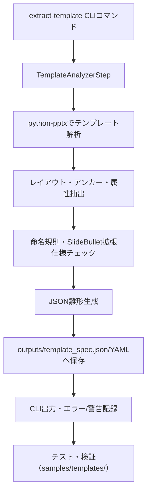

# RM-008/RM-010 テンプレート仕様エクスポート機能 設計まとめ

## 1. アーキテクチャ設計
- python-pptxでpptxテンプレートから図形・プレースホルダー属性抽出
- アンカー名（図形名・プレースホルダー名）を基準に座標・サイズ・種別・初期テキスト等を収集
- 命名規則ガイド準拠・SlideBullet拡張仕様と重複しない抽出ロジック
- 新規TemplateAnalyzerStepをpipelineに追加、outputs/template_spec.jsonへ雛形保存

## 2. JSON雛形生成処理フロー・スキーマ設計
- layout名・アンカー名・shape種別・座標・サイズ・初期テキスト・placeholder種別等を抽出
- 命名規則ガイド（日本語名可・pptx/JSON一致）に準拠
- SlideBullet拡張仕様と重複しないよう抽出ロジック共通化
- 雛形スキーマ例（anchors配列に属性を格納）

## 3. CLI新コマンド設計
- コマンド: `pptx-generator extract-template`
- 必須: `--template <path>`、オプション: `--output <path>`, `--layout`, `--anchor`, `--format`, `--verbose`
- 既存CLIと統合、outputsディレクトリ保存・詳細ログ出力

## 4. エラーハンドリング戦略
- ファイル不在・破損は即時終了
- 命名不一致・重複は警告としてCLI/JSON雛形両方に記録
- 抽出失敗shapeはerrorフィールド付きで雛形出力
- 必須属性欠落はmissing_fieldsで明記
- SlideBullet競合はconflictフィールドで明示

## 5. テスト戦略
- 単体テスト: 抽出関数・命名規則・エラー付与処理
- 統合テスト: CLI全オプション・サンプルテンプレート網羅
- サンプルテンプレート（templates.pptx等）でlayout/anchorフィルタ・エラーケース検証
- テスト設計・結果はdocs/qa/へ記録

## 6. 全体処理フロー（Mermaid図）

---

本設計内容で承認いただければ、実装フェーズへ進行可能です。ご確認・ご指示をお願いします。
