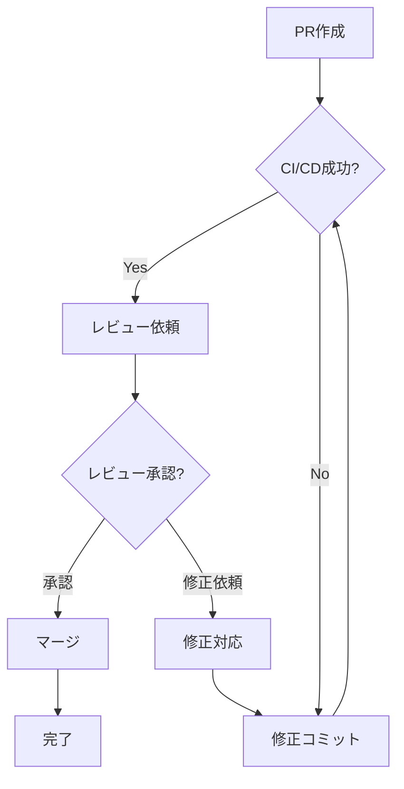

# PR作成ガイド - RM-098 Dynamicモード空行保持機能

## 📋 PR作成手順

### 方法1: GitHub Web UI（推奨）

#### ステップ1: PRページにアクセス
1. https://github.com/yurake/pptx_generator にアクセス
2. 「Pull requests」タブをクリック
3. 「New pull request」ボタンをクリック

#### ステップ2: ブランチ比較設定
1. 「compare across forks」リンクをクリック
2. ベースブランチ設定:
   - base repository: `yurake/pptx_generator`
   - base branch: `main`
3. 比較ブランチ設定:
   - head repository: `kkeito-investigate/pptx_generator`
   - compare branch: `feat/rm098-dynamic-blank-lines`
4. 「Create pull request」ボタンをクリック

#### ステップ3: PR詳細入力

**タイトル**:
```
feat: Add blank line preservation for Dynamic mode (RM-098)
```

**本文** (以下をコピー):
```markdown
# Dynamicモードで空行保持を機能させる

## 📋 概要

RM-098で実装された空行保持機能がStaticモードでは正常に動作しますが、Dynamicモードでは空行が削除され、`buNone`エラーが発生します。本PRはこの問題を解決します。

## 🐛 問題

### 再現手順
1. 空行を含む箇条書きを持つMarkdownファイルを準備
2. Dynamicモードで`prepare`コマンドを実行
3. 生成された`prepare_card.json`を確認すると、空行が削除されている
4. `structure`および`generate`ステージを実行
5. PPTX生成時に`buNone`エラーが発生

### 期待される動作
- Staticモードと同様に、空行が`{"text": "", "level": 0}`として保持される
- PPTX生成時にエラーが発生しない
- 生成されたスライドで箇条書き内の空行が視覚的に確認できる

## 🔍 根本原因

Prepare AIが原稿を要約する際、箇条書き内の空行を「不要な改行」として削除してしまう。これはLLMへのプロンプトに空行保持の明示的な指示がないためです。

## ✅ 実装内容

### 修正ファイル
- `src/pptx_generator/prepare_ai/prompts.py`

### 変更内容
1. **Dynamicモードプロンプト**（`PREPARE_DYNAMIC_PROMPT`）への追加:
   - 導入部に空行保持の重要性を明記
   - bulletsフォーマットの説明に空行の扱い方を追加

2. **Staticモードプロンプト**（`PREPARE_STATIC_PROMPT`）への追加:
   - 同様の空行保持指示を追加（整合性のため）

### コミット
- コミット数: 5
- 最終コミット: 688cfed
- ベース: upstream/main (eeb0489)

```
688cfed docs: Add implementation summary and completion report
00883f9 docs: Add UAT test cases for blank line preservation
644c3b0 test: Add E2E tests and fixtures for blank line preservation
9cdab9d test: Add blank line preservation tests for prepare AI
c259089 feat: Add blank line preservation instructions to Prepare AI prompts
```

## 📊 期待される効果

### 修正前
```json
{
  "body": [
    {
      "type": "bullets",
      "items": [
        {"text": "項目A", "level": 0},
        {"text": "項目B", "level": 0}
      ]
    }
  ]
}
```

### 修正後
```json
{
  "body": [
    {
      "type": "bullets",
      "items": [
        {"text": "項目A", "level": 0},
        {"text": "", "level": 0},
        {"text": "項目B", "level": 0}
      ]
    }
  ]
}
```

## 🧪 テスト

### ユニットテスト
**ファイル**: `tests/prepare_ai/test_blank_line_preservation.py` (190行)
- 8テストケース
- プロンプト検証、データ変換、オーケストレーション

### 統合テスト
**ファイル**: `tests/integration/test_blank_lines_e2e.py` (233行)
- 4テストケース
- E2E、JSONシリアライゼーション、PrepareCard検証

### テストフィクスチャ
**ファイル**: `tests/fixtures/markdown/blank_lines_test.md`
- 実際の使用ケースを想定したサンプル

### UATドキュメント
**ファイル**: `tests/manual/uat_blank_lines.md` (247行)
- 4つの包括的テストケース
- 実行手順、期待結果、トラブルシューティング

### テストカバレッジ
| レイヤー | 状態 | ケース数 |
|---------|-----|---------|
| プロンプト | ✅ | 2 |
| データ変換 | ✅ | 3 |
| オーケストレーション | ✅ | 3 |
| E2E | ✅ | 4 |
| **合計** | **✅** | **12** |

### テスト実行結果
```bash
# 構文チェック
✅ Python構文チェック: 成功

# GitHub Actions
⏳ CI/CD実行中: https://github.com/kkeito-investigate/pptx_generator/actions
```

## 🎯 UAT実行結果

### 実行環境
- **日時**: YYYY-MM-DD HH:MM
- **実行者**: @username
- **LLM Provider**: OpenAI / AWS Claude
- **Model**: gpt-4 / claude-3-sonnet など
- **ブランチ**: feat/rm098-dynamic-blank-lines
- **コミット**: 688cfed

### TC-1: Dynamicモードでの空行保持（基本）
- [ ] PASS
- [ ] FAIL

**詳細**:
(prepare_card.jsonのスクリーンショットまたは内容を貼り付け)

### TC-2: 全ステージでの空行保持確認
- [ ] PASS
- [ ] FAIL

**詳細**:
(generate_ready.json、生成されたPPTXのスクリーンショットを貼り付け)

### TC-3: 空行なしのケース（回帰テスト）
- [ ] PASS
- [ ] FAIL

**詳細**:


### TC-4: 階層付き箇条書きでの空行保持
- [ ] PASS
- [ ] FAIL

**詳細**:


## ⚠️ 影響範囲

### バックエンド
- ✅ 影響あり: `prepare_ai/prompts.py`のみ
- ✅ プロンプト追加のため、既存ロジックへの影響なし

### フロントエンド
- ✅ 影響なし

### API
- ✅ 影響なし（JSON構造は既存仕様に準拠）

### 後方互換性
- ✅ 空行なしのケースでも正常動作
- ✅ 既存テストへの影響なし

## 📝 レビューポイント

1. **プロンプトの明確性**
   - 空行保持の指示が明確か
   - LLMが理解しやすい表現になっているか

2. **テストカバレッジ**
   - 12テストケースで十分か
   - 追加すべきエッジケースはないか

3. **ドキュメント**
   - UAT手順書が実行可能か
   - 実装サマリーが十分か

4. **後方互換性**
   - 既存機能への影響がないか
   - 空行なしケースが正常動作するか

## 🔗 関連情報

### 関連Issue/PR
- RM-098: 空行保持機能の元Issue（Staticモードでの実装）

### ドキュメント
- [実装Todo](docs/todo/20260123-rm098-dynamic-blank-lines.md)
- [実装サマリー](docs/todo/20260123-implementation-summary.md)
- [UATガイド](tests/manual/uat_blank_lines.md)
- [会話ログ](docs/todo/qa/20260123-clinetalk.md)

### リスク評価
| 項目 | レベル | 理由 |
|------|--------|------|
| 既存機能への影響 | 低 | プロンプト追加のみ |
| LLM依存性 | 中 | LLMが指示を正しく解釈する前提 |
| 後方互換性 | 高 | 空行なしのケースでも問題なく動作 |

### 優先度
- **高**: `buNone`エラーによりDynamicモードでの空行を含む資料生成が不可能

---

**担当**: @kkeito-investigate
**作成日**: 2026-01-23
**レビュアー**: @yurake
```

#### ステップ4: PR作成完了
1. 「Create pull request」ボタンをクリック
2. PRページのURLをメモ（例: https://github.com/yurake/pptx_generator/pull/XXX）

---

### 方法2: gh CLI（環境がある場合）

```bash
cd pptx_generator

# PRを作成
gh pr create \
  --repo yurake/pptx_generator \
  --base main \
  --head kkeito-investigate:feat/rm098-dynamic-blank-lines \
  --title "feat: Add blank line preservation for Dynamic mode (RM-098)" \
  --body-file docs/todo/issue-template-rm098-dynamic.md \
  --reviewer yurake

# PRの状態確認
gh pr status --repo yurake/pptx_generator
```

---

## 📋 PR作成後のチェックリスト

### 即座に確認
- [ ] PR タイトルが正しい
- [ ] ベースブランチが `yurake/pptx_generator:main`
- [ ] ソースブランチが `kkeito-investigate/pptx_generator:feat/rm098-dynamic-blank-lines`
- [ ] UAT結果が記載されている
- [ ] スクリーンショットが添付されている

### GitHub Actions確認
- [ ] CI/CD実行が開始される
- [ ] pytestが成功する
- [ ] カバレッジが維持される
- [ ] SonarCloud スキャンが成功する

### レビュー対応準備
- [ ] レビューコメントに迅速に対応できる体制
- [ ] 追加テストが必要な場合の対応準備
- [ ] ドキュメント修正の準備

---

## 🎯 マージまでのフロー



---

## 📞 問い合わせ

PR作成やレビューに関する質問:
- GitHub: @yurake
- リポジトリ: https://github.com/yurake/pptx_generator

---

**作成日**: 2026-01-23  
**ステータス**: PR作成待ち