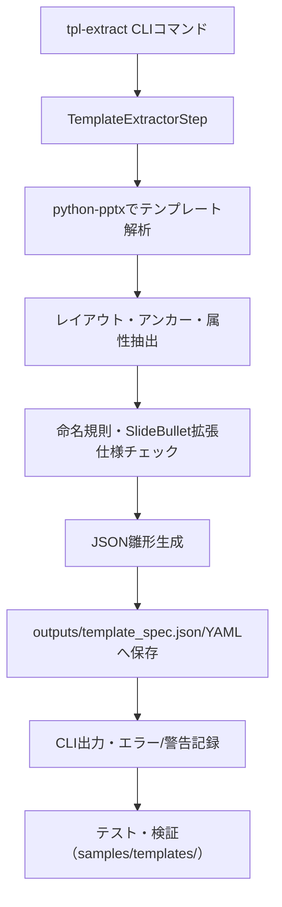

## 実装タスク

- [x] アーキテクチャ設計完了
  - メモ: 設計書作成済み（python-pptx活用、TemplateAnalyzerStep追加）
- [x] JSON雛形生成処理フロー設計完了
  - メモ: layout名・アンカー名・属性抽出フロー確定
- [x] CLI新コマンド設計完了
  - メモ: `tpl-extract` コマンド（旧 `extract-template`）、オプション仕様確定
- [x] エラーハンドリング戦略設計完了
  - メモ: ファイル不在、命名不一致、SlideBullet競合対応戦略確定
- [x] テスト戦略設計完了
  - メモ: 単体・統合テスト方針、サンプル活用方針確定
- [x] 全体処理フロー設計完了
  - メモ: Mermaid図付きフロー確定
- [x] ブランチ作成
  - メモ: feat/template-spec-export ブランチで作業中
- [x] TemplateExtractorStep実装
  - メモ: `src/pptx_generator/pipeline/template_extractor.py`で抽出ステップと本体を実装
- [x] モデルクラス拡張
  - メモ: `src/pptx_generator/models.py`にTemplateSpec関連モデルを追加
- [x] CLI統合実装
  - メモ: `src/pptx_generator/cli.py` に tpl-extract コマンドを追加
- [x] 単体テスト実装
  - メモ: `tests/test_template_extractor.py`で抽出ロジックを検証
- [x] 統合テスト実装
  - メモ: `tests/test_cli_integration.py` で tpl-extract コマンドの動作を検証
- [x] ドキュメント更新
  - メモ: README.md に tpl-extract コマンドの使用方法、オプション一覧、使用例を追加完了
- [x] PR作成
  - メモ: PR #154 (feat/template-spec-export → main) を作成済み

## 設計詳細

### 1. アーキテクチャ設計
- python-pptxでpptxテンプレートから図形・プレースホルダー属性抽出
- アンカー名（図形名・プレースホルダー名）を基準に座標・サイズ・種別・初期テキスト等を収集
- 命名規則ガイド準拠・SlideBullet拡張仕様と重複しない抽出ロジック
- TemplateExtractorStepをpipeline構成に追加し、outputs/template_spec.jsonへ雛形保存

### 2. JSON雛形生成処理フロー・スキーマ設計
- layout名・アンカー名・shape種別・座標・サイズ・初期テキスト・placeholder種別等を抽出
- 命名規則ガイド（日本語名可・pptx/JSON一致）に準拠
- SlideBullet拡張仕様と重複しないよう抽出ロジック共通化
- 雛形スキーマ例（anchors配列に属性を格納）

### 3. CLI新コマンド設計
- コマンド: `pptx tpl-extract`
- 必須: `--template <path>`、オプション: `--output <path>`, `--layout`, `--anchor`, `--format`, `--verbose`
- 既存CLIと統合、outputsディレクトリ保存・詳細ログ出力

### 4. エラーハンドリング戦略
- ファイル不在・破損は即時終了
- 命名不一致・重複は警告としてCLI/JSON雛形両方に記録
- 抽出失敗shapeはerrorフィールド付きで雛形出力
- 必須属性欠落はmissing_fieldsで明記
- SlideBullet競合はconflictフィールドで明示

### 5. テスト戦略
- 単体テスト: 抽出関数・命名規則・エラー付与処理
- 統合テスト: CLI全オプション・サンプルテンプレート網羅
- サンプルテンプレート（templates.pptx等）でlayout/anchorフィルタ・エラーケース検証
- テスト設計・結果はdocs/qa/へ記録

### 6. 全体処理フロー（Mermaid図）

## メモ
- 設計フェーズ完了、実装フェーズへ移行可能
- python-pptxライブラリの習熟が必要
- 既存のrenderer.pyやTemplateExtractorとの整合性確保が重要
- SlideBullet拡張仕様との競合回避に注意
- テスト実行時はsamples/templates/内のファイルを活用
